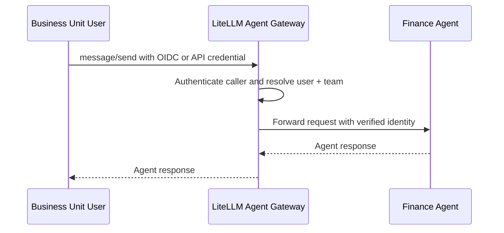
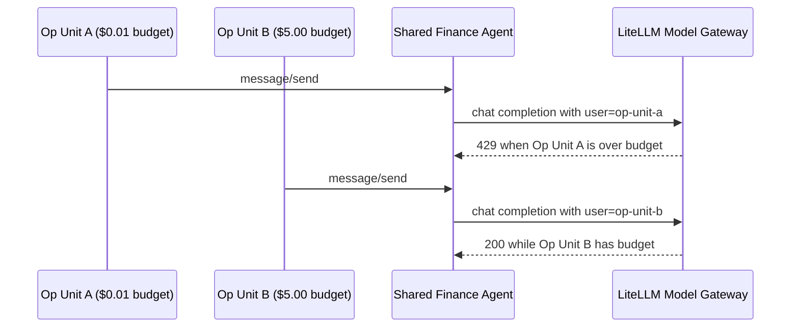

A shared agent should not mean a shared identity.

When a finance agent serves multiple business units, platform teams need a consistent way to identify who initiated each request, apply the right model and tool permissions, and attribute spend. LiteLLM keeps this context available across shared-agent workflows so each business unit can operate under its own access and budget policies.

LiteLLM provides one control plane for this workflow across the Agent Gateway, Model Gateway, and MCP Gateway. Teams can share the same agent infrastructure while keeping access, credentials, spend, and audit data tied to the right caller.

{/* truncate */}

## One gateway for the complete agent workflow

A typical agent request crosses four boundaries:

1. A user calls an agent.
2. The agent calls a model.
3. The agent calls an MCP tool.
4. The agent calls another agent.

LiteLLM governs each boundary through a single proxy:


The [Agent Gateway](../../docs/a2a) authenticates callers, controls which users and teams can invoke each agent, and records request, response, latency, and cost data. The Model Gateway routes LLM traffic and applies budgets and rate limits. The MCP Gateway centralizes tool access and upstream authentication.

Together, they let platform teams operate agents as shared services without giving up per-user governance.

## Authenticate every call to a shared agent

Start by registering each agent in the Agent Gateway. Agents appear in the Admin UI with their status and spend data:


Users can authenticate through OIDC or another supported LiteLLM credential while sharing the same team policy. In this example, two business units belong to `shared-agents-team`:


The team's object permissions define which agents and MCP servers its members can access. This lets both business units use the same finance agent without duplicating the agent registration or distributing its upstream credentials.


When a request reaches the Agent Gateway, LiteLLM validates the caller's authentication and resolves the associated user and team. The gateway forwards that verified context to the agent as `X-LiteLLM-User-Id` and `X-LiteLLM-Team-Id`.



The agent can use this authenticated context for downstream authorization, attribution, and budget enforcement.

Clients invoke the shared agent through the standard A2A JSON-RPC interface:

```bash
curl -X POST "$LITELLM_BASE_URL/a2a/$AGENT_ID" \
  -H "Authorization: Bearer $ACCESS_TOKEN" \
  -H "Content-Type: application/json" \
  -d '{
    "jsonrpc": "2.0",
    "id": "request-1",
    "method": "message/send",
    "params": {
      "message": {
        "kind": "message",
        "messageId": "message-1",
        "role": "user",
        "parts": [
          {"kind": "text", "text": "Give me a one-sentence finance status update."}
        ]
      }
    }
  }'
```

## Keep user attribution on model calls

The finance agent calls the Model Gateway with its own workload identity. This keeps service authentication separate from the end user's authentication.

For per-user attribution, the agent reads the verified `X-LiteLLM-User-Id` value from the inbound request and supplies it as the `user` field on its outbound model request. It also forwards LiteLLM trace and agent context headers so calls remain grouped under the same execution and spend is attributed to the correct agent.

This gives LiteLLM two useful dimensions at the same time:

- The workload identity identifies the agent making the model call.
- The `user` field identifies the customer or business unit whose budget applies.

Multiple teams can therefore share one agent and one model route while LiteLLM maintains separate usage and budget records for each caller.

## Apply each user's permissions to MCP tools

The same finance agent can access tools through the MCP Gateway without storing separate credentials for every upstream system.

In this example, the finance MCP server exposes two tools:

- `get_revenue_summary`, available to any authorized caller
- `get_payroll_details`, restricted to users with the `finance-payroll-access` group


For interactive per-user OAuth, configure the MCP server with `auth_type: oauth2` and `oauth2_flow: authorization_code`. The user completes a PKCE sign-in with the organization's identity provider. LiteLLM stores the resulting credential for that user and MCP server, then attaches it to later tool calls for the same user.

The upstream MCP server remains the authorization authority. It evaluates the token's claims and decides whether the user can access payroll details or only the broader revenue summary. LiteLLM centralizes the OAuth flow and credential handling while preserving each user's upstream identity.

See [MCP OAuth](../../docs/mcp_oauth) for configuration options, including machine-to-machine and on-behalf-of flows.

## Keep user and agent attribution across multi-agent calls

An agent-to-agent workflow includes two useful attribution dimensions:

- The immediate workload identity, such as the finance agent
- The originating user who started the workflow

LiteLLM records the immediate workload identity at every gateway hop. When a downstream agent also needs the originating user, the calling agent passes that authenticated user context as application metadata or a supported forwarded header.

Together, these dimensions give platform teams a complete view of the workflow: gateway logs show which agent made each call, while the propagated user context connects the workflow to the business unit that initiated it.

## Enforce independent budgets below the shared team

Shared infrastructure does not require a shared spend limit.

LiteLLM supports budgets at multiple levels, including keys, teams, agents, and customers. For a shared-agent deployment, create a customer record for each business unit and pass that customer ID in the model request's `user` field.

For example:

- `op-unit-a`: $0.01 budget
- `op-unit-b`: $5.00 budget
- Both units: the same finance agent and `shared-agents-team`



When one unit reaches its limit, LiteLLM rejects that unit's model requests without consuming the other unit's budget or throttling its traffic. The shared team budget can still provide an aggregate ceiling across both units.

This gives FinOps teams both views they need: consolidated spend for the shared service and independent controls for each business unit using it.

## Monitor identity and budgets in LiteLLM Logs

LiteLLM Logs gives platform, security, and FinOps teams a single operational view of shared-agent activity. When an agent carries the authenticated end-user context into its downstream calls, operators can filter by **End User** to follow one business unit across A2A agent invocations, model requests, and MCP tool operations.

Each log row includes the team, model or tool, token usage, cost, duration, and end-user ID. This makes it easy to start with a customer or business unit and trace the resources used throughout its workflow.


Request details also show when a customer budget blocks a call. The entry records the `429` status, the end-user ID, current spend, and configured budget limit. Because the request is rejected before reaching the model provider, it records zero model tokens and cost.


For shared-agent environments, these views answer three common operational questions:

- Which business unit initiated the workflow?
- Which agents, models, and tools handled its requests?
- Was a request served successfully or stopped by its customer budget?

Team and workload attribution support infrastructure-level reporting, while the end-user field provides the business-unit-level detail needed for access reviews, incident investigation, and spend management.

## A practical deployment pattern

To apply this architecture:

1. Register shared agents in the Agent Gateway.
2. Grant teams access to the required agents and MCP servers through object permissions.
3. Configure OIDC or another supported authentication method that resolves end-user identity and team membership.
4. Read the authenticated inbound user context and pass it as `user` on model calls.
5. Configure per-user OAuth for MCP servers that enforce user-specific permissions.
6. Create customer budgets for each business unit, with an optional aggregate team budget.
7. Use LiteLLM Logs to audit the user, key, team, agent, latency, and cost for each request.

The result is a shared agent platform with clear security and financial boundaries: users see only the tools and data they are authorized to access, spend is attributed to the correct business unit, and each unit can be governed independently without duplicating agent infrastructure.

Explore the [Agent Gateway](../../docs/a2a), [MCP Gateway](../../docs/mcp), and [budget and rate-limit controls](../../docs/proxy/users) to build this pattern in your LiteLLM deployment.
