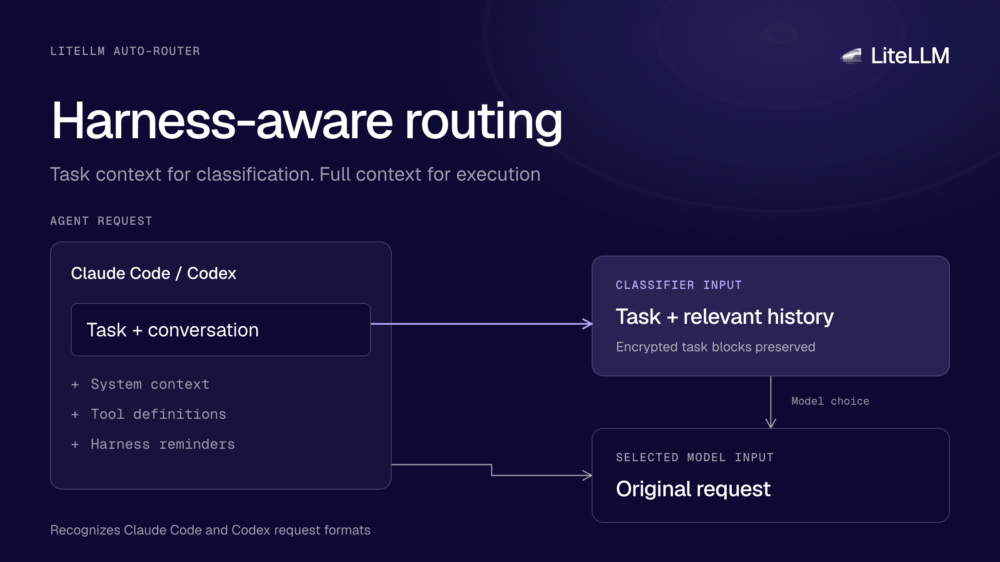

We've updated the Auto-Router to account for how Claude Code and Codex package requests. It now removes more harness context from classification, preserves encrypted delegated tasks, and shows exactly what the classifier received

{/* truncate */}

:::info[Help shape the Auto-Router]

Work with the LiteLLM team to test routing on your production traffic and help shape what we build next

<a className="button button--primary button--lg" style={{background: '#2e8555', borderColor: '#2e8555', color: '#fff'}} href="https://calendar.app.google/i2e7qVEJphHi5S8UA">Apply to Become a Design Partner</a>

:::

A coding harness sends more than the user's task. Requests also carry environment details, repository instructions, skill catalogs, and reminders. Those can dominate the classifier input or appear after the task as a separate message. Harness-aware routing uses the client identity and request format to find the task that needs a model

| Update | What changes |
| --- | --- |
| [Claude Code classification](https://github.com/BerriAI/litellm/pull/40655) | Omits caller system text from the classifier input |
| [Codex reminder handling](https://github.com/BerriAI/litellm/pull/40599) | Removes recognized harness blocks while preserving the delegated task |
| [Encrypted delegated tasks](https://github.com/BerriAI/litellm/pull/40608) | Preserves encrypted task blocks in native Responses classifier calls |
| [Classifier logs](https://github.com/BerriAI/litellm/pull/40604) | Separates classifier input, masked source request, and classifier response |

## Less classifier input for Claude Code

In a Claude Code reproduction, a short binary-search question used 2,478 classifier input tokens. Environment details, agent definitions, and the skill catalog accounted for 7,613 characters in the classifier's user payload

For recognized Claude Code requests, the LLM classifier now omits caller system text. The selected model still receives the original system text, and the classifier keeps the current ask, configured prior turns, and conversation-depth signal

| First classifier call | Before | After |
| --- | ---: | ---: |
| User payload, characters | 7,675 | 62 |
| Total input tokens | 2,478 | 524 |

That's **about 79% fewer classifier input tokens on this call**. The reproduction used Claude Code 2.1.268, a Haiku 4.5 classifier, and a three-turn session with one delegated subagent. It measures classifier overhead on that first call; total session cost and answer quality need separate evaluation. [Reproduction and results](https://github.com/BerriAI/litellm/pull/40655)

Task constraints supplied only in Claude Code system messages also stop influencing tier selection. Put constraints that should affect routing in the task itself

## Keep the Codex task in view

Codex can append environment and repository instructions after a delegated task. Previously, that trailing message could become the classifier's current ask

For recognized Codex user agents, the router now strips complete harness blocks such as `<environment_context>` and `<recommended_plugins>`, plus the repository instruction envelope. The delegated task stays available for classification, and the selected model receives the original request

With `classification_mode: user_turn` and a session identifier, a fresh ask followed by reminder text gets classified. Subsequent assistant or tool continuations reuse its selected model without another classifier call. A new ask remains eligible for classification. [Behavior and reproduction](https://github.com/BerriAI/litellm/pull/40599)

Custom `reminder_markers` replace the built-in markers, so include every pair your harness needs when overriding them

## Classify encrypted delegated tasks

Some Codex delegated tasks arrive in an `agent_message` containing `encrypted_content`. Converting that payload to ordinary text hid the task from the classifier and produced a `SIMPLE` verdict for a difficult request

The router now preserves the encrypted task in a native Responses classifier call. In the reproduction, the difficult task changed from `SIMPLE` on `gpt-5.6-luna` to `REASONING` on `gpt-6-astra`. The easy task stayed `SIMPLE` on `gpt-5.6-luna`, with both streaming and non-streaming requests tested. [Reproduction and results](https://github.com/BerriAI/litellm/pull/40608)

This requires a native OpenAI or Azure OpenAI Responses classifier deployment with credentials that can consume the encrypted content. Encrypted tasks bypass the local scoring shortcut in `heuristic_first` and `hybrid` modes. Unsupported deployments and decryption errors follow `classifier_fallback`. The live reproduction used OpenAI; Azure transport was not exercised

## See what the classifier received

Open a request in **Logs**, then select its **Classify** row. New captures show **Classifier input**, **Originating request, credentials masked**, and **Classifier response** separately

This makes it possible to check whether the task reached the classifier and compare its verdict with the original request. Credentials, including Cookie and Set-Cookie headers, are masked in the source copy. Message-logging redaction settings still apply, and older rows retain their existing view. [Logs update](https://github.com/BerriAI/litellm/pull/40604)

## Try it with your harness

Use a build containing the linked changes and send Claude Code or Codex traffic through the [Auto-Router](/docs/proxy/auto_routing). Preserve the client's `User-Agent` header so the router can recognize it. Test Claude Code behavior through the real client: the browser routing preview has no client-identity field and uses generic classification behavior

Share what you find in the [Auto-Router discussion](https://github.com/BerriAI/litellm/discussions/32168)
