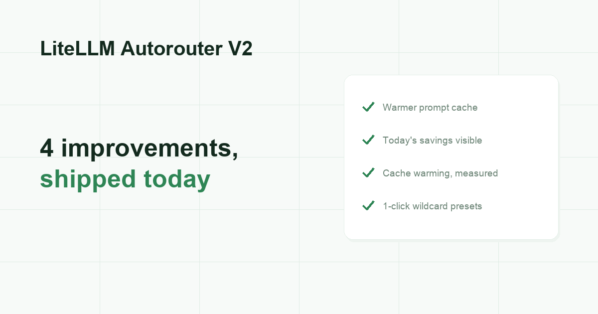

Four Auto-Router improvements shipped today. All four come down to the same two things: keeping your prompt cache warm, and showing you the savings you actually earned.

{/* truncate */}

:::info[🚀 Help shape the Auto-Router]

Get early access, work directly with the LiteLLM team, and influence the roadmap with your production traffic.

<a className="button button--primary button--lg" style={{background: '#2e8555', borderColor: '#2e8555', color: '#fff'}} href="https://calendar.app.google/i2e7qVEJphHi5S8UA">Apply to Become a Design Partner</a>

  

Already testing it? Share your results in [discussion #32172](https://github.com/BerriAI/litellm/discussions/32172).

:::

## 1. Sessions now stick to one deployment, not just one model

- Session affinity used to pin a conversation to a **model group**. If that group runs across several deployments, the conversation still bounced between them
- Every bounce is a cold prompt cache. You pay full price to re-read the same context, roughly every other turn
- Sessions now pin to the exact deployment that served the first turn, so the provider's cache stays warm for the whole conversation
- Session pins are also scoped per API key now. Two different keys that happened to use the same session id used to share one pin

**Why you care:** prompt caching and auto-routing finally compound instead of fighting each other. See [PR #36146](https://github.com/BerriAI/litellm/pull/36146).

## 2. Today's savings now show up today

- Spend is bucketed by UTC day. The dashboard asked for a range ending on **your** local today
- If you are in Pacific time, everything you sent after 5pm went into tomorrow's UTC bucket and simply did not appear
- Your dashboard read $0 for the entire evening, every evening, even while the router was saving you money
- The cost optimization dashboard now includes the current UTC day

**Why you care:** you can check today's savings today, instead of waiting until tomorrow to find out they existed. See [PR #36051](https://github.com/BerriAI/litellm/pull/36051).

## 3. The expired-miss stat now answers a real question

- Expired misses are the turns where a session came back to a tier after that tier's cache had already expired
- The percentage was divided only by return visits, which made the number look far worse than reality
- It is now a share of all measured turns

**Why you care:** the number now tells you whether paying for background cache warming is worth it, which is the only reason to look at it. Tab names got shorter too: "Overall" and "Auto-Router". See [PR #36037](https://github.com/BerriAI/litellm/pull/36037).

## 4. 1-click presets work with wildcard models

- If your models are configured as wildcards (`anthropic/*`, `openai/*`, `bedrock/*`), both family templates showed up greyed out: "Missing: claude-opus-5, claude-sonnet-5"
- The models were not missing. The template check and the tier dropdown right below it were reading two different lists of your models
- Templates now expand wildcards the same way the dropdown does

**Why you care:** if you run wildcard deployments, 1-click setup is actually 1 click. See [PR #36111](https://github.com/BerriAI/litellm/pull/36111).

## Try it

:::info

Questions, or numbers from your own traffic? Post them on [discussion #32172](https://github.com/BerriAI/litellm/discussions/32172). To work on this with us directly, [apply to be a design partner](https://calendar.app.google/i2e7qVEJphHi5S8UA).

:::

Full setup on the [Auto Routing docs page](/docs/proxy/auto_routing), and savings land on the cost optimization dashboard in your LiteLLM UI.
