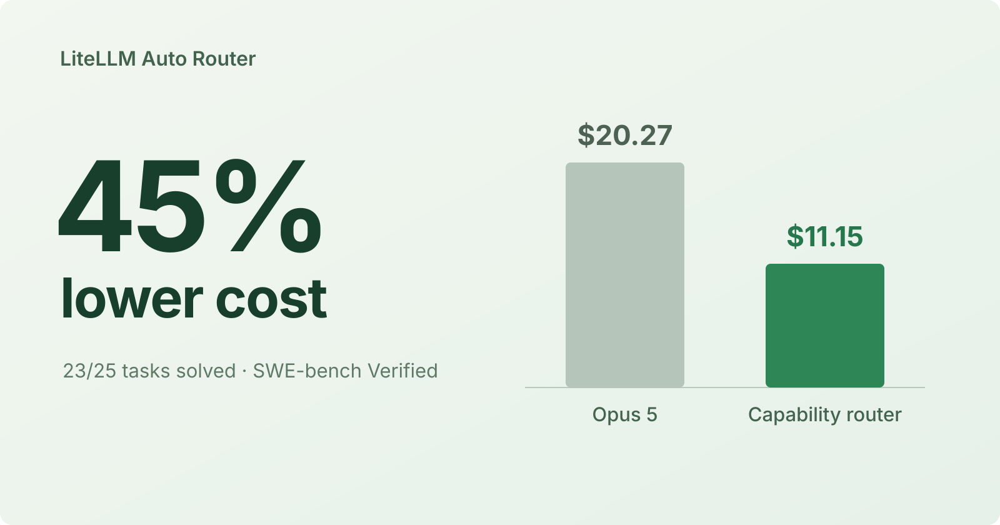
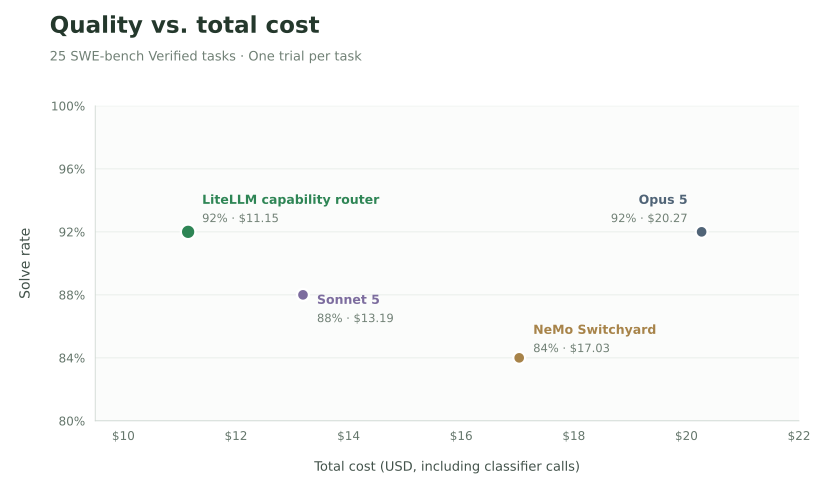

import styles from './styles.module.css';



We solved 23 of 25 SWE-bench Verified tasks with LiteLLM's experimental capability router for **$11.15**. With Opus 5 for all solver calls, we solved 23 tasks for **$20.27**. We spent **45% less**, including classifier calls, with prompt caching on in both runs.

{/* truncate */}

:::info[Help shape the Auto-Router]

Get early access and work with the LiteLLM team on routing for your production traffic.

<a className="button button--primary button--lg" href="https://calendar.app.google/i2e7qVEJphHi5S8UA">Apply to Become a Design Partner</a>

Share your results in [discussion #32168](https://github.com/BerriAI/litellm/discussions/32168).

:::

## Results

We compare four configurations on the same 25 tasks. We measure quality by solve rate and include unsuccessful attempts and classifier calls in total cost.



- **45% lower cost than Opus 5 at the same solve count.** We solved 23/25 tasks in each run, spending $11.15 with capability routing versus $20.27 with Opus 5.
- **One more task solved than Sonnet 5, for $2.04 less.** We solved 23/25 tasks with capability routing versus 22/25 with Sonnet 5.
- **Two more tasks solved than NeMo Switchyard, for $5.88 less.** We reached a 92% solve rate with LiteLLM capability routing versus 84% with Switchyard.

## Routing between Sonnet and Opus

We classify the task before choosing a model. We send GPT-5.4-mini the opening instruction, any latest user follow-up, and a capability checklist. We ask it to identify the hardest requirement and estimate Sonnet 5's chance of completing the whole task, using signals such as clear requirements, available inputs, and executable checks.

We compare that probability with the threshold for the task's capability category, requiring a higher probability for uncertain or unsupported tasks. We choose **Sonnet 5** when the estimate meets the threshold and **Opus 5** when it falls below.

In this run, we sent **98.4% of solver calls to Sonnet 5** and **1.6% to Opus 5**.

## Benchmark setup

We used the same Harbor and mini-swe-agent setup for each configuration: the same 25 SWE-bench Verified tasks, one attempt per task, three concurrent tasks, and the same verifier. We enabled prompt caching in each run and measured total cost from LiteLLM gateway spend logs, including classifier and judge calls.

## Scope of the result

We matched the Opus solve count on this subset, with different successes and failures: we solved 21 tasks in both runs, plus two distinct tasks in each. With 25 tasks and one attempt per configuration, we cannot establish equal quality across workloads or predict savings for your agent.

For a comparison on your workload, use the same tasks and verifier, enable prompt caching across configurations, and include classifier spend in the total.

For related experiments, read [Prompt Caching Works with Auto Router](https://docs.litellm.ai/blog/auto-router-prompt-caching-benchmark) and [Subtask-Specific Routing: Same Quality, 46% Less Cost](https://docs.litellm.ai/blog/subtask-type-routing).

## Try it

Use this example with a LiteLLM build that supports capability routing. Set `ANTHROPIC_API_KEY` and `OPENAI_API_KEY` in your environment, then save this as `config.yaml` or [download the configuration](./capability-router-config.yaml):

<div className={styles.configuration}>

```yaml title="config.yaml" keep-model-ids
model_list:
  - model_name: claude-sonnet-5
    litellm_params:
      model: anthropic/claude-sonnet-5
      api_key: os.environ/ANTHROPIC_API_KEY

  - model_name: claude-opus-5
    litellm_params:
      model: anthropic/claude-opus-5
      api_key: os.environ/ANTHROPIC_API_KEY

  - model_name: routing-classifier
    litellm_params:
      model: openai/gpt-5.4-mini
      api_key: os.environ/OPENAI_API_KEY

  - model_name: claude-capability-router
    litellm_params:
      model: auto_router/complexity_router
      complexity_router_config:
        classifier_type: capability
        classifier_llm_config:
          model: routing-classifier
          timeout_ms: 30000
        tiers:
          SIMPLE: [claude-sonnet-5]
          REASONING: [claude-opus-5]
        capability_classifier_config:
          efficient_tier: SIMPLE
          capable_tier: REASONING
          base_threshold: 0.5  # Example value; tune on your tasks.
          threshold_step: 0.1
        adaptive: false
        session_affinity: false
        route_housekeeping_to_cheapest_tier: false
```

</div>

Start the gateway with `litellm --config config.yaml` and use `claude-capability-router` as your client's model. Keep prompt caching enabled in your agent.

With these example thresholds, we choose Sonnet at a success probability of 0.5 for supported tasks, 0.6 for uncertain or unmatched tasks, and 0.7 for unsupported tasks. Below those thresholds, we use Opus. Tune these values on your own evaluation set.

:::info[Help shape the Auto-Router]

Work with the LiteLLM team to evaluate Auto Router on your production traffic.

<a className="button button--primary button--lg" href="https://calendar.app.google/i2e7qVEJphHi5S8UA">Apply to Become a Design Partner</a>

:::
