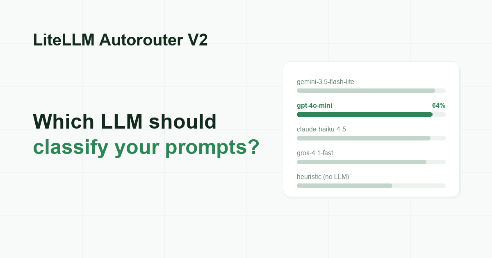

**Our pick for the Auto Router's classifier is `gpt-4o-mini`: second-best accuracy at half the leader's price.** We tested 13 classifiers on the same 100 prompts to find it.

{/* truncate */}

:::info[🚀 Help shape the Auto-Router]

Get early access, work directly with the LiteLLM team, and influence the roadmap with your production traffic.

<a className="button button--primary button--lg" style={{background: '#2e8555', borderColor: '#2e8555', color: '#fff'}} href="https://calendar.app.google/i2e7qVEJphHi5S8UA">Apply to Become a Design Partner</a>

<br /><br />

Already testing it? Share your results in [discussion #32172](https://github.com/BerriAI/litellm/discussions/32172).

:::

## Key findings

- **We identified four top performers:** `gemini-3.5-flash-lite` (65%), `gpt-4o-mini` (64%), `claude-haiku-4-5` (63%) and `grok-4.1-fast` (61%). All four score between 61% and 65%, close enough that the gaps are noise at this sample size, so pick on latency and price; accuracy will not separate them
- **Do not use a model built for reasoning as a classifier.** Anything that thinks before it answers (o3, `gpt-5.4-nano`) spends latency and tokens for zero accuracy gain. Classification is a one-word answer, so thinking is pure overhead
- **Open-source models are faster, and less accurate.** `llama-3.1-8b` on your own GPU is the fastest classifier we tested, at 0.16s, but only gets 48%. `deepseek-v3.2` is the one that keeps up with the hosted models, and it costs more to run
- **The free heuristic is a real floor at 45%.** It scores locally, with no API call and nothing added to your latency. Our pick gets 64% against its 45%, and that gap is the whole value of paying for a classifier hop

## The results

Every classifier saw exactly the same 100 prompts, stratified 25 per tier across `simple` / `medium` / `complex` / `reasoning`. Latency is the median per classification; cost is per 1,000 classifications.

| Classifier | Accuracy | Latency | Cost per 1k |
| --- | --- | --- | --- |
| **gemini-3.5-flash-lite** | **65%** | 0.50s | $0.09 |
| gpt-4o-mini | 64% | 0.59s | $0.04 |
| claude-haiku-4-5 | 63% | 0.78s | $0.34 |
| deepseek-v3.2 (dedicated GPU) | 63% | 0.16s | $0.16 |
| grok-4.1-fast | 61% | 0.41s | $0.06 |
| gpt-5.4-nano | 55% | 0.71s | $0.09 |
| gemma-3-4b (dedicated GPU) | 51% | 0.22s | $0.06 |
| ministral-3b | 49% | 0.33s | n/a |
| llama-3.1-8b (dedicated GPU) | 48% | 0.16s | $0.03 |
| **heuristic (no LLM)** | **45%** | ~0ms | free |
| qwen3-4b (dedicated GPU) | 44% | 0.64s | $0.06 |

Open-source models were also run on local CPU; accuracy came out close to the GPU runs and the latency is not comparable to hosted endpoints, so those rows are omitted.

## How it was measured

- **Same prompt for every model**, `temperature=0`, `max_tokens=8` except models that must be allowed to think. No per-model prompt tuning; this measures the model and only the model
- **Also tracked:** macro-F1, within-one-tier accuracy, the split between under-routing (quality risk) and over-routing (wasted spend), and p95 latency
- **Dedicated-GPU rows** ran on on-demand H100/H200 deployments, measured warm; first call on a cold deployment costs 20 to 24 seconds. Dedicated-GPU latency and shared-endpoint latency are different products, so compare within a deployment type
- **Labels are not LLM-judged.** The common trap is generating ground truth with a big LLM and then scoring small LLMs against it, which measures agreement with a judge rather than correctness. Every item in the 400-item set takes its tier from an intrinsic property of its source:

| Tier | Sources |
| --- | --- |
| simple | TriviaQA single-fact, llm-query-complexity-benchmark LOW, RouterArena *easy*, hand-authored chit-chat / format / extract |
| medium | llm-query-complexity-benchmark MEDIUM, RouterArena *medium*, GSM8K, hand-authored explain / small-code / write |
| complex | llm-query-complexity-benchmark HIGH (MMLU-Pro, PubMedQA), RouterArena *hard*, hand-authored system design and open-ended synthesis |
| reasoning | MATH-500 level 5, AIME 2025, BIG-Bench-Hard, hand-authored proofs and puzzles |

## How do you get past 65%?

Not by shopping for a better classifier. Four unrelated model families all top out around the same number and miss on the same tier, which says the ceiling belongs to the task rather than to any one model. Three things move it:

- **Customize the tier definitions.** The classifier prompt is replaceable, and the tier names with it. Tiers written in your own vocabulary, "customer support reply" or "SQL generation" instead of "medium", are a far easier call than a generic 4-way complexity scale
- **Round up when torn.** A prompt misread upward wastes a little money; misread downward it produces a visibly worse answer. Steering ties toward the more capable tier converts quality risk into a small, bounded over-spend
- **Let the router learn from outcomes.** This is the real answer, and it is where adaptive routing comes in

Adaptive routing stops treating the tier as the final word. It keeps a per-model quality estimate for each type of request, updates it from what actually happened on your traffic, and picks the model that scores best on your own quality-versus-cost weighting. The classifier still sets the floor, so a hard prompt never drops to a cheap model; above that floor the router is free to learn that one model handles your code review requests better than its tier suggests, and another is overkill for your summarization.

The important difference is what gets graded. A classifier is graded on agreeing with a human label, which is exactly the subjective judgement that caps this benchmark at 65%. Adaptive routing is graded on whether the answer was good, on your traffic, which is the thing you actually wanted to know.

## What's next

- **Auto Router evaluation on your live traffic.** Everything above is scored on public benchmarks; the next step is replaying your own production prompts through the router, so the accuracy and savings numbers are measured on the traffic you actually serve rather than ours
- **Adaptive routing trained on your live traffic.** The classifier picks a tier; adaptive routing then learns which model inside that tier earns its price on your requests, scoring real outcomes instead of following a fixed tier-to-model mapping

## Try it

:::info

Try it yourself with the configuration below, and post any feedback, questions, or numbers from your own traffic on [discussion #32172](https://github.com/BerriAI/litellm/discussions/32172). If you want to work on this with us directly, [apply to be a design partner](https://calendar.app.google/i2e7qVEJphHi5S8UA).

:::

```yaml title="config.yaml"
model_list:
  - model_name: claude-haiku-4-5           # $1 / $5 per 1M tokens
    litellm_params:
      model: anthropic/claude-haiku-4-5
      api_key: os.environ/ANTHROPIC_API_KEY
  - model_name: claude-sonnet-5            # $3 / $15
    litellm_params:
      model: anthropic/claude-sonnet-5
      api_key: os.environ/ANTHROPIC_API_KEY
  - model_name: claude-opus-5              # $5 / $25
    litellm_params:
      model: anthropic/claude-opus-5
      api_key: os.environ/ANTHROPIC_API_KEY
  - model_name: gpt-4o-mini                # the classifier: 64% tier accuracy, ~$0.04/1k
    litellm_params:
      model: openai/gpt-4o-mini
      api_key: os.environ/OPENAI_API_KEY

  - model_name: smart-router
    litellm_params:
      model: auto_router/complexity_router
      complexity_router_config:
        tiers:
          SIMPLE:    claude-haiku-4-5
          MEDIUM:    claude-sonnet-5
          COMPLEX:   claude-opus-5
          REASONING: claude-opus-5
        classifier_type: llm
        classifier_llm_config:
          model: gpt-4o-mini               # a model_name from model_list above
          timeout_ms: 3000                 # on timeout, falls back to the heuristic
      complexity_router_default_model: claude-sonnet-5
```

Point a client at `smart-router` and every response carries `x-litellm-model-name` and `x-litellm-response-cost`. Full reference, including the classifier and tier-boundary knobs, on the [Auto Routing docs page](/docs/proxy/auto_routing).
