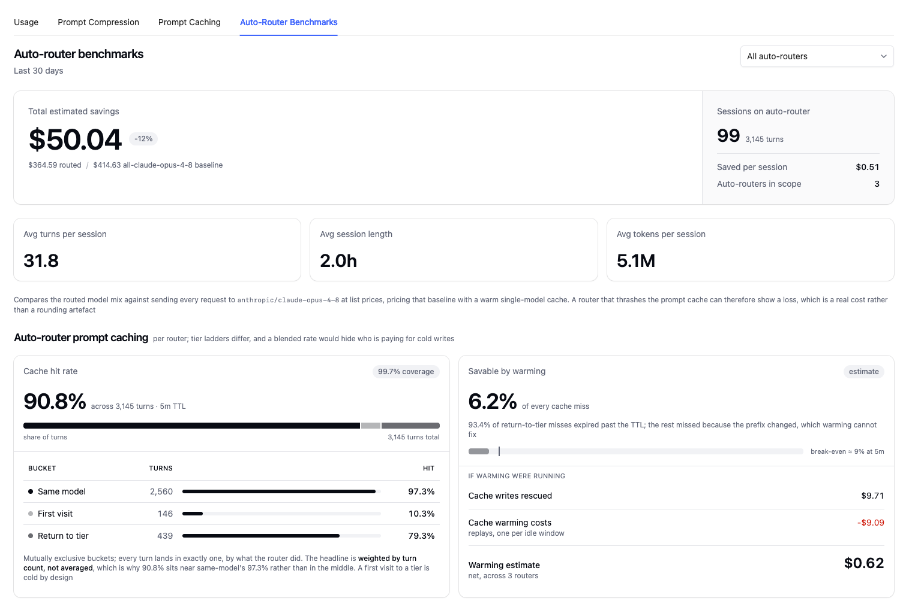
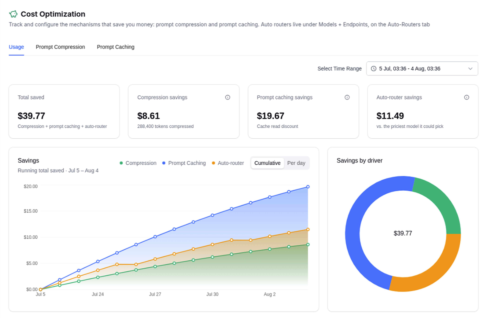

"Yes, do that."

Your router sees a short, simple message and sends it to the cheap tier, where it green-lights a database migration. The classifier was only ever shown the current turn, so it had no way to know what "that" was. Across 5,600 live classifier calls, follow-ups that only make sense against their history routed to the right tier **14% of the time**; give the classifier a couple of prior turns and that goes to **78%**, 5.6x more accurate, for under a tenth of a cent per request and no measurable latency.

That fix ships in v1.97, along with cost and usage benchmarks for the auto router, so you can see what routing saved you instead of guessing, and with savings now rolling into the Cost Optimization totals. Session affinity also flips off by default, because our caching data says it was costing you routing quality to buy a cache hit you would get anyway.

:::warning Two defaults changed

`classifier_context_window_size` now defaults to `3` (LLM classifier only), and `session_affinity` now defaults to `false` (all routers). Your config files aren't touched, but these defaults apply to any key you haven't set, so a config that never mentioned `session_affinity` will start reclassifying every turn after you upgrade. If you set either key explicitly, nothing changes for you.

:::

{/* truncate */}

## Cost and usage benchmarks

Auto routing has a measurement problem: the counterfactual is invisible. You know what you spent. You don't know what the same traffic would have cost on a single frontier model, which is the only number that tells you whether routing is working. The new **Auto-Router Benchmarks** view computes it for you.



Per router and per time range, it prices your routed traffic against the same traffic sent to one frontier model at list prices, and reports the gap in dollars and percent alongside the session economics behind it: sessions on the router, turns per session, tokens per session, and savings per session. The baseline is priced with a warm single-model cache rather than a cold-priced strawman, so a router that thrashes the prompt cache can show a loss. That is a real cost, and you should be able to see it.

Below that, prompt cache behaviour can be broken down per router rather than blended, because tier ladders differ and an average would hide which router is paying for cold writes. Turns land in exactly one of three buckets, staying on the same model, visiting a tier for the first time, or returning to a tier it used before, and only the last of those is a cache miss routing could have avoided. The view also estimates what a background cache warmer would be worth on your traffic, netting rescued cache writes against the cost of the replays.

### Savings roll up into Cost Optimization

Router savings used to live only in the router's own view. They now feed the **Cost Optimization** section alongside prompt compression and prompt caching, as their own card, savings line, and slice of the by-driver breakdown, so the top-line number covers everything rather than a subset. Auto-router savings there are measured against the priciest model the router could have picked.



The two views answer different questions, so their savings figures won't match: Benchmarks prices your traffic against one frontier model end to end, while the Cost Optimization card counts only the difference between the tier the router picked and the priciest tier it could have picked. The Benchmarks numbers are queryable directly:

```bash
GET /auto_router/benchmarks?start_date=2026-07-01&end_date=2026-07-31
```

## The LLM classifier can see prior turns

:::note

Everything in this section requires `classifier_type: llm`. The heuristic scorer doesn't call a model and has nowhere to put the context, so it is unchanged; the three fields below are read only on the LLM path.

:::

### The problem

The LLM classifier used to see exactly one turn: the current one. That's fine when the turn describes its own difficulty. It falls apart when the turn is referential. "Yes please." "Keep going." "Now do the same for the streaming path." These are short and look trivial, so they route to the cheap tier while approving work that is anything but.

Three new fields on `complexity_router_config` fix this:

```yaml
    litellm_params:
      model: auto_router/complexity_router
      complexity_router_config:
        classifier_type: llm
        classifier_llm_config:
          model: gpt-5.4-mini
        classifier_context_window_size: 3                  # default 3; 0 = old behavior
        classifier_context_per_turn_chars: 200             # default 200
        classifier_context_include_assistant_turns: false  # default false
```

Prior turns go in oldest-first, numbered `[1]`, `[2]`, `[3]`, each clipped to `classifier_context_per_turn_chars` with a trailing ellipsis so the classifier can tell a truncated turn from an unfinished one.

Turns without human-written text don't eat a slot. Tool output is excluded, `<system-reminder>` blocks are stripped, turns left empty after stripping are skipped, and a turn identical to the ask being classified is dropped. If you enable `classifier_context_include_assistant_turns`, assistant messages join the window with role labels, but that text only ever reaches the classifier payload; keyword rules, escalation, the heuristic scorer, and semantic matching still read the human message alone.

### What we measured

5,600 live classifier calls against real providers. Two sweeps of seven configurations each (`classifier_context_window_size` of 0, 1, 2, 3, 5, 8, 10), one with assistant turns in the window and one without, across three multi-turn datasets, two repeats per conversation. Everything else was byte-identical between configurations: same conversations, same rubric, same classifier model (`gpt-5.4-mini`), same per-turn cap. We shuffled work items across configurations so provider drift during the run couldn't land on one value of N.

**Quality.** Agreement between the tier the router picked and the reference tier:

| Window | Short-reply follow-ups | MT-Bench 2nd turns | ShareGPT multi-turn |
|---|---|---|---|
| 0 | 50.0% | 49.4% | 83.8% |
| 1 | 71.2% | 53.1% | 84.4% |
| 2 | 87.5% | 53.1% | 90.6% |
| **3** *(default)* | **85.0%** | **55.0%** | **91.9%** |
| 5 | 86.2% | 53.8% | 91.9% |
| 8 | 87.5% | 55.6% | 91.2% |
| 10 | 90.0% | 55.6% | 88.8% |

The sharpest cut is the 36 follow-ups whose last turn only makes sense against the history, the "yes, do that" cases from the top of this post. Agreement there runs **14% at N=0, 47% at N=1, 78% at N=2**, then flat out to N=10. Self-describing controls in the same set sit at 80% with no window and 91 to 95% with one, so the window isn't just lifting every number; it fixes the cases it was built for.

Note what N=1 does *not* do. Handing the classifier a single prior turn recovers less than half the gap: it learns that a conversation happened, not what it was about, and roughly a third of referential cases stay misrouted. If you've built this yourself with one turn of lookback, that's the number to know.

MT-Bench's low ceiling is the reference's fault rather than the router's. Its category-to-tier mapping labels every "writing" second turn MEDIUM, so read that column as a trend line, not an accuracy score.


**Latency.** It doesn't move. Paired per conversation against N=0, every 95% bootstrap CI contains zero in both sweeps:

| Window | Assistant turns on | Assistant turns off |
|---|---|---|
| 1 | +21.5 ms [-19.6, +63.9] | -17.8 ms [-68.9, +29.6] |
| 2 | +10.5 ms [-31.2, +55.2] | -14.3 ms [-67.2, +34.4] |
| 3 | +6.2 ms [-30.0, +43.0] | -10.8 ms [-61.1, +37.1] |
| 5 | +6.0 ms [-37.5, +52.6] | +11.7 ms [-40.6, +61.9] |
| 8 | -10.5 ms [-45.0, +23.9] | +10.2 ms [-43.6, +63.9] |
| 10 | +9.0 ms [-25.9, +43.1] | -15.3 ms [-65.6, +30.0] |

Prompt tokens and latency correlate at r = 0.007 with assistant turns on and r = 0.018 with them off, across a 318 to 1,043 token range. The window adds prefill and nothing else; output is a fixed, tiny structured tier. p50 sits near 600 ms in every configuration.

**Cost.** The classifier itself is cheap, at most $0.61 per 1,000 requests, under a tenth of a cent each:

| Window | Classifier $/1k req (follow-ups / MT-Bench / ShareGPT) | Modelled routed $/1k req |
|---|---|---|
| 0 | $0.31 / $0.32 / $0.34 | $2.87 / $5.41 / $5.48 |
| 2 | $0.38 / $0.42 / $0.44 | $6.79 / $4.65 / $5.31 |
| 3 | $0.38 / $0.42 / $0.47 | $6.49 / $5.13 / $5.14 |
| 10 | $0.38 / $0.42 / $0.61 | $6.42 / $4.87 / $5.22 |

What moves money is which tier gets picked, and it moves both ways.

On the short-reply set, routed cost more than doubles, from $2.87 to about $6.50 per 1k. At N=0 those requests were going to the cheap tier while approving hard work; the tier mix was 66% SIMPLE at N=0 and 30% at N=2. The extra spend is the correct spend. The old number was cheap because it was wrong. On MT-Bench and ShareGPT it drifts down instead, as context resolves ambiguous follow-ups into MEDIUM rather than REASONING.

Which of those two your traffic looks like, we can't tell you from here. That's the whole reason the Benchmarks view exists: compare your routed spend against the baseline after a day and you'll know which failure mode you had.

### What to run

The default of 3 is past the point where every curve flattens, and the extra classifier tokens beyond that buy nothing. The tables above are the assistant-turns-on sweep; the user-only sweep, which is the default, plateaus a slot earlier, since an assistant turn otherwise consumes a slot. So 3 works either way.

We left `classifier_context_include_assistant_turns` off because enabling it shifts tier decisions, and therefore spend, for routers already in production. That should be your call, not ours.

Leave `classifier_context_per_turn_chars` at 200. The plateau arrives well before the cap bites, and the truncation marker is enough for the classifier to notice the turn was cut.

<details>
<summary>Caveats</summary>

Reference tiers are judgement calls. The hand labels and the ShareGPT judge pass both encode "a short reply inherits the difficulty of the work it approves," which is exactly the behavior the window produces. That makes the follow-up set both our sharpest instrument and our most sympathetic one.

Routed completion cost is modelled, not billed: the chosen tier's price applied to the conversation's prompt tokens plus 600 output tokens. No tier model was actually called, which isolates the effect of the tier choice from the effect of any particular answer.

We swept one classifier model. A reasoning-heavier one carries more absolute latency, though the marginal cost of roughly 200 extra prefill tokens should stay negligible.

Latency came from a single VM at concurrency 10. The paired differences carry the finding; the absolute numbers reflect that setup.

</details>

## Session affinity is off by default

Session affinity pins a session to whatever model handled its first turn and skips reclassification after that, to keep provider prompt caches warm. It used to be on by default. It shouldn't have been.

Our [prompt caching benchmark](/blog/auto-router-prompt-caching-benchmark) looked at 4,684 switch-backs and found 97.4% still warm at the 5-minute TTL, 99.3% at an hour. Provider caches survive routing changes far better than pinning assumed, so the default was trading routing quality for a cache hit you were going to get anyway.

The second reason is the section above. With affinity on, the context window only matters on turn one, or when no `session_id` resolves; every turn after that reuses the pinned model without reclassifying. Pinning was partly a workaround for a classifier that couldn't see conversation history. That classifier can see it now.

If your config doesn't mention `session_affinity`, upgrading means every turn gets classified again. Should you want the old behavior, either strict per-session model consistency or prefixes long enough that a miss genuinely hurts, set it:

```yaml
      complexity_router_config:
        session_affinity: true
        session_affinity_ttl_seconds: 3600
```

Affinity needs a resolvable `session_id` in metadata, and is ignored when `plugins` are set.

:::info[🚀 Help shape the Auto-Router]

Get early access, work directly with the LiteLLM team, and influence the roadmap with your production traffic.

<a className="button button--primary button--lg" style={{background: '#2e8555', borderColor: '#2e8555', color: '#fff'}} href="https://calendar.app.google/i2e7qVEJphHi5S8UA">Apply to Become a Design Partner</a>

<br /><br />

Already testing it? Share your results in [discussion #32168](https://github.com/BerriAI/litellm/discussions/32168).

:::

## Try it

```yaml
model_list:
  - model_name: gpt-5.4-nano
    litellm_params: {model: openai/gpt-5.4-nano}
  - model_name: gpt-5.4-mini
    litellm_params: {model: openai/gpt-5.4-mini}
  - model_name: claude-sonnet-5
    litellm_params: {model: anthropic/claude-sonnet-5}
  - model_name: gpt-5.5
    litellm_params: {model: openai/gpt-5.5}

  - model_name: smart-router
    litellm_params:
      model: auto_router/complexity_router
      complexity_router_default_model: claude-sonnet-5
      complexity_router_config:
        classifier_type: llm
        classifier_llm_config:
          model: gpt-5.4-mini
          timeout_ms: 2000
        classifier_context_window_size: 3
        classifier_context_per_turn_chars: 200
        tiers:
          SIMPLE: gpt-5.4-nano
          MEDIUM: gpt-5.4-mini
          COMPLEX: claude-sonnet-5
          REASONING: gpt-5.5
```

Every response carries `x-litellm-model-name` and `x-litellm-response-cost`, so you can check the tier per request before trusting any aggregate.

Then give it a day of real traffic and open Benchmarks. Your own routed-versus-baseline number will tell you more about your workload than any of our datasets can.

Full docs: [Auto Routing](https://docs.litellm.ai/docs/proxy/auto_routing).
