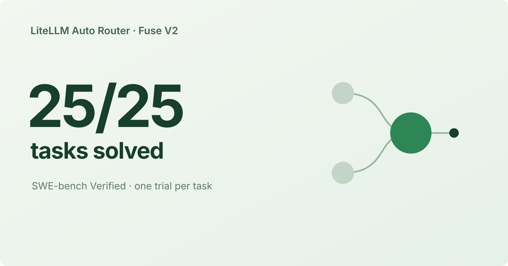

We’re improving Fuse V2 by combining complexity and capability assessment to learn where each model succeeds, fails, and needs an upgrade.

{/* truncate */}

:::info[Help shape the Auto-Router]

Work with the LiteLLM team to evaluate routing on your production traffic.

<a className="button button--primary button--lg" style={{color: "#102c25"}} href="https://calendar.app.google/i2e7qVEJphHi5S8UA">Apply to Become a Design Partner</a>

:::

## Results

We evaluated **25 tasks on SWE-bench Verified**, with one attempt per task. Key findings from this run:

- **25/25 tasks solved**, compared with 23/25 for both the capability classifier and Opus 5 only.
- **21% lower cost per task solved than the complexity classifier:** $0.75 versus $0.95.
- **15% lower cost per task solved than Opus 5 only:** $0.75 versus $0.88.

| Configuration | Tasks solved | Solve rate | Total cost | Cost / task solved |
| --- | ---: | ---: | ---: | ---: |
| **Fuse** | **25/25** | **100%** | **$18.65** | **$0.75** |
| Complexity classifier | 24/25 | 96% | $22.70 | $0.95 |
| Capability classifier | 23/25 | 92% | $11.15 | $0.48 |
| NeMo Switchyard | 21/25 | 84% | $17.03 | $0.81 |
| Opus 5 only | 23/25 | 92% | $20.27 | $0.88 |
| Sonnet 5 only | 22/25 | 88% | $13.19 | $0.60 |

The capability classifier had the lowest total cost and cost per task solved. We divide total cost, including classifier calls and unsuccessful attempts, by tasks solved. Dollar values round to cents; percentage reductions use the ratios before rounding. [Download the results table](./benchmark-results.csv).

At the tested settings, we sent all Fuse V2 solver calls to Opus. We observed 23–25 solves across all-Opus runs; this single-trial result does not establish a repeatable quality or cost improvement from fusion.

## Improving the fusion of complexity and capability

We want to predict when a model will struggle with a task and when another model can help. In Fuse V2, we combine two assessments:

- **Complexity:** assess the task’s scope, reasoning demands, and available checks.
- **Capability:** estimate each model’s chance of completing that task and identify its likely failure.

We ask the judge for both assessments at the start of each task, then reuse the model choice. We choose between solvers using the difference in their predicted success probabilities.

In this experiment, we compared Sonnet 5 and Opus 5, with GPT-5.4-mini as the judge. See the [Fuse V2 implementation](https://github.com/BerriAI/litellm/blob/32326a08184497431a20d63c4e1f08d7ad05dc07/litellm/router_strategy/complexity_router/llm_v2.py).

## Learning where each model works

We see different strengths in the fixed-model results from our separate Terminal-Bench repeat study:

- **pytorch-model-cli:** Sonnet solved 2/3 attempts; Opus solved 0/3.
- **query-optimize:** Opus solved 3/3 attempts; Sonnet solved 1/3.

We want Fuse V2 to recognize these differences before choosing a model. To improve the combined assessment, we need to check its predictions against what each model can do on the same task.

## What we’re improving next

Our goal is to match the capability classifier’s cost while delivering the complexity classifier’s quality. We’re working toward that in three steps:

- **Calibrate model predictions.** Run both models on the same tasks and use their successes and failures to adjust the judge’s forecasts.
- **Tune when to upgrade.** Use separate tuning data to choose the cheaper model where it can finish the task and upgrade when we expect a quality gain that justifies the added cost.
- **Validate quality and savings.** Test Fuse on unseen tasks across repeated attempts, tracking solve rate and cost per task solved.

## Benchmark setup

- **Harness:** Harbor 0.22.0 with mini-swe-agent 2.4.6; the same agent configuration and budgets across arms.
- **Tasks:** 25 SWE-bench Verified tasks, sampled with seed `20260911`; one attempt per task and configuration.
- **Scoring and cost:** Harbor verifier `reward == 1.0`; LiteLLM spend logs with prompt caching enabled across arms. We excluded superseded setup-failure trials.

:::info[Become an Auto-Router design partner]

Work with the LiteLLM team to test Fuse V2 on your workload and help improve model selection.

<a className="button button--primary button--lg" style={{color: "#102c25"}} href="https://calendar.app.google/i2e7qVEJphHi5S8UA">Apply to Become a Design Partner</a>

:::
