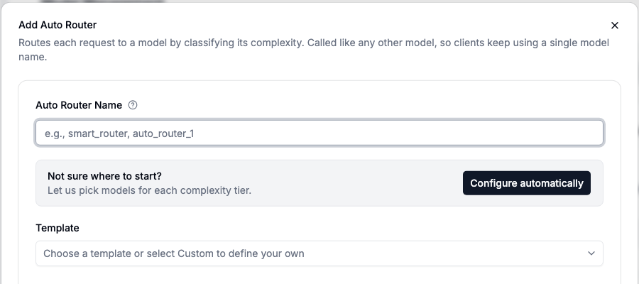

Heuristic v1 scores seven prompt signals, including reasoning language, code, technical terms, and prompt length. You can tune those signals for the traffic your router serves.

{/* truncate */}

:::info[🚀 Help shape the Auto-Router]

Test heuristic tuning on your production traffic with the LiteLLM team and influence the roadmap.

<a className="button button--primary button--lg" style={{background: '#2e8555', borderColor: '#2e8555', color: '#fff'}} href="https://calendar.app.google/i2e7qVEJphHi5S8UA">Apply to Become a Design Partner</a>

<br /><br />

Share benchmark results in [discussion #32168](https://github.com/BerriAI/litellm/discussions/32168).

:::

We tested that idea on a balanced 240-prompt mix:

| Configuration | Accuracy | Cost / 1K prompts | Estimated cost / 1K correct tasks |
| --- | ---: | ---: | ---: |
| Default Heuristic v1 | 90.8% | $2.90 | **$3.19** |
| Workload-tuned Heuristic v1 | **95.2%** | **$3.85** | **$4.04** |
| All Opus | 94.9% | $9.53 | $10.04 |

We calculate cost per 1,000 correct tasks as `cost per 1,000 prompts / accuracy`.

- The tuned configuration cut the classification error rate from **9.2% to 4.8%**, a **48% reduction**.
- That gain cost **26.6% more per correct task** than the default.
- The tuned configuration matched all-Opus accuracy at **59.7% lower cost per correct task**.
- A separate held-out search kept accuracy at **91.3%** while cutting cost per correct task by **12%**.

A useful profile depends on your traffic. Code-heavy workloads and support questions reward different routing choices.

## Tune the signals your workload uses

You can tune:

- `reasoningMarkers`, `multiStepPatterns`, and `questionComplexity` for reasoning-heavy prompts.
- `codePresence` and `technicalTerms` for code and domain-specific traffic.
- `tokenCount` and `simpleIndicators` for prompt length and low-complexity cues.
- A custom dimension for workload-specific vocabulary or structure.

For a useful comparison:

- Start with a held-out sample from your traffic.
- Keep the model ladder and test set fixed.
- Change one signal family at a time and inspect which prompts move tiers.
- Compare accuracy, cost per completed task, latency, and tier distribution.

The [shadow evaluation workflow](/docs/auto_router/evaluate) tests a candidate on sampled production traffic without changing the response your user receives.

## See classifier overhead per 1,000 turns

An LLM classifier adds one model call before the routed request. You can now track that overhead:

- AutoRouter records the charge as `classifier_cost`.
- The `x-litellm-classifier-cost` header covers Chat Completions, Responses, and Messages APIs.
- Our 5,600-call classifier-context benchmark topped out at **$0.61 per 1,000 requests**.
- The Auto-Router Usage tab shows classifier cost next to routed spend, estimated savings, sessions, and turns.

## Start from current models

The family presets now use current reasoning models:

- Anthropic Family sends reasoning traffic to **Claude Fable 5.1 at high effort**.
- OpenAI Family sends reasoning traffic to **GPT-6 Astra at xhigh effort**.
- Presets match the provider model behind each deployment, so deployment names do not need to match the catalog.
- **Configure automatically** checks the models your proxy serves, fills the tier configuration, and opens it for review.



## More controls for agent traffic

Recent AutoRouter changes also cover long-running agent sessions:

- **A `NON_REASONING` tier below Simple** handles tool-result relays, acknowledgements, and reformatting work.
- **Output limits from the selected tier** replace a caller's cap with the chosen model's output ceiling. An explicit per-tier cap still wins.
- **Classifier timeout protection** opens a circuit breaker after a timeout and uses the configured fallback during the cooldown.
- **Cross-provider tool history** lets the Messages API replay `tool_use` history when a session moves between OpenAI and Anthropic tiers.

## Try the AutoRouter

:::info

Open **Add Model → Auto Router** and select **Configure automatically**. Review the generated tiers, then test them against your traffic. Share results in [discussion #32168](https://github.com/BerriAI/litellm/discussions/32168), or [apply to be a design partner](https://calendar.app.google/i2e7qVEJphHi5S8UA) to work with the LiteLLM team.

:::

You can also start with a file-based config:

```yaml title="config.yaml"
model_list:
  - model_name: claude-haiku-4-5
    litellm_params:
      model: anthropic/claude-haiku-4-5
      api_key: os.environ/ANTHROPIC_API_KEY

  - model_name: claude-sonnet-5
    litellm_params:
      model: anthropic/claude-sonnet-5
      api_key: os.environ/ANTHROPIC_API_KEY

  - model_name: claude-fable-5-1-high
    litellm_params:
      model: anthropic/claude-fable-5-1
      api_key: os.environ/ANTHROPIC_API_KEY
      reasoning_effort: high

  - model_name: smart-router
    litellm_params:
      model: auto_router/complexity_router
      complexity_router_config:
        classifier_type: heuristic
        tiers:
          SIMPLE: claude-haiku-4-5
          MEDIUM: claude-sonnet-5
          COMPLEX: claude-fable-5-1-high
          REASONING: claude-fable-5-1-high
      complexity_router_default_model: claude-sonnet-5
```

Full reference on the [Auto Routing docs page](/docs/proxy/auto_routing).
