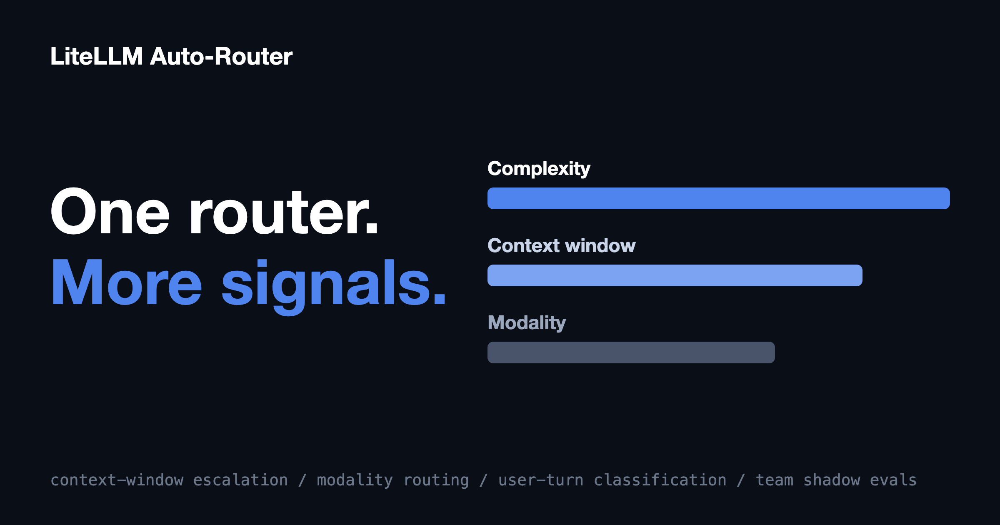

The Auto-Router picks a model by asking how hard the request is. This release adds the questions that come right after: does the request fit the model we picked, and can that model even see it?

{/* truncate */}

:::info[🚀 Help shape the Auto-Router]

Get early access, work directly with the LiteLLM team, and influence the roadmap with your production traffic.

<a className="button button--primary button--lg" style={{background: '#2e8555', borderColor: '#2e8555', color: '#fff'}} href="https://calendar.app.google/i2e7qVEJphHi5S8UA">Apply to Become a Design Partner</a>

<br /><br />

Already testing it? Share your results in [discussion #32168](https://github.com/BerriAI/litellm/discussions/32168).

:::

Complexity tiers don't predict routability. A trivially simple question asked 300k tokens into a coding session still can't go to a small model, and a "what's in this screenshot?" request can't go to a text-only model no matter how easy the question is. The router now checks for both before dispatch, and shadow evaluations let you prove any of these configurations on a team's live traffic before rolling it out.

## One router, more routing signals

| Routing signal | What it does | Config key | Default |
| --- | --- | --- | --- |
| **Complexity** | Classifies the request and picks a tier | `tiers` | core behavior |
| **Context size** | Escalates prompts that provably don't fit the decided tier | `enable_context_window_escalation` | **on** |
| **Modality** | Routes image-bearing requests to vision-capable tiers | `modality_routing` | off, opt-in |
| **Turn type** | Classifies new user asks only, skipping continuation turns | `classification_mode: user_turn` | `every_request` |

Every gate reports what it did. Escalated decisions carry `context_escalated` or `modality_escalation` plus the tier the classifier originally picked, so nothing the router does is invisible.

## Context-window based routing

The market-standard answer to "the prompt didn't fit" is reactive: send the request, catch the context-length 400, retry on a bigger model. You pay for the failed call, you pay the latency, and in a long session you pay it again on every turn. When we surveyed how routing products handle this, reactive fallback was the norm; we didn't find one that filters candidates by token count before dispatch.

The Auto-Router now does it pre-dispatch. After classification, it estimates the full prompt footprint, including system prompts and tool definitions; for coding agents like Claude Code those carry most of the payload, so estimating from the message list alone would undercount exactly the traffic this exists for. If the decided tier provably can't hold the prompt, the router prefers a fitting model group in-tier, then escalates to the lowest tier that provably fits, so you never pay for more model than the prompt requires. Models with unknown context windows are left alone; the gate acts only when it can prove a mismatch. Escalated decisions are never session-pinned, so when the session shrinks back down (after compaction, or a fresh conversation) routing comes back down with it.

Context-window escalation ships enabled, with a safety buffer (`context_window_escalation_buffer: 0.95`) so prompts near the limit escalate instead of gambling.

## Modality-based routing

If your cheap tier is text-only and a request carries an image, the old outcome was a provider-side error after the request had already left the gateway. With `modality_routing: true`, the router detects images anywhere in the request: OpenAI `image_url` and `input_image` parts, Anthropic `image` blocks, and images nested inside tool results, which is the shape real agent screenshots actually arrive in. It then walks up from the decided tier to the nearest tier whose models support vision. If no configured tier can see, you get a clear 400 from the gateway instead of a confusing provider error.

Capability comes from the model registry, and only models explicitly marked as lacking vision are excluded; unknown models stay eligible. The gate is opt-in and off by default.

## Classify when it matters

Agentic sessions fire many requests per conversation, and most of them (tool results, follow-ups, retries) aren't new questions. With `classification_mode: user_turn`, the classifier runs only when the newest message is an actual new user ask, and the standing decision carries the continuation turns. Fewer classifier calls, less routing overhead, and steadier model selection mid-task.

## Shadow-evaluate it on a team, before anyone notices

[Shadow evaluations](/blog/auto-router-shadow-evaluations) already let you test the Auto-Router against a key's live traffic without changing a single user-facing response. They picked up two upgrades.

Evaluation targets are now `key | team | user`. If your traffic authenticates with JWTs there is no virtual key to point at, so team and user targeting makes that traffic evaluable for the first time.

A single shadow-eval job can also compare several Auto-Router configurations at once, against the same sampled traffic. Sampling is paired, meaning every config sees the identical request, so quality and cost differences are attributable to the config rather than traffic luck.

That closes the loop on everything above: draft a config with the new gates on, shadow it against your current router on a real team's traffic, read the paired comparison, promote the winner.

## Turning it on

```yaml
model_list:
  - model_name: gpt-4o-mini
    litellm_params: {model: openai/gpt-4o-mini, api_key: os.environ/OPENAI_API_KEY}
  - model_name: gpt-4o
    litellm_params: {model: openai/gpt-4o, api_key: os.environ/OPENAI_API_KEY}
  - model_name: claude-sonnet-5
    litellm_params: {model: anthropic/claude-sonnet-5, api_key: os.environ/ANTHROPIC_API_KEY}
  - model_name: gpt-5.5
    litellm_params: {model: openai/gpt-5.5, api_key: os.environ/OPENAI_API_KEY}

  - model_name: smart-router
    litellm_params:
      model: auto_router/complexity_router
      complexity_router_config:
        tiers:
          SIMPLE:    gpt-4o-mini
          MEDIUM:    gpt-4o
          COMPLEX:   claude-sonnet-5
          REASONING: gpt-5.5

        # on by default: escalate prompts that provably don't fit
        enable_context_window_escalation: true
        context_window_escalation_buffer: 0.95

        # opt-in: route image requests to vision-capable tiers
        modality_routing: true

        # classify new user asks, carry the decision through continuation turns
        classification_mode: user_turn
      complexity_router_default_model: gpt-4o
```

Context-window escalation is already on; long sessions just stop failing. Modality routing is one line. Both show up in the routing decision, so you can watch exactly when and why each gate fired.

:::info[Try it on your traffic]

Point a shadow-eval job at your busiest team, compare your current config against one with the new gates on, and tell us what you see in [discussion #32168](https://github.com/BerriAI/litellm/discussions/32168), or

<a className="button button--primary button--lg" style={{background: '#2e8555', borderColor: '#2e8555', color: '#fff'}} href="https://calendar.app.google/i2e7qVEJphHi5S8UA">Apply to Become a Design Partner</a>

:::
