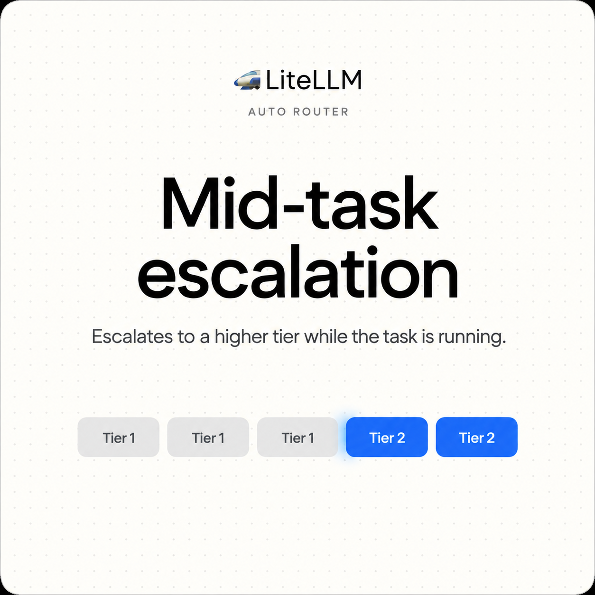
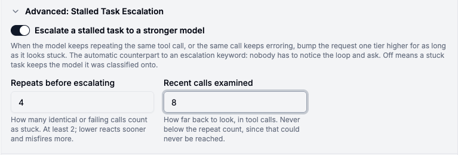

{/* truncate */}

:::info[🚀 Help shape the Auto-Router]

Get early access, work directly with the LiteLLM team, and influence the roadmap with your production traffic.

<a className="button button--primary button--lg" style={{background: '#2e8555', borderColor: '#2e8555', color: '#fff'}} href="https://calendar.app.google/i2e7qVEJphHi5S8UA">Apply to Become a Design Partner</a>

<br /><br />

Already testing it? Share your results in [discussion #32168](https://github.com/BerriAI/litellm/discussions/32168).

:::

The Auto-Router routes on the newest turn. That works until an agentic task gets stuck: a cheap model calls the same tool with the same arguments three times in a row, or the same call keeps erroring, and the newest turn in that history is still something as harmless-looking as "can you try a different approach?" Read on its own, that turn classifies SIMPLE every time, so the router sends it right back to the model that was already failing. The only way out was a person watching the loop and typing an escalation keyword.

`stall_escalation_enabled: true` gives the router that judgment on its own. It reads the assistant's own recent tool calls, not the human's messages, and bumps the request one tier higher for as long as the task looks stuck, the automatic counterpart to `escalation_keywords`.

## How it decides

A task counts as stalled when the newest tool call is still part of a stuck pattern: it repeats, or it errored, at least `stall_escalation_repeat_threshold` times across the last `stall_escalation_window` calls. Anchoring on the newest call, rather than counting whichever pattern is most common in the window, is what keeps a recovered task from being escalated on stale evidence. A model that tried the same command three times and then found a different path still has those three calls sitting in the window for a few more turns; counting them alone would escalate a request that is already making progress again. The matches don't have to be back to back either, so a retry loop broken up by one unrelated lookup still counts.

Detection reads both tool-call shapes: Anthropic Messages `tool_use`/`tool_result` blocks, including `is_error`, and chat-completions `tool_calls`/`tool` messages, which carry no standard error flag, so those calls are judged on repetition alone. There's no state to expire or leak. Detection reruns on every classified turn from that request's own message list, so the bump lasts only as long as the recent tool calls still look stuck and lifts on its own the moment they don't.

Escalation records `stall_escalation` in `routing_decision.signals`, so it shows up in spend logs like every other routing decision.

## In the dashboard

Auto-Routers get an "Advanced: Stalled Task Escalation" section with the toggle and both knobs:



`stall_escalation_enabled` cannot be combined with `session_affinity` or `classification_mode: user_turn`. Both replay a held routing decision on most turns instead of classifying, so detection would never see the tool calls it needs to look at, and the dashboard toggle greys out with that explanation rather than letting you save a config the backend would reject.

## Turning it on

```yaml
model_list:
  - model_name: gpt-4o-mini
    litellm_params: {model: openai/gpt-4o-mini, api_key: os.environ/OPENAI_API_KEY}
  - model_name: gpt-4o
    litellm_params: {model: openai/gpt-4o, api_key: os.environ/OPENAI_API_KEY}

  - model_name: smart-router
    litellm_params:
      model: auto_router/complexity_router
      complexity_router_config:
        tiers:
          SIMPLE: gpt-4o-mini
          MEDIUM: gpt-4o

        # off by default: bump a stuck task one tier higher
        stall_escalation_enabled: true
        stall_escalation_window: 6
        stall_escalation_repeat_threshold: 3
```

:::info[Try it on your traffic]

Point a shadow-eval job at your busiest team, compare your current config against one with stall escalation on, and tell us what you see in [discussion #32168](https://github.com/BerriAI/litellm/discussions/32168), or

<a className="button button--primary button--lg" style={{background: '#2e8555', borderColor: '#2e8555', color: '#fff'}} href="https://calendar.app.google/i2e7qVEJphHi5S8UA">Apply to Become a Design Partner</a>

:::
