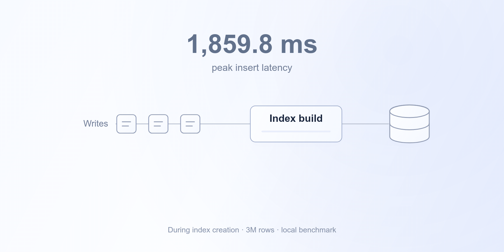

Adding an index should make your database faster. During LiteLLM upgrades, ours was blocking spend-log writes.

This week, we changed how those indexes are built. In a local upgrade benchmark with **3 million spend-log rows**, the slowest observed insert dropped from **1,859.8 ms to 19 ms**: a **99% reduction**.

{/* truncate */}

## Why an index was blocking writes

An upgrade migration ran `CREATE INDEX` on the spend-log table. PostgreSQL blocked new writes while it built the index. With millions of rows, that meant new spend logs had to wait.

Switching to `CREATE INDEX CONCURRENTLY` alone did not solve it for partitioned databases. PostgreSQL does not support that statement on a partitioned parent, so the migration failed and could keep upgraded pods from starting.

## Build indexes while writes continue

We moved these index builds out of schema migrations and into a dedicated builder. It uses `CREATE INDEX CONCURRENTLY` for ordinary tables. For partitioned tables, it builds each partition's index concurrently, then attaches it to the parent index. Valid existing indexes are reused.

We also fixed a remaining stall on partitioned databases. Creating the parent index and attaching a partition index still need locks. A long-running transaction could leave the index operation waiting, with spend-log writes queued behind it.

Both steps now use a **200 ms lock timeout** and back off between retries. If the lock stays busy, the builder leaves the remaining work for the next build. In a separate PostgreSQL 16 test with a 10-second blocker, the slowest insert during partition attachment fell from **9.946 seconds to 197 ms**.

## How we measured the 99% reduction

The original benchmark used PostgreSQL 14.24 and the same **3-million-row, unpartitioned spend-log table** before and after, with an insert attempted every 50 ms during the upgrade. The updated run completed **382 inserts with zero errors**. A sampler checking every 100 ms observed no spend-log inserts waiting on a database lock.

The 1,859.8 ms and 19 ms figures are the slowest observed inserts during index creation in those runs.

See the changes: [concurrent index builds](https://github.com/BerriAI/litellm/pull/43948) and [bounded lock waits for partitioned databases](https://github.com/BerriAI/litellm/pull/44109).
