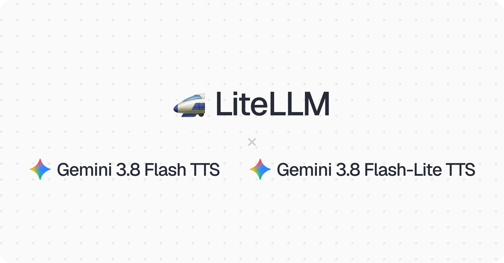

import Tabs from '@theme/Tabs';
import TabItem from '@theme/TabItem';



LiteLLM supports `gemini-3.8-flash-tts` and `gemini-3.8-flash-lite-tts` on day 0 through `/v1/audio/speech`, on Google AI Studio (`gemini/`). Both are generally available and replace the 3.1 Flash TTS preview.

{/* truncate */}

[Per Google](https://blog.google/innovation-and-ai/models-and-research/gemini-models/gemini-3-8-text-to-speech/), Flash TTS is built for creative work like games, audiobooks and podcasts, and Flash-Lite TTS is the cheaper tier for high-volume dubbing and voice agents. Both draw on more than 2,000 prebuilt voices, and Flash TTS covers 130 languages with automatic detection.

:::note
**No Docker image upgrade needed.** Both models route through LiteLLM's existing Gemini speech path, so any recent version works for inference. For cost tracking, hit the **Reload Model Cost Map** button in the Admin UI (or `POST /reload/model_cost_map`) to pull pricing from [PR #42752](https://github.com/BerriAI/litellm/pull/42752), on `v1.76.0` and above.
:::

## Launch pricing

Both models launch at promotional pricing through December 31, 2026, and Google's standard pricing applies from January 1, 2027. LiteLLM tracks cost at the launch rate.

Flash TTS is $0.50 per 1M text input tokens and $9.00 per 1M audio output tokens, and Flash-Lite TTS is $0.50 and $6.00. Batch and Flex run at half these rates and Priority at 1.8x. For comparison, the 3.1 Flash TTS preview was $1.00 in and $20.00 out.

## Quick Start

<Tabs>
<TabItem value="sdk" label="SDK">

```python
import litellm

response = litellm.speech(
    model="gemini/gemini-3.8-flash-tts",
    input="Welcome back. Your order shipped this morning.",
    voice="Kore",
)

response.stream_to_file("welcome.wav")
```

</TabItem>

<TabItem value="proxy" label="PROXY">

**1. Setup config.yaml**

```yaml
model_list:
  - model_name: gemini-3.8-flash-tts
    litellm_params:
      model: gemini/gemini-3.8-flash-tts
      api_key: os.environ/GEMINI_API_KEY
  - model_name: gemini-3.8-flash-lite-tts
    litellm_params:
      model: gemini/gemini-3.8-flash-lite-tts
      api_key: os.environ/GEMINI_API_KEY
```

**2. Start the proxy**

```bash
litellm --config /path/to/config.yaml
```

**3. Test it**

```bash
curl http://0.0.0.0:4000/v1/audio/speech \
  -H "Authorization: Bearer $LITELLM_KEY" \
  -H "Content-Type: application/json" \
  -d '{
    "model": "gemini-3.8-flash-tts",
    "input": "Welcome back. Your order shipped this morning.",
    "voice": "Kore"
  }' \
  --output welcome.wav
```

</TabItem>
</Tabs>

## Notes

Input is capped at 8,192 tokens per request and output at 16,384, so split long scripts such as audiobook chapters across calls. Pass a prebuilt voice by name in `voice`; see Google's [speech generation guide](https://ai.google.dev/gemini-api/docs/speech-generation) for the list.

## Feedback

Running Gemini 3.8 TTS through LiteLLM and hitting something unexpected? Share it on [GitHub discussion #42776](https://github.com/BerriAI/litellm/discussions/42776).
