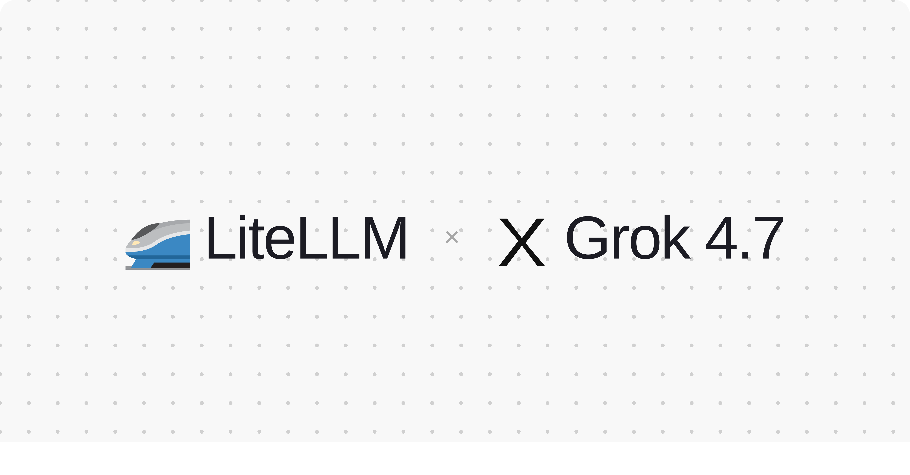

import Tabs from '@theme/Tabs';
import TabItem from '@theme/TabItem';



LiteLLM supports `grok-4.7` on day 0 through the xAI provider, on both `/chat/completions` and `/responses`. Tool calling, structured outputs, image input, prompt caching and `reasoning_effort` all work as they do for Grok 4.6, so an existing config only needs the model id swapped.

{/* truncate */}

xAI calls Grok 4.7 its flagship model for code and everything else: agentic tool calling, minimal hallucinations and configurable reasoning. It has a 500K-token context window, takes text and image input, and supports `low`, `medium`, `high` (default) and `xhigh` reasoning effort.

## Pricing

Per 1M tokens: $2.00 input, $0.50 cached input, $6.00 output, matching Grok 4.6. Past 200K input tokens every rate doubles ($4.00, $1.00 and $12.00). Pricing lands in [PR #42264](https://github.com/BerriAI/litellm/pull/42264); without it requests route fine but log $0 spend. Hit **Reload Model Cost Map** in the Admin UI, or `POST /reload/model_cost_map`, to pick it up without a redeploy on `v1.76.0` and above.

## Usage

<Tabs>
<TabItem value="sdk" label="SDK">

```python
from litellm import completion

response = completion(
    model="xai/grok-4.7",
    messages=[{"role": "user", "content": "What is the weather in Paris? Use the tool."}],
    tools=[{
        "type": "function",
        "function": {
            "name": "get_weather",
            "parameters": {"type": "object", "properties": {"city": {"type": "string"}}, "required": ["city"]},
        },
    }],
    reasoning_effort="xhigh",  # low | medium | high (default) | xhigh
)

print(response.choices[0].message.tool_calls)
```

</TabItem>
<TabItem value="proxy" label="Proxy">

```yaml
model_list:
  - model_name: grok-4.7
    litellm_params:
      model: xai/grok-4.7
      api_key: os.environ/XAI_API_KEY
```

```bash
curl -X POST "http://0.0.0.0:4000/chat/completions" \
  -H "Content-Type: application/json" \
  -H "Authorization: Bearer $LITELLM_KEY" \
  -d '{
    "model": "grok-4.7",
    "messages": [{"role": "user", "content": "what llm are you"}],
    "reasoning_effort": "high"
  }'
```

The same deployment serves `/v1/responses`:

```bash
curl -X POST "http://0.0.0.0:4000/v1/responses" \
  -H "Content-Type: application/json" \
  -H "Authorization: Bearer $LITELLM_KEY" \
  -d '{"model": "grok-4.7", "input": "what llm are you"}'
```

</TabItem>
</Tabs>

Reasoning tokens come back in `usage.completion_tokens_details.reasoning_tokens` and cache hits in `usage.prompt_tokens_details.cached_tokens`, and both are priced into the spend LiteLLM logs. Full provider reference on the [xAI docs page](/docs/providers/xai).

## Feedback

Running Grok 4.7 through LiteLLM and hitting something unexpected? Open an issue on [GitHub](https://github.com/BerriAI/litellm/issues).
