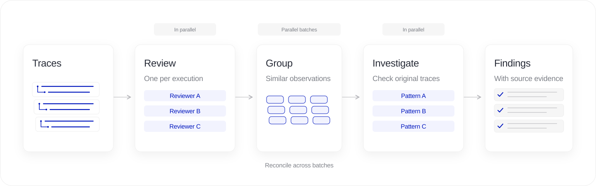
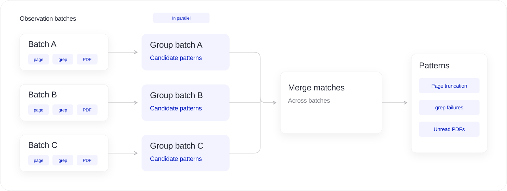
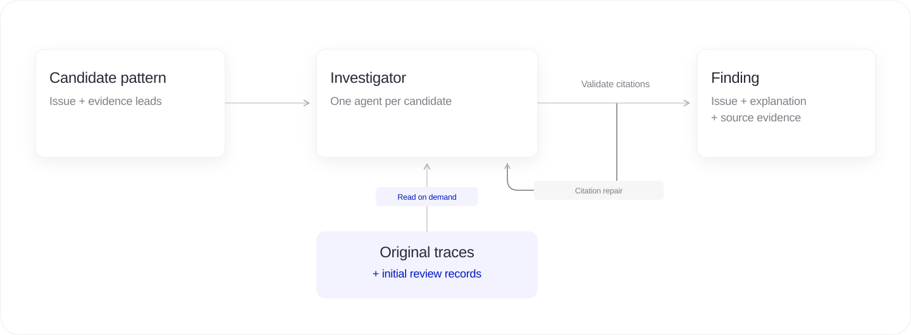

import LensHero from './LensHero';

export const Hero = LensHero;

Consider a research agent that reads web pages and writes reports. Its web tool cuts each page to 8,000 characters. The agent misses details further down the page, then makes claims that its sources do not support. It finishes the task without an error.

You could find this by reading the tool results and checking the report. Across thousands of runs, you need to find the affected sessions, separate them from healthy ones, and work out what they have in common.

We built [LiteLLM Lens](/blog/litellm-lens-launch) to do that work. Lens uses agents to review recorded executions in parallel, group related observations, and investigate each candidate pattern against the original traces.

{/* truncate */}



## Start with the task and the recorded evidence

You choose which activity to investigate and describe what your agent should do. You can add checks such as “Find claims that the retrieved sources do not support” or “Find repeated tool failures, including ones the agent recovers from.” Lens also checks for supported problems outside those specific questions.

An execution can include model calls, tool inputs and outputs, and recorded subagent work. Lens keeps the parent and child relationships so reviewers can follow a handoff through the trace. A child agent might fail, recover, or return a result that the parent uses in its final answer.

An agent can finish a task after repeated failed tool calls. Missing parts of a recording do not prove that the agent failed.

## Phase 1: Review each execution

We assign one reviewer to each selected execution and run reviewers in parallel, up to the configured concurrency.


The reviewer starts with the task, investigation checks, and execution metadata. It opens the trace through tools as it works. It can inspect other selected executions if it needs more context.

For the research example, the reviewer might notice a page that ends mid-sentence, then find a claim in the final answer that the returned text does not support. It records both observations with source quotes and span IDs. It can leave the cause open for further investigation.

We ask reviewers to assess the process as well as the outcome. An agent that retries an incompatible `grep` tool five times, then succeeds through a terminal, has recovered. You may still want to fix those five failed attempts. The reviewer should preserve that evidence for comparison with other runs.

## Reviewers can use Python

A long trace does not need to fit into a single model prompt. We give reviewers a workspace they can inspect with tools.


The catalog lists executions and spans. Read opens source text, with optional span and character ranges. Search finds matching text. Python lets the reviewer write code for questions that need computation: count repeated errors, measure tool responses, or follow a set of parent and child spans.

For example, a reviewer can select an execution and ask Python to print the length and last 120 characters of each tool record:

```python
for session in data["sessions"]:
    for part in session["parts"]:
        if part["kind"] == "tool":
            content = part["content"]
            print(part["span_id"], len(content), content[-120:])
```

The worker loads the selected evidence into `data`. The model receives the program's output and execution status. The source records stay outside the conversation until the reviewer asks to read them. The example measures the recorded text, which can include formatting around the tool response. A reviewer must inspect that format before treating the length as a page-size limit.

We run Python in a confined process with resource limits and temporary storage. It has the standard library, with no network access or permission to launch other processes. Reviewers can use it from the first phase, before we have a candidate pattern.

Python helps locate and compare evidence. The reviewer must still cite the original trace. For long investigations, agents can replace their active conversation with working notes and retrieve earlier tool results from the saved history. The original evidence remains available after compaction.

## Phase 2: Group related observations

After the reviews, we group observations in parallel batches. We then reconcile matching candidates across batches.



We group by the check and the suspected cause. A PDF task can fail because the agent has no PDF tool, or because an available renderer returns an error. Those problems need different fixes.

For the research example, several reviewers might report abrupt page endings and unsupported claims. We collect the related observations into a candidate about missing source content. We keep the supporting execution references so the next agent can check the originals.

We treat these groups as hypotheses until an investigator checks the evidence.

## Phase 3: Investigate the candidate

We assign an investigator to each candidate and run these agents in parallel. Each investigator can read the original traces and the initial review records, with the same read, search, and Python tools.



The investigator checks the proposed explanation against supporting examples and counterexamples. In the research case, it can compare affected page responses, inspect where the text ends, and check what the final answers claim. It can also examine runs where the agent acknowledged missing information or obtained the rest of the source.

The finding should say how much the evidence establishes. Repeated 8,000-character responses can support a truncation hypothesis. Establishing that truncation caused a particular false claim needs more evidence. For problems you did not ask about, we require strong evidence of a deviation and its consequence. For a requested hypothesis, the agent can give a plausible explanation and state what would confirm it.

An investigator can return no finding if the candidate does not hold up. Before accepting a finding, Lens checks its execution and span references and verifies that its quotes occur in the cited source. An invalid citation returns feedback to the agent for repair.

These checks catch invented references and altered quotes. They do not prove that the agent's interpretation is correct.

## What we tested

We built a golden dataset with 25 investigations, 3,752 sessions, and 99,797 spans. The largest investigation contains 2,048 sessions. We included nested agents, long tool results, healthy controls, and failures followed by recovery. These are controlled test cases, not customer traffic.

One case contains 24 sessions about producing a PDF attachment. Three lack the capability to create or attach the PDF. In two others, the available renderer fails. The remaining sessions serve as controls. In a development run with read, search, and Python, our model-based evaluator matched both expected issue groups. It marked three other issue cards as supported. We scored those apart from the expected answers and tracked duplicate findings as a separate quality measure.

We also ran the worker on a real coding-agent session with 350 spans. The reviewer and investigators made five Python calls, all of which completed. They used code to inspect tool results and find validation commands. Lens reported three issues and one useful behavior pattern. We checked all 33 citations against the source.

One finding concerned shell commands that piped test and lint output through `tail`. The agent reported the pipeline's zero exit status even when the underlying check had failed. Lens identified the command-composition problem and noted later passing checks. It did not claim that those earlier failures remained in the delivered code.

The tests also showed the cost of broad reads. In that coding session, a search returned more than 544,000 characters. On-demand access gives the agent control over what it reads, but the agent can still request too much. We inspect tool use, finding support, and missed issues when we compare versions. A valid quote or a completed run is not enough to judge quality.

## Read the findings and follow the evidence

You can watch the investigation progress in Lens as reviewers finish and investigators check candidates. A finding includes the problem, its consequence, suggested next steps, and links to supporting runs. You can open the cited step to check the input and output yourself.

The linked-run count reflects the supporting runs Lens cites. It is not an estimate of the failure rate across all your traffic. You can mark a finding as expected behavior, add feedback, or resolve it after a fix.


The worker runs on your infrastructure. It polls LiteLLM for jobs and uses the gateway for evidence and model calls. ClickHouse stores trace data, and Postgres stores investigation state. You choose the analysis model through LiteLLM. The [investigation pipeline](https://github.com/BerriAI/litellm/blob/main/litellm/proxy/lens/context_pipeline.py) and its tools are open source.

To try it on your agent, [connect a worker and create an investigation](/docs/proxy/lens/investigations). Start with a task you understand and a specific check, then use the linked evidence to decide what to change.
