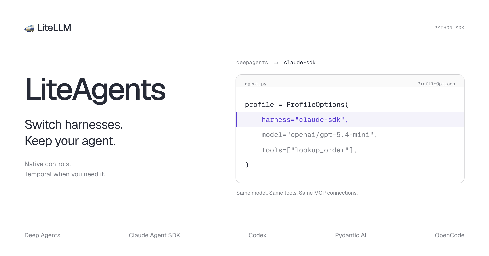

You've built an agent with your own tools, prompts, and model configuration. Now you want to try a different harness on the same task.

**LiteAgents lets you switch agent harnesses without rewriting your application.** Its interface is modeled after the Claude Agent SDK, including the `query()` pattern and typed messages. Choose Deep Agents, Pydantic AI, Claude Agent SDK, Codex, or OpenCode while keeping your tools, MCP connections, model configuration, and client code. Each selected harness runs its own agent loop.

LiteLLM gives you a common interface to models. LiteAgents brings that approach to agent harnesses, with native controls and optional durability through Temporal.

{/* truncate */}

## Change one field to try another harness

An agent harness runs the loop around a model: supplying context, calling tools, and deciding when to continue. Different harnesses approach that work differently. You should be able to compare them on your own tasks without rebuilding the surrounding application.

In LiteAgents, the harness is a field in your profile:

```python
import os
from liteagents import LiteAgentClient, LiteAgentOptions, ProfileOptions

profile = ProfileOptions(
    harness="deepagents",  # Try "claude-sdk", "codex", or "pydantic-ai".
    model="my-model",
    model_kwargs={
        "api_base": "https://your-gateway.example/v1",
        "api_key": os.environ["LITELLM_API_KEY"],
    },
)

options = LiteAgentOptions(profile=profile, tools=[lookup_order])
async with LiteAgentClient(options=options) as agent:
    async for message in agent.query("Check the status of order A123."):
        print(message)
```

This excerpt uses your existing `lookup_order` tool and the `LITELLM_API_KEY` environment variable. Set `model` to the alias configured on your gateway and `api_base` to its endpoint. LiteAgents sends the alias unchanged; no routing prefix is needed. Once you've installed the harness you want to try, change `harness` and run the same application.

Install only the harness integrations you plan to use. Extras such as `[deepagents]` supply that adapter's dependencies and reuse compatible packages in your Python environment. `[all]` is a convenience for trying every integration; OpenCode also needs its executable. Changing the profile selects which harness runs.

LiteAgents adapts your tools, MCP configuration, and events to each harness. Your application receives the same `AssistantMessage`, `UserMessage`, and optional streaming `TextDelta` types whichever harness you choose. LiteLLM handles model translation internally, so switching harnesses keeps the same model connection. With a gateway, the gateway routes your model alias to its provider. Without a gateway, use a LiteLLM `provider/model` name and provider credentials; LiteAgents calls that provider through the LiteLLM Python library. Profiles also load from JSON or YAML.

## Keep the harness's native controls

Each harness still runs its own agent loop. Through `harness_options`, you can use supported native settings such as Deep Agents middleware and backends or Pydantic AI tool timeouts.

Shared configuration makes switching straightforward; native options let you tune the harness you've chosen. Those options remain specific to that harness, and your model must support the settings you request. Switching selects a harness for new runs; it doesn't migrate an ongoing native session.

## Add Temporal when you need durable runs

A simple agent runs locally without Temporal or PostgreSQL. When a job needs to survive a worker restart or keep running after the client disconnects, add Temporal to the profile and run a worker. Your application keeps the same client API.

Durable runs recover recorded operations and checkpoints after worker failure. You can start locally with SQLite, then use self-hosted Temporal or Temporal Cloud. Tools that perform external actions still need idempotency if an interrupted action may be retried.

## Try it on your agent

The SDK is available as a preview. Follow the [getting-started guide](https://github.com/BerriAI/liteagents/blob/main/docs/getting-started.md), or install the package from the [latest preview release](https://github.com/BerriAI/liteagents/releases/tag/v0.3.0a2).

Start with the [harness-switching cookbook](https://github.com/BerriAI/liteagents/blob/main/cookbook/recipes/10_harness_switch.py). It runs the same model, Python tool, MCP tool, and follow-up across all six harness selectors. Add `--temporal` to try the same task with durability. The [cookbook collection](https://github.com/BerriAI/liteagents/blob/main/cookbook/recipes/README.md) also covers streaming, approvals, subagents, and worker recovery.

Try your workflow on another harness and [tell us how it goes](https://github.com/BerriAI/liteagents/issues).
