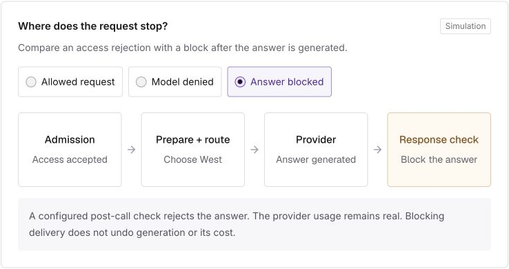

import ThemedImage from '@theme/ThemedImage';
import HeroLight from './hero.png';
import HeroDark from './hero-dark.png';

<ThemedImage
  alt="Learn the LiteLLM gateway at litellm.ai/course. Follow a request through gateway access checks, Router deployment selection, and SDK provider translation."
  sources={{
    light: typeof HeroLight === 'string' ? HeroLight : HeroLight.src.images.at(-1).path,
    dark: typeof HeroDark === 'string' ? HeroDark : HeroDark.src.images.at(-1).path,
  }}
  style={{width: '100%'}}
/>

Connecting an app to LiteLLM is a small part of running a gateway. You also need to know which models a key can call, how a deployment is chosen, what happens when it fails, and where usage is recorded.

The [LiteLLM gateway course](https://litellm.ai/course) walks through those decisions in order. It is for developers and platform teams that deploy LiteLLM, and contributors who want to understand the code before opening a pull request.

{/* truncate */}

## Start with one request

The first lessons follow a support app that sends a question to a model called `support-chat`. The gateway checks the caller's access. The Router chooses a deployment. The SDK translates the call into the provider's format.

Later lessons build on that same app. You add access rules, compare routing choices, follow retries and fallbacks, and see how costs and logs are recorded. This gives each feature a place in a request you already understand.

In [Follow one request](https://litellm.ai/course#/lesson/request-lifetime), you can switch between an allowed request, a denied model, and a blocked answer. The diagram shows where each request stops. Denying model access stops the request before the provider is called. Blocking a generated answer happens after the provider has done billable work.

These examples let you compare behavior without a running gateway or provider credentials. They illustrate the request flow; they do not send live model requests.

## Understand the deployment you run

For teams operating LiteLLM, the course connects individual settings to the system around them. Virtual keys and teams determine access. Routing and fallbacks determine where a request can go. Budgets, rate limits, and content checks place different limits on that work.

The operations lessons then explain what changes when you run more than one gateway worker. Each worker has its own memory. Redis can coordinate shared counters and caches, while PostgreSQL stores durable records. Adding workers does not increase a provider's quota.

The course also covers streaming, caching, tools, agents, and other request types. Each topic builds on the earlier lessons about requests and state. Use the [production guide](https://docs.litellm.ai/docs/proxy/prod) alongside the course when you are ready to configure your deployment.

## Find where a code change belongs

Contributors need to know which part of LiteLLM owns a behavior. A provider request in the wrong format points toward an SDK adapter. An unexpected deployment choice points toward the Router. A permission error starts with the gateway's access checks.

The lessons include **Why this exists** and **Where the code lives** sections. Open them to read the reason for a behavior and follow links to the relevant implementation, documentation, or tests.

The final chapter applies that understanding to making and reviewing a change. For example, changing a field in the dashboard can also require changes to permissions, stored data, and the settings loaded by gateway workers. The course helps you follow that path and choose what to test. The [contribution guide](https://docs.litellm.ai/docs/extras/contributing_code) covers repository setup and the pull request process.

## Take the course

The course has 83 lessons in 15 chapters. Follow the lessons in order, or use the sidebar to return to a topic. Your progress is saved in your browser. No login is required.

The current edition was reviewed on September 28, 2026, against LiteLLM 1.104.0. Code links point to the revision used for that review.

**[Start the LiteLLM gateway course →](https://litellm.ai/course)**
