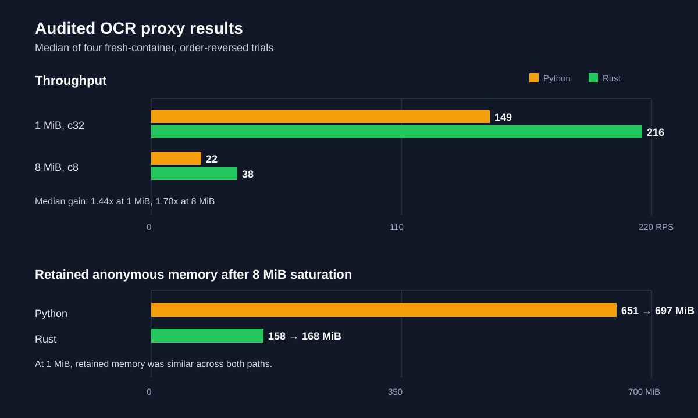

# LiteLLM OCR uses Rust by default starting with v1.102.0-rc.1

Starting with LiteLLM `v1.102.0-rc.1`, the Rust implementation is the default execution path for OCR. Existing `ocr()` and `aocr()` calls keep the same request and response contract.

{/* truncate */}

## No API migration required

Continue using the existing OCR API. This example uses the Rust path by default in `v1.102.0-rc.1` and later:

```python
from litellm import ocr

response = ocr(
    model="mistral/mistral-ocr-latest",
    document={
        "type": "document_url",
        "document_url": "https://arxiv.org/pdf/2201.04234",
    },
)

for page in response.pages:
    print(page.markdown)
```

The same default applies to asynchronous OCR calls and to OCR requests served through the LiteLLM Proxy. Provider-specific configuration, file uploads, optional OCR parameters, callbacks, logging, and response formatting continue to use the existing LiteLLM interface.

## Audited proxy results

Rust improves the OCR data path, but the first proxy benchmark was too confident. The revised results below are medians from four fresh-container trials run in both orders. Absolute RPS varied significantly, so the ratios are host-specific ranges, not production constants.



| Workload | Python | Rust | Gain |
|---|---:|---:|---:|
| 1 MiB, c32 | 149 RPS | 216 RPS | 1.44x |
| 8 MiB, c8 | 22 RPS | 38 RPS | 1.70x |

The strongest result is large-image memory. After `8 MiB` saturation, retained anonymous memory increased from `651 MiB` to `697 MiB` on Python and from `158 MiB` to `168 MiB` on Rust. At `1 MiB`, retained memory was similar, so Rust does not universally use less memory.

Fixed-arrival testing also found a capacity difference. At `8 MiB` and `30` offered RPS, Rust remained stable at `p95 32 ms`. Python reached the `2 GiB` limit, drained at `17.6 RPS`, and reached `p95 3.7 seconds`.

Default Docker logging materially affects these results. Two workers did not fit comfortably in a `2 GiB` container, and both variants reached the memory ceiling. With `100 ms` provider latency and low concurrency, the throughput difference disappeared. The mock provider and client were also confirmed to have roughly `10x` the proxy capacity.

Python and Rust returned byte-identical responses. The audit completed `29,679` proxy requests with no semantic failures.

These measurements cover the data plane only. Authentication, callbacks, database connections, observability, and multi-replica scaling need separate validation before setting production limits.

## Opt out when needed

Set `LITELLM_RUST=0` to disable the Rust path for a process:

```bash
export LITELLM_RUST=0
```

You can also opt out for the current Python process before making OCR calls:

```python
import litellm

litellm.rust(False)
```

See the [OCR API documentation](../../docs/ocr) for supported providers, SDK usage, proxy configuration, and request formats.
