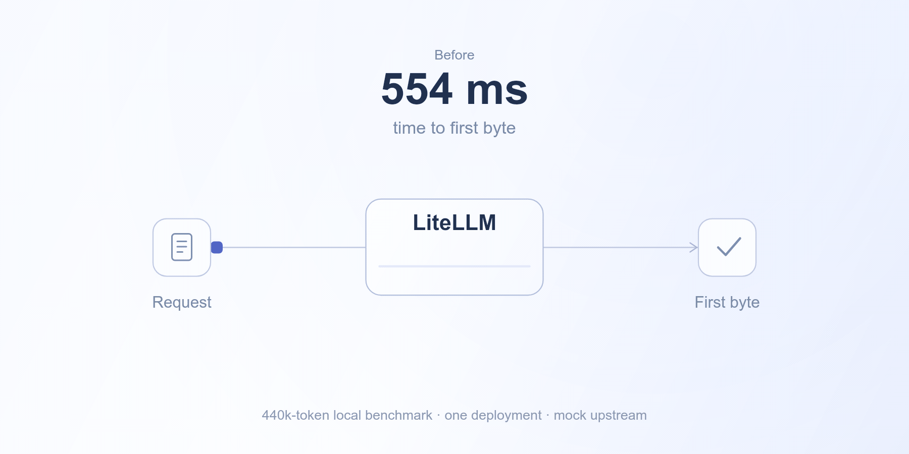

import { BenchmarkResults, MeasuredTrace, TraceExamples } from './diagrams';
import PromptLatencyHero from './PromptLatencyHero';

export const Hero = PromptLatencyHero;



LiteLLM was counting every token in a long conversation to answer a yes-or-no routing question.

Removing that unnecessary work took median time to first byte from **554 ms to 37 ms** in our local 440k-token benchmark: **93% lower**. We also improved the OpenTelemetry traces so you can see where a request spends its time.

{/* truncate */}

## Counting 440,000 tokens to check for 1,024

LiteLLM's optional `prompt_caching` routing check helps keep requests on deployments that can reuse their cached prompt. To check whether a prompt met a deployment's minimum size, often 1,024 tokens, it counted the entire conversation.

For a coding session with hundreds of turns and tool results, that could mean hundreds of milliseconds of Python work before the model call.

**We skip the check for one healthy deployment.** There is no routing choice to make, so we now skip the eligibility count, prefix hash, and cache-pin lookup entirely. This is the path measured below.

**With multiple deployments, counting stops once the answer is known.** The eligibility check stops after the first message that brings the count to the required minimum. Cache affinity and prefix hashing remain in place. Other uses of token counting, including usage accounting, are unchanged.

## 554 ms → 37 ms

The benchmark used a 439,945-token conversation with 334 turns and 18 tools, one healthy deployment, Redis response caching, and the `prompt_caching` check enabled. The test provider replied immediately, isolating request overhead from model generation time.

<BenchmarkResults />

Each result is the median of three requests after one warmup, on the same local machine. Both Rust and Python paths benefit because the removed counting work ran in Python. `/v1/responses` already bypassed this check and stayed roughly flat. Requests without the optional check are unaffected. [Full benchmark samples and setup](https://github.com/BerriAI/litellm/pull/44221).

## See where the time goes

The request's server span now records when the body arrives, JSON parsing finishes, pre-call hooks complete, and a deployment is selected. That separates a slow upload from work inside the proxy.

Here's a measured `/v1/messages` trace from the local benchmark, reconstructed from the recorded timestamps:

<MeasuredTrace />

Redis and Postgres spans are clearer too. Cache operations contain their Redis calls, and database spans name the operation and table. An in-memory auth-cache hit no longer appears as a database query.

<TraceExamples />

Every successful deployment selection also records its model group, attempt, and reason. For example, a fallback emits this event on the server span:

```json
{
  "name": "litellm.request.deployment_selected",
  "attributes": {
    "litellm.deployment.model_group": "backup",
    "litellm.deployment.reason": "fallback",
    "litellm.deployment.attempt": 1
  }
}
```

This is an illustrative event from the fallback test. Attempts count within a model-group hop, so the first selection in the backup group starts at 1. Post-response cache writes and database flushes remain linked to the request without extending its duration.

Enable [OpenTelemetry v2](https://docs.litellm.ai/docs/observability/opentelemetry_v2) with `LITELLM_OTEL_V2=true` to see these traces in your observability backend.

See the changes: [prompt-cache routing and request events](https://github.com/BerriAI/litellm/pull/44221), [real database I/O](https://github.com/BerriAI/litellm/pull/44148), [cache and Redis spans](https://github.com/BerriAI/litellm/pull/44150), and [Postgres operation names](https://github.com/BerriAI/litellm/pull/44240).
