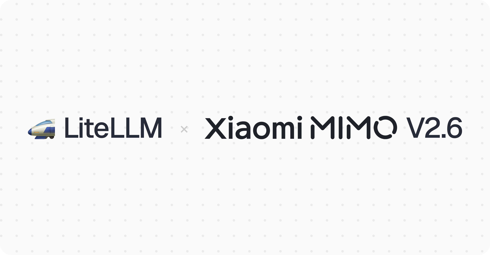

import Tabs from '@theme/Tabs';
import TabItem from '@theme/TabItem';



LiteLLM supports `mimo-v2.6-pro` and `mimo-v2.6-flash` on day 0, and prices both on Xiaomi's own endpoint for the first time.

{/* truncate */}

## Pricing

Per 1M tokens, Pro is $0.435 input and $0.87 output, Flash is $0.14 and $0.28. V2.6 costs what V2.5 cost; Xiaomi kept the rates and raised the model.

Pro reads cached input at $0.0036, about a 121st of its input rate, where most providers in the same cost map charge a tenth. Cache writes are free for now.

## Thinking is on by default

Every V2.6 model reasons unless told otherwise, and Xiaomi controls that with `thinking.type` rather than `reasoning_effort`. LiteLLM treats `xiaomi_mimo` as an OpenAI-compatible provider and does not map `thinking` for it yet, so pass it through explicitly with `allowed_openai_params=["thinking"]`.

In multi-turn tool calling, the `reasoning_content` from a prior assistant turn has to go back in the next request or the API returns a 400.

## Usage

<Tabs>
<TabItem value="sdk" label="SDK">

```python
from litellm import completion

response = completion(
    model="xiaomi_mimo/mimo-v2.6-pro",
    messages=[{"role": "user", "content": "Refactor this migration script."}],
    thinking={"type": "disabled"},          # on by default
    allowed_openai_params=["thinking"],
)

print(response.choices[0].message.content)
```

</TabItem>
<TabItem value="proxy" label="Proxy">

```yaml
model_list:
  - model_name: mimo-v2.6-pro
    litellm_params:
      model: xiaomi_mimo/mimo-v2.6-pro
      api_key: os.environ/XIAOMI_MIMO_API_KEY
      allowed_openai_params: ["thinking"]

  - model_name: mimo-v2.6-flash
    litellm_params:
      model: xiaomi_mimo/mimo-v2.6-flash
      api_key: os.environ/XIAOMI_MIMO_API_KEY
```

</TabItem>
</Tabs>

Hit **Reload Model Cost Map** in the Admin UI, or `POST /reload/model_cost_map`, to pick the rows up without a redeploy on `v1.76.0` and above.

## If you are on V2.5

Xiaomi deprecates `mimo-v2.5-pro` and `mimo-v2.5` at 10:00 Beijing time on October 21, 2026.

## Feedback

Running MiMo V2.6 through LiteLLM and hitting something unexpected? Share it on {/* TODO: link the discussion once posted */} [GitHub discussions](https://github.com/BerriAI/litellm/discussions).
