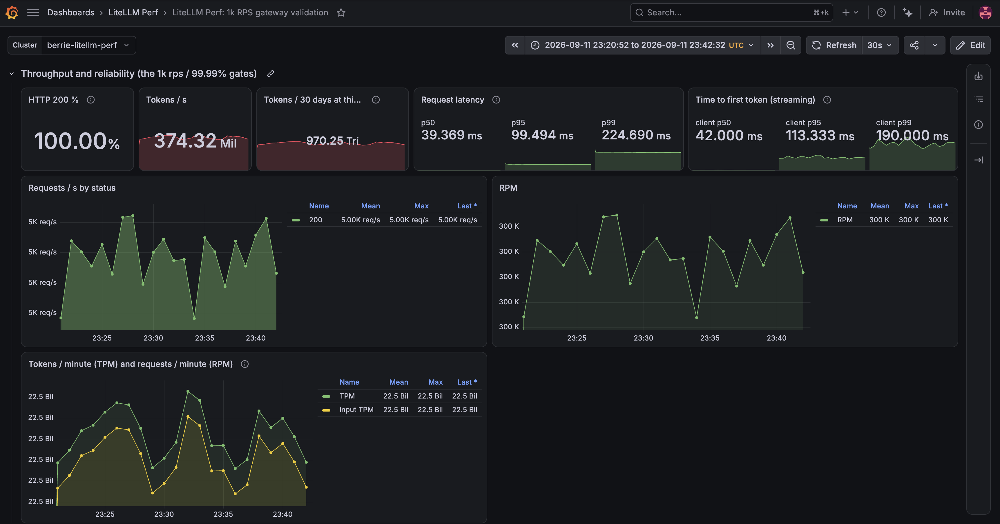
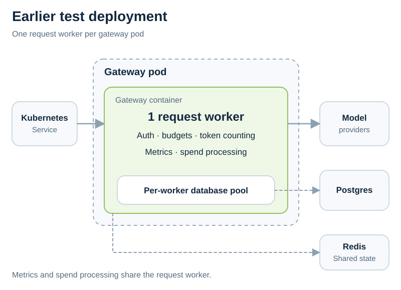
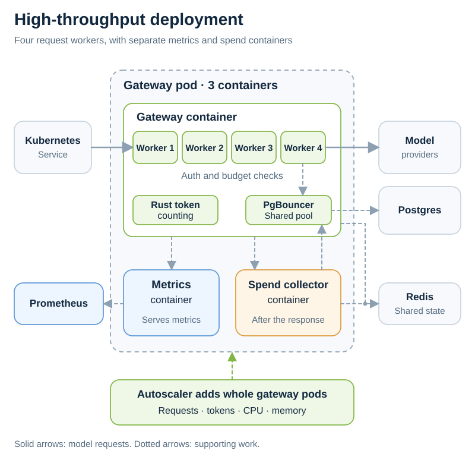

In our performance test, LiteLLM handled **5,000 requests per second** and **374 million tokens per second**. At that rate, 30 days of traffic would total **970 trillion tokens**, nearly **1 quadrillion**.

The new high-throughput deployment runs more request workers in each pod, speeds up token counting, and moves metrics and spend processing into separate containers.

{/* truncate */}

## The result

The dashboard below shows the September 11 test window, from 23:20:52 to 23:42:32 UTC.

| Metric | Dashboard result |
| --- | --- |
| Requests per second | 5,000 |
| Tokens per second | 374.32 million |
| HTTP 200 rate at the gateway | 100.00% |
| Gateway request latency, p95 | 99.49 ms |
| Gateway request latency, p99 | 224.69 ms |
| Projected tokens over 30 days | 970.25 trillion |

[View the Grafana run](https://berriai.grafana.net/d/litellm-perf-1k-rps/litellm-perf3a-1k-rps-gateway-validation?from=2026-09-11T23:20:52.577Z&to=2026-09-11T23:42:32.045Z&timezone=utc&var-cluster=berrie-litellm-perf&refresh=30s).

This test used a mock model to measure gateway capacity. The token volume is mostly input tokens from large prompts. The latency numbers exclude a real model's generation time, and the HTTP 200 rate covers requests seen by the gateway.

The monthly figure is a projection: tokens per second multiplied by the seconds in 30 days. The test did not run for a month.

## What changed in the deployment

In the earlier test deployment, each gateway pod ran one request worker. That worker also handled metrics and spend processing. Each worker opened its own database connection pool.

The high-throughput profile runs **four request workers per pod**, with separate containers for metrics and spend processing. A shared PgBouncer pool keeps database connections under control as more workers are added.

The Admin UI, management API, and database migrations also run separately from the gateway. Increasing capacity for model requests does not require scaling those components with it.

## Why it scales

**Faster token counting.** Large prompts need to be counted before budget checks can finish. The Rust path reduced counting time for a 100K-token prompt from 100 ms to 10.2 ms in a separate test.

**Less work competing with requests.** Prometheus scrapes go to the metrics container. Spend calculation and log processing run in the collector after the response. Authentication and budget checks stay in the request workers.

**Shared database connections.** The workers in a pod share one PgBouncer pool, so adding workers does not create a full database pool for each one.

**Scaling that follows traffic.** The autoscaler watches requests, tokens, CPU, and memory. It adds complete gateway pods when any of those signals calls for more capacity.

In the separate [published 3,000 RPS comparison](/docs/benchmarks#high-throughput-profile-3000-rps-with-50k-to-100k-token-prompts), this profile reached **224.61M tokens/s**, compared with **6.92M** on the earlier deployment. Both used 132 request workers: the new profile packed them into 33 pods instead of 132.

## Try the deployment

The profile is currently an **opt-in development preview in nightly builds**. Start with the [high-throughput deployment guide](/docs/proxy/high_throughput), which includes the Helm values for workers, connection pooling, sidecars, and autoscaling.

Test with your own prompt sizes, streaming traffic, and model providers before choosing production capacity.
