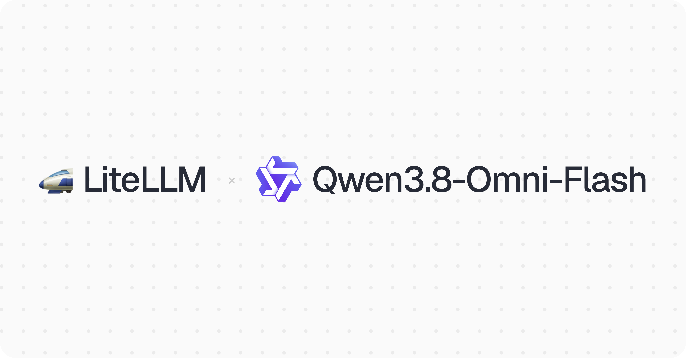

import Tabs from '@theme/Tabs';
import TabItem from '@theme/TabItem';



LiteLLM supports `qwen3.8-omni-flash` on day 0 through the DashScope provider, with text, image, audio and video input and text output. Audio and video content parts pass straight through, so an OpenAI-shaped request works as it is.

{/* truncate */}

Qwen calls it its first omni model built around agentic work. It reasons over audio and video together and calls tools across long jobs, such as editing a vlog or recapping a film. It has a 1M-token context window and 131K max output, and Qwen puts video input at about 89% cheaper than Qwen3.5-Omni-Plus.

## Pricing

Per 1M tokens, International: $0.15 input, $0.016 cached input, $0.47 output. Pricing lands in [PR #41754](https://github.com/BerriAI/litellm/pull/41754); without it requests route fine but log $0 spend. Hit **Reload Model Cost Map** in the Admin UI, or `POST /reload/model_cost_map`, to pick it up without a redeploy on `v1.76.0` and above.

## Usage

LiteLLM's DashScope provider defaults to the mainland China endpoint. On an International account, set `api_base` to `https://dashscope-intl.aliyuncs.com/compatible-mode/v1`, as below. Audio goes in as a `data:;base64,` URL rather than the bare base64 OpenAI accepts.

<Tabs>
<TabItem value="sdk" label="SDK">

```python
import base64
from litellm import completion

audio = base64.b64encode(open("clip.wav", "rb").read()).decode()

response = completion(
    model="dashscope/qwen3.8-omni-flash",
    api_base="https://dashscope-intl.aliyuncs.com/compatible-mode/v1",
    messages=[{"role": "user", "content": [
        {"type": "input_audio", "input_audio": {"data": "data:;base64," + audio, "format": "wav"}},
        {"type": "text", "text": "Summarize this clip in one sentence."},
    ]}],
)

print(response.choices[0].message.content)
```

</TabItem>
<TabItem value="proxy" label="Proxy">

```yaml
model_list:
  - model_name: qwen3.8-omni-flash
    litellm_params:
      model: dashscope/qwen3.8-omni-flash
      api_base: https://dashscope-intl.aliyuncs.com/compatible-mode/v1
      api_key: os.environ/DASHSCOPE_API_KEY
```

```bash
curl -X POST "http://0.0.0.0:4000/chat/completions" \
  -H "Content-Type: application/json" \
  -H "Authorization: Bearer $LITELLM_KEY" \
  -d '{
    "model": "qwen3.8-omni-flash",
    "messages": [{"role": "user", "content": "what llm are you"}]
  }'
```

</TabItem>
</Tabs>

## Feedback

Running Qwen3.8-Omni-Flash through LiteLLM and hitting something unexpected? Share it on [GitHub discussion #41845](https://github.com/BerriAI/litellm/discussions/41845).
