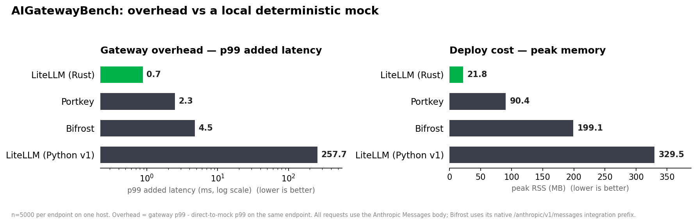
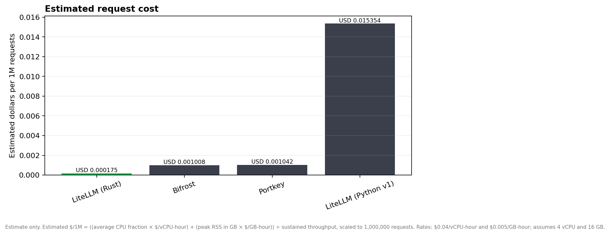
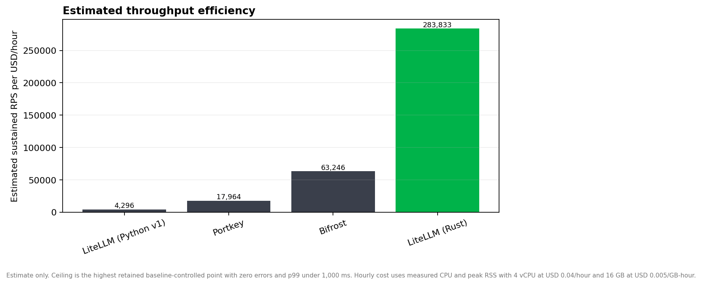
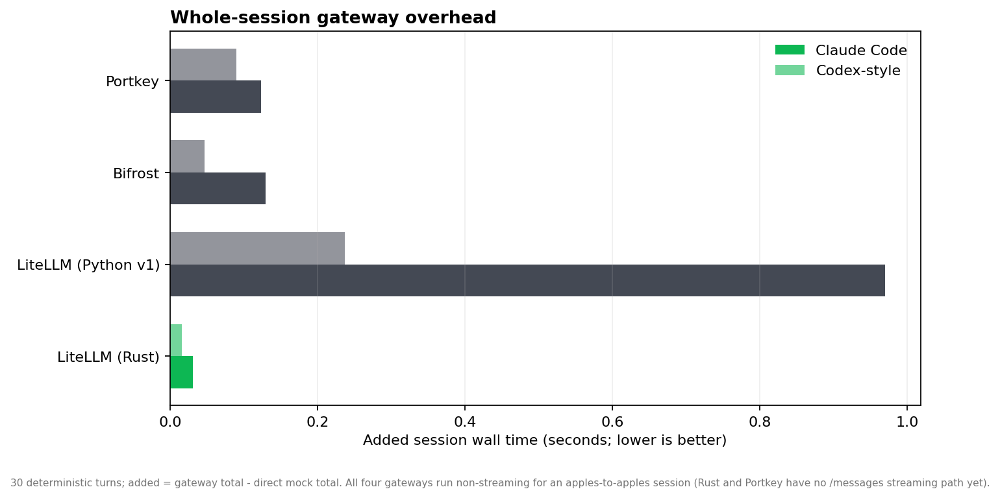
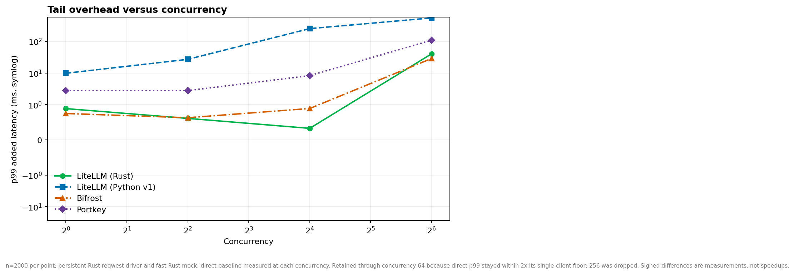
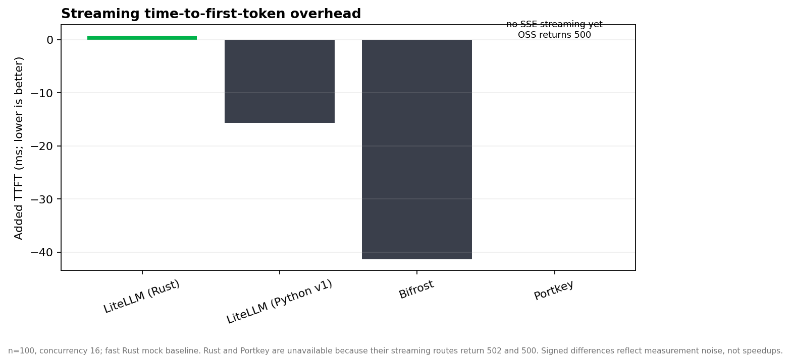

*Last Updated: July 2026*

We are launching an early beta of the LiteLLM AI Gateway in Rust, with support for the `/messages` API on Anthropic and Azure Anthropic. To measure how it compares to other gateways, we built [AIGatewayBench](https://github.com/BerriAI/ai-gateway-bench), a reproducible benchmark for gateway overhead: the latency, memory, and dollar cost a gateway adds on top of the upstream model.

The result: the Rust gateway is roughly `7x` faster on tail overhead and uses `9x` less memory than the next-closest gateway we tested, at the lowest cost per request and the highest sustained throughput per dollar. It is also the fastest across whole coding-agent sessions.

{/* truncate */}

## How the benchmark works

Every gateway points at the same local deterministic Rust mock upstream, so provider latency and network noise drop out and what remains is the gateway's own overhead:

```
overhead = latency(client -> gateway -> mock) - latency(client -> mock directly)
```

We compare four gateways on identical hardware, mock, and load driver: LiteLLM (Rust), LiteLLM (Python v1), Portkey (OSS), and Bifrost. All requests use the Anthropic Messages body. The lens is a coding agent rather than a chatbot, because an agent runs a tight loop that streams every turn, leans on tool calls, and ships large context, so a few milliseconds of gateway overhead compounds into seconds of wall-clock lag a developer feels. Everything below is generated from committed CSVs in the [results directory](https://github.com/BerriAI/ai-gateway-bench/tree/main/results); you can reproduce it yourself.

## Overhead and memory

The headline numbers are tail overhead and peak memory. On p99 added latency the Rust gateway adds about `0.7ms`, against `2.3ms` for Portkey, `4.5ms` for Bifrost, and `257.7ms` for the current LiteLLM Python proxy. On peak memory it holds around `21.8MB`, against `90.4MB` for Portkey, `199.1MB` for Bifrost, and `329.5MB` for Python. That is roughly `7x` lower tail overhead and `9x` less memory than the closest compiled-language competitor.



## Cost per request

Lower CPU and memory at higher throughput translate directly into a lower cost to run the gateway. Estimating dollars per one million requests from measured CPU, peak RSS, and sustained throughput on a standard 4 vCPU / 16 GB instance, the Rust gateway comes in at about `$0.000175` per million requests, against `$0.001008` for Bifrost, `$0.001042` for Portkey, and `$0.015354` for Python. That is roughly `6x` cheaper than the next-closest gateway and almost two orders of magnitude cheaper than the Python proxy.



The same story shows up as throughput efficiency, sustained requests per second per dollar per hour. The Rust gateway reaches about `283,833` RPS per dollar, against `63,246` for Bifrost, `17,964` for Portkey, and `4,296` for Python, so it delivers about `4.5x` more sustained throughput per dollar than the next-best gateway.



## Agentic coding workloads

For coding agents the number that matters is added wall time across a whole session, not a single request. We replay deterministic Claude Code and Codex-style control loops of 30 turns and measure the overhead each gateway adds to the full session. The Rust gateway adds about `0.03s` to a Claude Code session and `0.016s` to a Codex-style session, against `0.13s` and `0.047s` for Bifrost, `0.12s` and `0.09s` for Portkey, and `0.97s` and `0.24s` for Python. Across an agent that issues many turns per task, the Rust path stays effectively invisible while the Python proxy adds close to a full second per session.



Tail overhead also holds up as concurrency rises. Sweeping concurrency from 1 to 64 against a controlled direct baseline, the Rust and Bifrost tails stay low while the Python proxy's p99 added latency climbs into the hundreds of milliseconds. The direct baseline was retained through concurrency 64 because its p99 stayed within twice the single-client floor; concurrency 256 was dropped.



For completeness we also measured streaming time-to-first-token overhead. Here the signed differences reflect measurement noise against the fast mock rather than real speedups, and two routes are unavailable: the Rust `/messages` streaming path and Portkey OSS both return errors on streaming Anthropic Messages requests today, so they are labeled explicitly rather than scored.



## Reproduce it

Every chart above is generated from a committed CSV containing the exact plotted values, and the mock, load driver, and hardware are held identical across all four gateways. The full harness, per-gateway setup, and raw run data live in [AIGatewayBench](https://github.com/BerriAI/ai-gateway-bench). If you want to run the Rust gateway in your own stack, [sign up for the early beta](https://docs.google.com/forms/d/e/1FAIpQLSecWdOjkzjEson2UiZpDftOoZPs8RQbtlAM40KSvDXZqEgYaA/viewform?usp=dialog) and read more about the migration in [Migrating LiteLLM to Rust](/blog/litellm-rust-launch).
