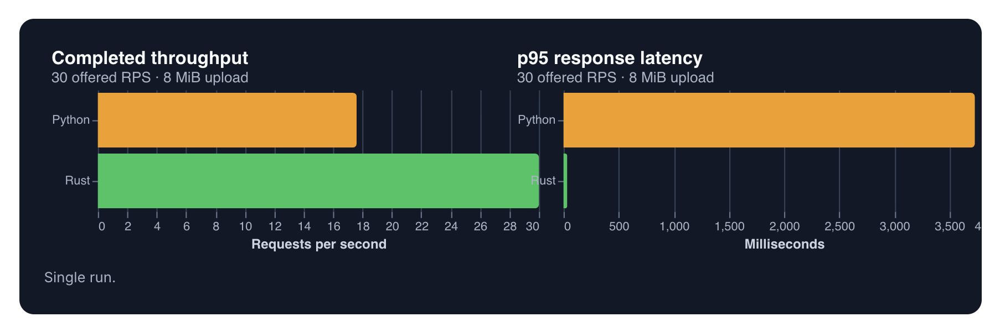
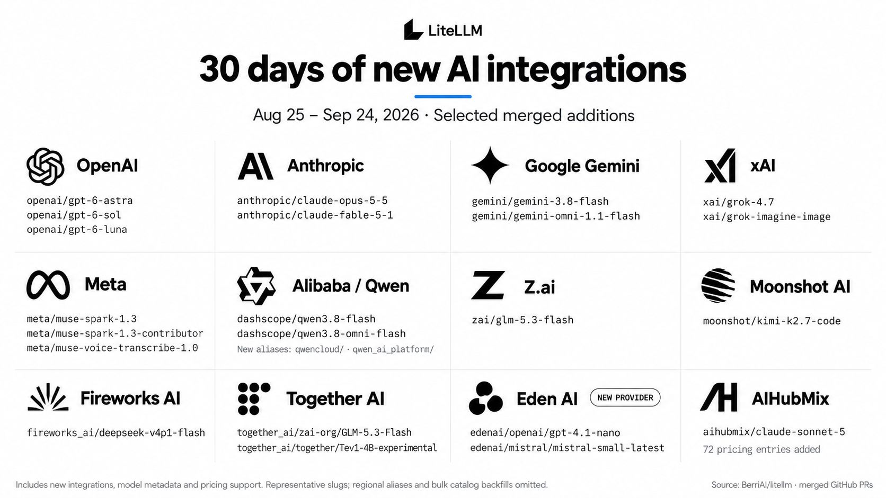
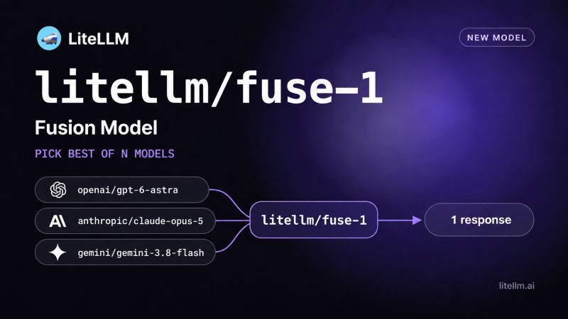
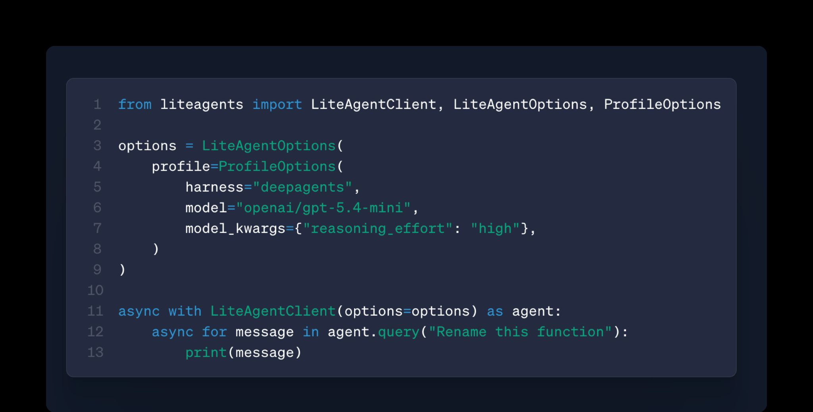

Thank you to everyone who joined our September town hall. We covered security updates, stability updates, and new features in the product, including OCR running on Rust by default and test coverage past the 80% target we set in August.

{/* truncate */}

## Security

We shipped 52 security fixes this month, broken down by category:

| Category                                    | Fixes |
| -------------------------------------------- | ----- |
| Credential / secret / PII hardening          | 27    |
| General hardening (validation, fail-closed)  | 12    |
| Quota / budget / rate-limit hardening        | 10    |
| Access control / authz hardening             | 3     |

Major work in security went into authentication:

- Configurable password policies
- Blocking passwords found in known breaches
- Enforced SSO login
- The option to disable logins that use credentials held in environment variables

**Master keys.** Wiz found 1 in 10 of the LiteLLM instances they scanned running with a blank or default master key. LiteLLM now refuses to start when the master key is unset or still at the default, so a deployment leaning on it will fail to boot on upgrade.

**A new disclosure practice, and more CVEs.**

- For anything an unauthenticated attacker can reach, we build the fix in a private fork and publish it at the same moment as the release, the backports, and the disclosure.
- We're minting more CVEs than before, mostly low and medium severity.
- The increase comes from a change in publishing policy. Our security posture hasn't changed.
- Subscribe to our [GitHub security advisories](https://github.com/BerriAI/litellm/security/advisories) to get them as they land.

Next month we're at Patch the Planet, an OpenAI and Trail of Bits initiative where security engineers spend a focused week on one project.

## Stability

In September we shipped **583 bug fixes**.

| Area                          | Fixes |
| ----------------------------- | ----- |
| Proxy Core & Resilience       | 228   |
| Providers & Model Transforms  | 94    |
| Other / SDK                   | 88    |
| UI + Auth / SSO               | 57    |
| Cost, Budgets & Observability | 43    |
| MCP Gateway                   | 39    |
| Streaming / Realtime APIs     | 34    |

The largest share went to the proxy core: scaling, resilience, and the circuit breakers that decide what happens when a dependency fails. If Redis goes down, the gateway should not.

- **Coverage.** We committed to 80% by the end of September and finished at **83.5%**, measured as the share of endpoints and user flows the suite exercises, not lines of code.
- **User flows.** Up from 402 to 521 covered, with 600 the October target.
- **Staffing.** One engineer now works only on cost and budget discrepancies, so report them as you hit them. Two more are on open source full time, aiming for fewer than 100 open issues by year end.

## Product

**221 feature commits** this month.

### OCR runs on Rust by default

Starting with `v1.102.0`, OCR runs on Rust by default. `LITELLM_RUST=0` still falls back to Python. SDK and gateway users don't need to change anything for this migration.

- On a single CPU, median throughput went from 143.6 to 211.7 RPS at 1 MiB, and from 21.6 to 36.2 RPS at 8 MiB.
- These are proxy overhead numbers, measured against a local mock provider with proxy CPU as the bottleneck. [Full methodology](https://docs.litellm.ai/blog/litellm-rust-ocr).
- `/messages` is next, shipping as opt-in.
- By December 1, we want chat completions, messages, and responses migrated and deployable as a pure Rust Axum server.
- Progress is public at [docs.litellm.ai/rust-migration](https://docs.litellm.ai/rust-migration), currently at 5%.

### New models

We added a lot of new models over the past month, across nearly every major provider.

Highlights include OpenAI's GPT-6 family, Claude Opus 5.5 and Claude Fable 5.1, Gemini 3.8 Flash and Grok 4.7, plus Eden AI as a new provider.

### Fusion

`litellm/fusion-1` sends your request to a configurable panel of models in parallel, has a judge compare the successful responses, then has that judge synthesize one answer. It works with Chat Completions, Anthropic Messages, and Responses.

It's expensive, and cost and latency both scale with panel size and the models you pick. Keep it for hard problems where quality matters more than cost. See the [fusion docs](https://docs.litellm.ai/docs/fusion) for setup.

### liteagents SDK

liteagents is a beta SDK that lets you swap between agent harnesses without rewriting your agent. Pick the harness in a `ProfileOptions` block, whether that's the Claude Agent SDK, Deep Agents or Pydantic AI, and query it through one client.

### Also shipped

- **Self-hosting.** A PgBouncer inside the container shares database connections across workers, spend writes can move to a sidecar off the request path, and Helm and Terraform can [autoscale on requests and tokens per second](https://docs.litellm.ai/docs/proxy/deploy#scale-on-requests-and-tokens-per-pod) per pod rather than only CPU.
- **MCP Gateway.** The `/mcp` route now runs [semantic search across tools](https://docs.litellm.ai/docs/mcp_tool_search) and returns only those matching the query, so we no longer trim long upstream catalogs to fit. [Tool permissions](https://docs.litellm.ai/docs/mcp_control) are enforced on listing and calling, and session tokens are RS256-signed so an external gateway can verify a token came from LiteLLM.
- **Team admin permissions.** Budget, TPM, RPM and the approved model list stay with the proxy admin while team admins self-serve keys and models. Rolling out shortly.

## We're hiring

We're hiring across the core gateway; reach us at [recruiting@berri.ai](mailto:recruiting@berri.ai), or [product@berri.ai](mailto:product@berri.ai) for product feedback.

Thank you for using LiteLLM. **The LiteLLM Team**
