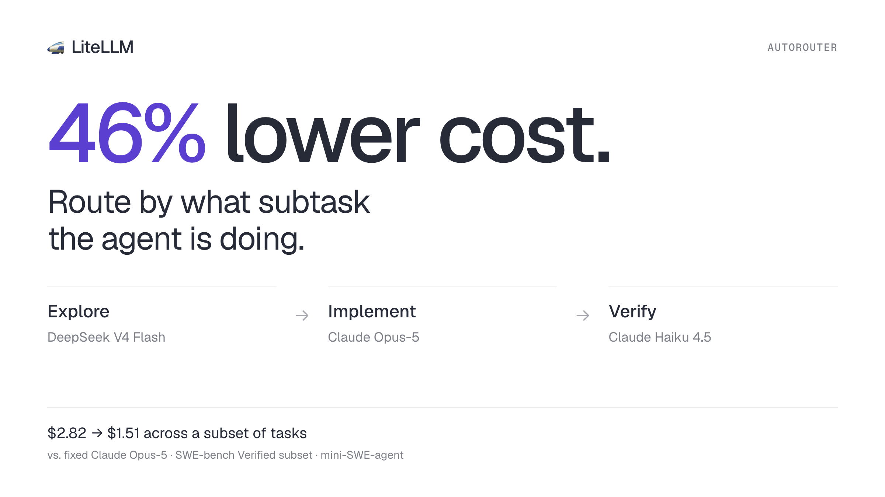

**An experimental router that picks a model per agent phase matched fixed Claude Opus-5 quality on a SWE-bench Verified subset for 46% less money.**

{/* truncate */}

:::info[🚀 Help shape the Auto-Router]

Get early access, work directly with the LiteLLM team, and influence the roadmap with your production traffic.

<a className="button button--primary button--lg" style={{background: '#2e8555', borderColor: '#2e8555', color: '#fff'}} href="https://calendar.app.google/i2e7qVEJphHi5S8UA">Apply to Become a Design Partner</a>

<br /><br />

Already testing it? Share your results in [discussion #32168](https://github.com/BerriAI/litellm/discussions/32168).

:::

Frontier models are good at coding agents. They are also expensive, and most of what an agent does in a session does not need one. An agent spends the bulk of its turns reading files, grepping, and running tests. Only a fraction of the turns are the actual edits, and that is where the hard reasoning lives.

This experiment acts on that observation. Instead of picking one model for a whole session, it looks at what the agent is doing right now and routes each turn to the model that phase deserves.

## How it works

Every request an agent sends to the gateway carries its full conversation history, including every tool call it has made so far. The router reads that history and classifies each tool call into one of three phases:

- **Explore**: reading and searching. `grep`, `find`, `cat`, `head`, `git diff`, `python -c` one-liners that inspect state, or dedicated tools like `Read`, `Glob`, `Grep`
- **Implement**: changing files. `sed -i`, redirects and heredocs, `tee`, `patch`, `git apply`, Python writing to disk, `mv`/`cp`/`rm`, or dedicated tools like `Edit`, `Write`
- **Verify**: running the code. `pytest`, `tox`, `runtests.py`, `make test`, `unittest`, `curl` against a live service

Tool names are matched case-insensitively and any shell-like tool (`bash`, `shell`, `exec`, `terminal`) is treated the same way, so the classifier works with Claude Code, mini-SWE-agent, and anything else speaking OpenAI or Anthropic tool calls.

Individual calls are noisy. An agent mid-edit will `cat` a file to check its work. So the router does not react to single calls: it walks the classified calls as runs and only flips the current phase when a new phase has held for two consecutive calls. The result is a stable signal for what subtask the agent is in, computed in well under a millisecond per request with no extra LLM call and no classifier cost.

That phase then maps to a tier, and each tier has its own model:

```yaml title="config.yaml"
- model_name: subtask-type-router
  litellm_params:
    model: auto_router/complexity_router
    complexity_router_default_model: anthropic/claude-sonnet-5
    complexity_router_config:
      classifier_type: custom
      classifier_plugin: subtask_type_classifier.subtask_type_classifier
      classifier_fallback: default_model
      deployment_affinity: true
      tiers:
        SIMPLE:                          # explore
          - fireworks_ai/deepseek-v4-flash
        MEDIUM:                          # verify
          - anthropic/claude-haiku-4-5
        COMPLEX:                         # implement
          - model_name: anthropic/claude-opus-5
            litellm_params:
              reasoning_effort: high
```

Exploration goes to a fast, cheap model. Verification, where the model mostly needs to read a test log and decide what to do next, goes to Haiku. Implementation, where the change actually gets written, goes to Opus with high reasoning effort. The opening turns of a session, before any tool call has established a phase, go to the default model, Sonnet.

## Results

We ran mini-SWE-agent on 12 SWE-bench Verified tasks, once against fixed `anthropic/claude-opus-5` and once against the router above, and scored both with the official SWE-bench harness. Costs are the sum of every LLM call as reported by the gateway. Fixed Opus only resolved 9 of the 12, so the head-to-head comparison below is restricted to those 9 for a fair fight.

Across the 9 tasks both configurations solved:

| | Fixed Opus | Subtask router |
|---|---|---|
| Tasks resolved | 9 / 9 | 9 / 9 |
| Total LLM cost | $2.82 | $1.51 |
| Cost per solved task | $0.31 | $0.17 |
| LLM turns | 112 | 205 |

Same quality, **$1.31 saved (46%)**. The router took more turns per task, since the explore model is more incremental than Opus, but each of those turns was cheap enough that the total still came in at roughly half.

Where the money went with the router, over all 382 turns of the full 12-task run:

| Model | Turns | Share of turns | Cost |
|---|---|---|---|
| deepseek-v4-flash (explore) | 277 | 73% | $0.14 |
| claude-haiku-4-5 (verify) | 38 | 10% | $0.34 |
| claude-sonnet-5 (opening) | 12 | 3% | $0.08 |
| claude-opus-5 (implement) | 55 | 14% | $2.56 |

86% of the agent's turns never touched Opus. The 14% that did were the edits, which is exactly the part of the job a frontier model should own. Worth sitting with the first row: 73% of all turns cost $0.14 in total. Exploration is nearly free once it is on the right model.

## Why phase, not difficulty

Most auto-routers ask how hard a prompt is, and send an LLM classifier to answer it. In an agent loop that question is almost always answered "hard", because the prompt is a coding task with tools attached, and the classifier costs money on every turn.

Phase routing asks a different question: what is the agent doing right now? That one has a cheap, deterministic answer already sitting in the tool-call history, and unlike difficulty it changes many times within a single task. That is where the savings are.

This is still an experiment. Twelve tasks is a small sample, mini-SWE-agent is a simpler loop than most production agents, and the phase taxonomy is a first cut that will need work on agents whose tool vocabularies look nothing like these. We are running it on more traffic before drawing firmer conclusions
