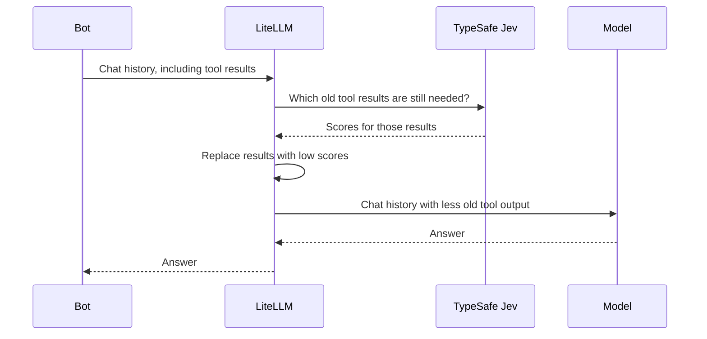

A bot looks up the weather, then checks a shop's opening hours. The user asks, "What time does the shop close?" The bot still sends the old weather report to the model, even though it no longer helps answer the question.

TypeSafe Jev helps LiteLLM spot tool results that are no longer needed. LiteLLM replaces those results with a short notice before calling the model. This is called compaction, and it can reduce the input tokens used by long conversations.

{/* truncate */}

## What Jev does

[TypeSafe's Jev](https://docs.typesafe.ai/api) answers questions with a choice, a score, or a yes/no probability. For example, it can choose whether a customer question belongs with billing or support.

You can call Jev directly through LiteLLM's `/typesafe/v1/systemone` endpoint. The [TypeSafe pass-through guide](/docs/pass_through/typesafe) shows the request format, logging, and cost tracking.

For compaction, LiteLLM asks Jev a simple question about each older tool result: **does the bot still need this to answer the user's latest question?**

## How compaction works



LiteLLM checks each completed tool exchange: a tool call and its results. By default, results with a Jev score below `0.2` are replaced with:

```text
[Tool result removed by TypeSafe compaction: judged no longer relevant to the current task]
```

Results that are kept stay unchanged. LiteLLM also keeps the tool calls and their IDs, so the conversation still has the structure the model expects. System and user messages are unchanged. The last assistant message and any tool exchange it belongs to are protected.

The guardrail works with Chat Completions, Anthropic Messages, and the Responses API. Jev checks the old tool results; your chosen model writes the answer.

## Enable compaction in LiteLLM

Use a LiteLLM proxy with a model already configured and a build that includes the `typesafe` guardrail. Keep your existing authentication setup, including OIDC if you use it.

Set your TypeSafe API key on the proxy:

```bash
export TYPESAFE_API_KEY="your-typesafe-api-key"
```

Add this guardrail to your existing `config.yaml`, then restart the proxy:

```yaml title="config.yaml"
guardrails:
  - guardrail_name: jev-compaction
    litellm_params:
      guardrail: typesafe
      mode: pre_call
      api_key: os.environ/TYPESAFE_API_KEY
      optional_params:
        relevance_threshold: 0.2
```

`pre_call` means compaction runs before LiteLLM calls your model. The proxy sends TypeSafe the system text, latest user question, and older tool exchanges selected for evaluation. This setup leaves compaction off until you enable it for a request or team.

## Try it: weather, then shop hours

This example has two tool results: a weather report and the shop's opening hours. The user only wants to know when the shop closes. Jev can mark the weather report for removal. The shop hours belong to the last assistant exchange, so LiteLLM keeps them.

Set `LITELLM_PROXY_URL` to your gateway URL and `ACCESS_TOKEN` to a bearer token accepted by your proxy. For OIDC, use your valid OIDC access token. Replace `my-model` below with a model available to your team.

<details>
<summary>Complete example request</summary>

```bash
curl -i "$LITELLM_PROXY_URL/v1/chat/completions" \
  -H "Authorization: Bearer $ACCESS_TOKEN" \
  -H "Content-Type: application/json" \
  -d '{
    "model": "my-model",
    "guardrails": ["jev-compaction"],
    "tool_choice": "none",
    "tools": [{
      "type": "function",
      "function": {
        "name": "lookup",
        "description": "Look up the weather or shop hours.",
        "parameters": {
          "type": "object",
          "properties": {"query": {"type": "string"}},
          "required": ["query"]
        }
      }
    }],
    "messages": [
      {"role": "system", "content": "Answer the latest question using the tool results. Keep it short."},
      {"role": "user", "content": "Check the weather in London, then look up the shop hours."},
      {"role": "assistant", "tool_calls": [{"id": "call_weather", "type": "function", "function": {"name": "lookup", "arguments": "{\"query\":\"London weather\"}"}}]},
      {"role": "tool", "tool_call_id": "call_weather", "content": "Today in London it is cool and cloudy. It may rain in the afternoon, so bring an umbrella. The wind is light and the temperature is 16 C. Tomorrow is expected to be warmer with clear skies. This weather report covers the next two days."},
      {"role": "assistant", "tool_calls": [{"id": "call_shop", "type": "function", "function": {"name": "lookup", "arguments": "{\"query\":\"shop hours\"}"}}]},
      {"role": "tool", "tool_call_id": "call_shop", "content": "Shop hours: Monday to Friday, open at 9 AM and close at 6 PM. On Saturday, open at 10 AM and close at 4 PM. The shop is closed on Sunday. These hours apply to the main shop on High Street. Customers can collect online orders during the same opening hours."},
      {"role": "user", "content": "Forget the weather. What time does the shop close on Monday?"}
    ]
  }'
```

</details>

Both tool results are longer than the default 200-character minimum. If Jev scores the weather result below `0.2`, LiteLLM replaces it with the removal notice. The shop hours stay in the request, and the model should answer **6 PM**.

Jev may decide a result is still useful and keep it. Turning on compaction does not guarantee that every request gets smaller.

## Check the result

Look for `jev-compaction` in the `x-litellm-applied-guardrails` response header. On a proxy with database logging, open the request in **Logs → Guardrails & Policy Compliance**. When results are removed, the guardrail records:

| Field | What it shows |
| --- | --- |
| `exchanges_evaluated` | How many tool exchanges Jev checked. |
| `exchanges_dropped` | How many had their results replaced. |
| `chars_removed` | About how many characters were removed. |
| `model` | The configured Jev model. |

Compare the same request with compaction on and off. For the off version, remove `guardrails` from the request and use a team without compaction enabled. Also leave `default_on` disabled. Compare input tokens, response time, and whether the answer is still correct. Include Jev's own cost when checking total savings.

## Turn it on for a team

On LiteLLM Enterprise, attach `jev-compaction` to a team. If your users authenticate with OIDC, use the LiteLLM team that their tokens map to. See the [OIDC setup guide](/docs/proxy/token_auth#tracking-end-users--internal-users--team--org) for that mapping.

```bash
curl "$LITELLM_PROXY_URL/team/update" \
  -H "Authorization: Bearer $LITELLM_MASTER_KEY" \
  -H "Content-Type: application/json" \
  -d '{
    "team_id": "my-team-id",
    "guardrails": ["jev-compaction"]
  }'
```

Start with the default score threshold of `0.2`. A higher threshold can remove more results, so check that answers stay correct before raising it. If Jev is unavailable, LiteLLM's default `fail_open` setting sends the original request to the model without compaction.

See the [TypeSafe compaction guide](/docs/proxy/guardrails/typesafe) for more settings, or the [pass-through guide](/docs/pass_through/typesafe) to call Jev directly.
