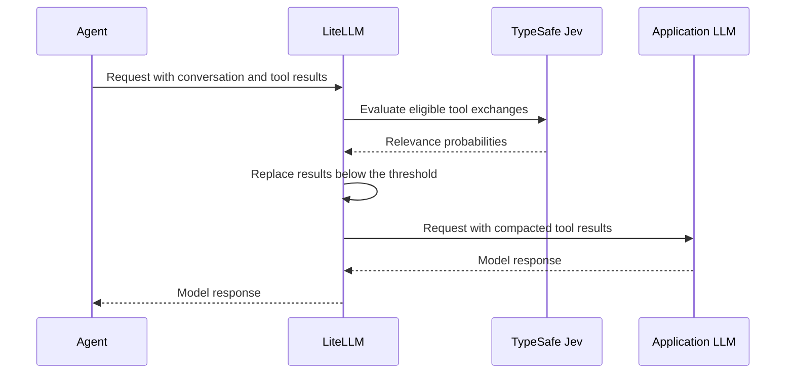

Agent conversations accumulate tool results. An operations assistant may retrieve a weather report, inspect a service, and read a deployment runbook. When the user asks a follow-up about the runbook, earlier results still travel with the conversation and consume input tokens.

LiteLLM's TypeSafe integration uses Jev to decide which tool results the current task still needs. The compaction guardrail replaces results judged irrelevant with a short removal notice before the request reaches the LLM. Retained results stay intact, giving platform teams a way to reduce repeated context while keeping compaction centrally configured in the gateway.

{/* truncate */}

## Typed decisions for agent workflows

[TypeSafe's Jev](https://docs.typesafe.ai/api) answers typed questions: a choice between options, a score, or a yes/no probability. Applications can use these decisions to route a support request, evaluate a condition, or decide whether an earlier tool result remains useful.

LiteLLM exposes Jev through two integrations:

| Integration | What it does | Where to use it |
| --- | --- | --- |
| TypeSafe pass-through | Returns Jev's typed answers to your application. | Call `/typesafe/v1/systemone` with a LiteLLM key. |
| TypeSafe compaction guardrail | Evaluates earlier tool exchanges and replaces results that fall below a relevance threshold. | Enable `guardrail: typesafe` on LLM requests. |

For direct Jev calls, set `TYPESAFE_API_KEY` on the proxy and send a request using a LiteLLM virtual key:

```bash
curl "$LITELLM_PROXY_URL/typesafe/v1/systemone" \
  -H "Authorization: Bearer $LITELLM_API_KEY" \
  -H "Content-Type: application/json" \
  -d '{
    "model": "jev-latest",
    "state": "The customer needs a copy of the invoice from last month.",
    "questions": {
      "department": {
        "type": "choice",
        "instructions": "Which team should handle this request?",
        "criteria": {
          "billing": "Invoices, payments, and refunds",
          "technical": "Bugs, outages, and integrations",
          "sales": "Pricing and new accounts"
        }
      }
    }
  }'
```

Set `LITELLM_PROXY_URL` to your gateway URL and `LITELLM_API_KEY` to a valid LiteLLM key. The proxy supplies the upstream TypeSafe credential and returns TypeSafe's response format, including `answers.department`. These pass-through calls support logging and cost tracking from TypeSafe's reported token usage. See the [TypeSafe pass-through guide](/docs/pass_through/typesafe) for the response format and configuration.

## Compact tool results before the next model call

The compaction guardrail applies Jev's decisions during LiteLLM's `pre_call` step. It sends the latest user text, system text, and eligible tool exchanges to TypeSafe, with one yes/no probability question per exchange: is this still needed to complete the task?



An exchange consists of an assistant's tool calls and their corresponding results. If Jev scores an exchange below the configured threshold, LiteLLM replaces its tool-result content with:

```text
[Tool result removed by TypeSafe compaction: judged no longer relevant to the current task]
```

The assistant's tool calls, tool-call IDs, and message order remain intact. Retained tool results are preserved verbatim. System and user messages remain unchanged, and the shared compression policy protects the last assistant message and any exchange containing it, along with the prompt-cache prefix through an Anthropic cache breakpoint.

The guardrail supports Chat Completions, Anthropic Messages, and Responses API requests. Jev evaluates relevance; your configured application model still generates the answer.

## Enable compaction in LiteLLM

Use a LiteLLM build that includes the `typesafe` guardrail. Set the provider credentials on the proxy:

```bash
export TYPESAFE_API_KEY="your-typesafe-api-key"
export OPENAI_API_KEY="your-openai-api-key"
export LITELLM_MASTER_KEY="sk-your-litellm-master-key"
```

Save this configuration as `config.yaml`. For an existing deployment, add the guardrail entry alongside your existing models and authentication settings.

```yaml title="config.yaml"
model_list:
  - model_name: operations-model
    litellm_params:
      model: openai/gpt-4.1-mini
      api_key: os.environ/OPENAI_API_KEY

general_settings:
  master_key: os.environ/LITELLM_MASTER_KEY

guardrails:
  - guardrail_name: jev-compaction
    litellm_params:
      guardrail: typesafe
      mode: pre_call
      api_key: os.environ/TYPESAFE_API_KEY
      optional_params:
        relevance_threshold: 0.2
```

Start the proxy with `litellm --config config.yaml`. The guardrail uses `jev-latest` by default and calls TypeSafe's hosted API from the proxy. Compaction is opt-in with this configuration.

## Try a conversation with stale tool results

The example below contains an earlier weather lookup and a deployment runbook. The latest question asks only about the runbook. The weather result exceeds the default 200-character minimum, so it is eligible for evaluation. The runbook belongs to the last assistant exchange and is protected.

Set `LITELLM_PROXY_URL` to your proxy URL, such as `http://localhost:4000`, and `LITELLM_API_KEY` to your virtual key. For a local test, you can use the master key configured above.

<details>
<summary>Complete example request</summary>

```bash
curl -i "$LITELLM_PROXY_URL/v1/chat/completions" \
  -H "Authorization: Bearer $LITELLM_API_KEY" \
  -H "Content-Type: application/json" \
  -d '{
    "model": "operations-model",
    "guardrails": ["jev-compaction"],
    "tool_choice": "none",
    "tools": [{
      "type": "function",
      "function": {
        "name": "lookup",
        "description": "Retrieve a report or runbook.",
        "parameters": {
          "type": "object",
          "properties": {"query": {"type": "string"}},
          "required": ["query"]
        }
      }
    }],
    "messages": [
      {"role": "system", "content": "Answer the latest question using the relevant tool result. Be concise."},
      {"role": "user", "content": "Check the Lisbon weather, then read the deployment runbook."},
      {"role": "assistant", "tool_calls": [{"id": "call_weather", "type": "function", "function": {"name": "lookup", "arguments": "{\"query\":\"Lisbon weather\"}"}}]},
      {"role": "tool", "tool_call_id": "call_weather", "content": "Lisbon weather report: temperature 23 C, humidity 61 percent, northwest wind at 14 km/h. Skies are mostly clear with scattered coastal clouds. The afternoon high is 26 C with less than 5 percent chance of rain. Sunset is at 19:42 local time, visibility is 12 km, and pressure is steady at 1017 hPa. Bring a light jacket for the evening waterfront breeze."},
      {"role": "assistant", "tool_calls": [{"id": "call_runbook", "type": "function", "function": {"name": "lookup", "arguments": "{\"query\":\"deployment runbook\"}"}}]},
      {"role": "tool", "tool_call_id": "call_runbook", "content": "Deployment runbook, revision 12. Production runs in AWS region eu-west-1. Operational request logs are retained for 30 days, then deleted by the lifecycle policy. Deployments use a blue-green rollout with readiness checks before traffic switches. On-call engineers monitor error rates after deployment and roll back if the error budget alert fires."},
      {"role": "user", "content": "According only to the runbook, which AWS region hosts production and how long are operational request logs retained?"}
    ]
  }'
```

</details>

If Jev scores the weather exchange below `0.2`, LiteLLM replaces that result with the removal notice. The runbook reaches the LLM intact, so the answer should identify `eu-west-1` and `30 days`. Removal depends on Jev's evaluation; enabling the guardrail does not guarantee a smaller request.

## Measure compaction in Logs

Check the `x-litellm-applied-guardrails` response header for `jev-compaction`. On a proxy with database-backed logging, open the request in **Logs → Guardrails & Policy Compliance**. When results are removed, the guardrail records:

| Field | What it shows |
| --- | --- |
| `exchanges_evaluated` | How many tool exchanges Jev evaluated. |
| `exchanges_dropped` | How many exchanges had their tool results replaced. |
| `chars_removed` | The approximate reduction in tool-result characters. |
| `model` | The configured Jev evaluation model. |

The applied-guardrail header confirms invocation; the counters show whether content was removed. Compare the same request with compaction enabled and disabled, using a key without an attached guardrail and leaving `default_on` disabled for the baseline. Check downstream prompt-token usage, latency, and answer quality together. Character counts are not token savings, and an end-to-end cost comparison also needs to account for Jev's evaluation cost.

## Roll out to an application's virtual key

Once the results fit your workload, attach `jev-compaction` to the application's virtual key. With a database-backed proxy, an administrator can create a key with compaction enabled:

```bash
curl "$LITELLM_PROXY_URL/key/generate" \
  -H "Authorization: Bearer $LITELLM_MASTER_KEY" \
  -H "Content-Type: application/json" \
  -d '{
    "key_alias": "operations-agent",
    "models": ["operations-model"],
    "guardrails": ["jev-compaction"]
  }'
```

Configure the application to use the returned key. LiteLLM then applies compaction without requiring a `guardrails` field on every call. To enable it by default across the proxy, set `default_on: true` under the guardrail's `litellm_params`.

Start with the default relevance threshold of `0.2`; raising it permits more removals. `min_chars_to_evaluate` defaults to `200`, and `max_result_chars_in_state` defaults to `4000` characters per exchange sent to Jev. The latter bounds evaluator input while leaving retained results in the LLM request unchanged.

On an evaluator failure, the default `fail_open` behavior forwards the request without compaction. The evaluator call can still add latency before a failure is handled. Set `unreachable_fallback: fail_closed` if your deployment should reject the request instead.

Explore the [TypeSafe compaction guide](/docs/proxy/guardrails/typesafe) for endpoint-specific opt-in and configuration options, or the [pass-through guide](/docs/pass_through/typesafe) to build your own typed decisions with Jev.
