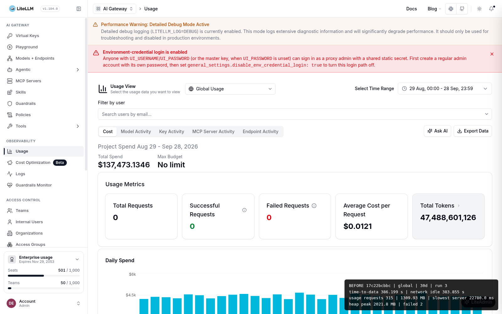
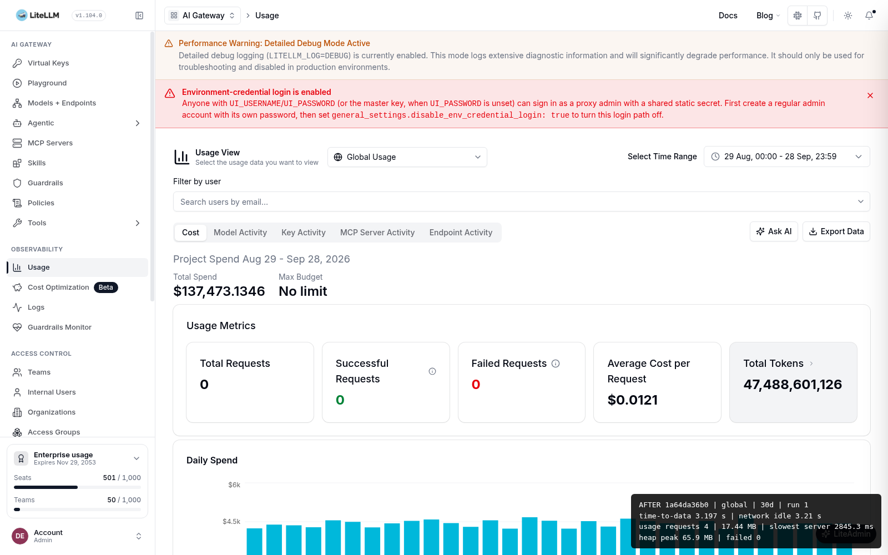

import { BeforeArchitecture, AfterArchitecture, BeforeAfterGrid } from './diagrams';

*Last Updated: September 2026*

Enterprise AI Gateway deployments can have thousands of API keys. Every key writes one row per model per day into the spend tables. The Usage page in the LiteLLM Admin UI used to download all of those rows into the browser and add them up in JavaScript. With a few hundred keys this was fine. With 5,000 keys and 90 days of history, the page pulled millions of rows over dozens of requests and stayed on a loading bar for a long time. Some tabs never finished.

This post explains, in simple terms, why that happened, what we changed, and how much faster the page is now.

{/* truncate */}

## The problem: the browser was doing the database's job

The old design had one idea: fetch everything, then work it out on the client. Each usage tab (Usage, Team, Tag, Organization, Customer, Agent, User) called `/daily/activity?page=1`, then `page=2`, and so on, 1000 rows at a time, until there were no more rows. It then kept all of those rows in React state and computed totals, top keys, per-model breakdowns, search results and CSV exports from that in-memory list.

<BeforeArchitecture />

This has three costs that all grow with the number of keys. The network cost: one request per 1000 rows, so a large tenant makes dozens of round trips before anything shows. The memory cost: the tab holds every row, so the browser heap grows with your history. The CPU cost: adding up and sorting tens of thousands of objects in JavaScript on every filter change.

There was also a hidden correctness risk. A first attempt at a fix simply capped the number of keys the page loaded. That made the page fast, but anything computed from the capped list was now wrong: totals could be short, search could miss keys, export could be incomplete, and the "top keys for this model" list could skip the real top key if it was not in the global top N. We reverted that attempt and did the redesign properly.

## The fix: let Postgres do the math, and only send what the page shows

The new design has one idea too: the page asks for exactly what it displays, and the database computes it. Totals are summed in SQL over all rows, so they are always complete. Only the top N keys by spend are returned, where N is chosen by the client and capped by the server. Everything that needs to look beyond those N keys (search, export, per-model top keys, cache leakage ranking) is its own server route, called only when you use it.

<AfterArchitecture />

We split the code into three layers so each one can be reviewed and tested on its own.

The repository layer (`DailyActivityRepository`) is the only place that talks to the database. It takes a typed scope (which table, which entity ids, which dates, which keys) and returns typed rows. It uses Prisma where Prisma can express the query, and one central SQL builder module for the grouping and ranking queries Prisma cannot. Empty scopes are safe by construction: an empty list of ids turns into `FALSE`, never into "match everything".

The service layer is the API routes. It does auth, works out the caller's scope, validates the requested limit against a hardcoded server maximum, and calls the repository. There is no SQL in any route file. Asking for more than the maximum returns HTTP 422 with a clear message instead of a slow query.

The client layer is the Admin UI. It makes one bounded request per page, tells you when the key list is capped, and calls the search, export and ranking routes on demand. There is no code path left that pages through history in the browser.

<BeforeAfterGrid />

## Why client-settable limits and not a config flag

We did not want another environment variable. The number of keys a page shows is a display choice, so the client sends it. The server keeps the hard ceiling so a single request cannot pull an unbounded result set, and rejects anything above it with 422. Defaults match what the page showed before, so existing deployments see no change in what is on screen, only in how fast it appears.

## Before and after numbers

We measured both designs against the same Postgres database: 5,000 API keys, 50 teams, 20 tags, 5 organizations, 100 customers, 500 users, 91 days of history, and about 4.9 million daily rows. Both proxies ran a production UI build with an 18 GB memory limit. Each page was loaded five times with a cold browser cache on each side, and we report the median. "Before" is the unbounded design that shipped through v1.104. "After" is the redesigned stack.

The "before" pages did not finish. Every run was still paging when we stopped it at 90 seconds, or showed $0 because the first request failed. To get a real number we let a few runs go with no time limit. The Usage page took 379 to 386 seconds for 30 days and about 34 minutes for 90 days, moved 1.3 to 3.8 GB into the browser, and pushed the JavaScript heap past 2 GB.

<!-- BENCHMARK: entity rows (Team, Tag, Organization, Customer) are pending the entity rollup key-bound fix and a re-run; do not publish with TBD -->

| Page | Metric | Before | After |
|---|---|---|---|
| Usage (30 days) | time to totals | 379 to 386 s (uncapped runs) | 3.2 s |
| Usage (30 days) | usage requests / bytes | 315 / 1.3 GB | 4 / 17 MB |
| Usage (30 days) | peak browser heap | 2.0 GB | 65 MB |
| Usage (90 days) | time to totals | about 34 min (uncapped run) | 10.0 s |
| Usage (90 days) | usage requests / bytes | 914 / 3.8 GB | 4 / 51 MB |
| User Usage (90 days) | time to totals | not finished in 90 s | 13.8 s |
| Agent Usage (90 days) | time to totals | not finished in 90 s | 12.6 s |
| Cache leakage card (30 days) | time to ranking | not finished in 90 s | 3.6 s |
| Team Usage (90 days) | time to totals | not finished in 90 s | TBD |
| Tag Usage (90 days) | time to totals | not finished in 90 s | TBD |
| Organization Usage (90 days) | time to totals | not finished in 90 s | TBD |
| Customer Usage (90 days) | time to totals | not finished in 90 s | TBD |

Where both sides finished, total spend and total tokens matched the database to the cent on before and after. The redesign changes how the numbers are computed, not what they are.

The benchmark also caught a bug in the new code: the per-entity breakdown on the Team, Tag, Organization and Customer pages still listed every key under each entity, so those responses were 100 to 390 MB and the Customer page ran out of memory at 90 days. We fixed the rollup so it only lists the top N keys per entity, the same bound the top-level list uses, and the entity rows above come from the re-run on the fixed build.

Here is the same Usage page, same database, same 30 day range. The timing overlay in the corner is from the benchmark harness. Before: 386 seconds, 315 requests, 1.3 GB, 2 GB heap. After: 3.2 seconds, 4 requests, 17 MB, 65 MB heap.

## What this means for a production-grade AI Gateway

Dashboards are part of the gateway's reliability story. If the page that shows you your spend falls over at the scale where you most need it, it is not doing its job. The usage page now loads the same small payload whether the proxy has 50 keys or 50,000, the database does the heavy lifting where the data lives, and every number on screen is computed over all rows. The pieces that need to see beyond the top N are still there, they just run on the server when you ask for them.

## Key Takeaways

- The old usage page fetched every key's daily rows into the browser, one request per 1000 rows, so load time grew with the number of keys
- The new page makes one bounded request: complete totals from SQL plus only the top N keys, with N set by the client and capped by the server
- Search, CSV export, per-model top keys and cache leakage ranking are server routes called on demand, so they see all keys without the page paying for them upfront
- The code is split into a repository layer (all database access, typed, no inline SQL in routes), a service layer (auth, scope, 422 on out-of-range limits) and a client layer (bounded fetches only)
- Totals, requests and tokens match the old design exactly; only the loading time and memory changed

---

### Frequently Asked Questions

### Are the totals on the Usage page still correct if I have more keys than the top N?

Yes. Totals are summed in SQL over every row in your date range before any limit is applied. The limit only decides how many individual keys are listed on the page. The UI tells you when the list is capped.

### Can I still search for or export a key that is not in the top N?

Yes. Key search and CSV export are server routes. Search looks through all keys in your scope, and export streams every row in batches on the server, so the CSV is complete no matter what the page shows.

### Why does the API return 422 when I ask for a large limit?

Each route has a hardcoded maximum. Asking for more than that is rejected up front instead of running a query that could hurt the database. If you need more keys than the page shows, use search or export.

### Is this available in LiteLLM OSS?

Yes. Ships in LiteLLM OSS (Apache 2.0) by default from the release that includes the redesign stack. [LiteLLM Enterprise](https://litellm.ai/enterprise) adds SSO/SCIM, air-gapped deployment, 24/7 SLA support, and advanced guardrails on top.

---

## Conclusion

A reliable AI Gateway has to stay usable at scale, and that includes the pages that tell you what you are spending. Moving the work from the browser to the database made the usage page load in constant time and made every number on it complete. This is how AI Gateway infrastructure should behave when a tenant grows from hundreds of keys to tens of thousands.
For teams with strict uptime and compliance requirements, [LiteLLM Enterprise](https://litellm.ai/enterprise) provides the additional controls needed for regulated production environments.

## Recommended Reading

- [LiteLLM AI Gateway, full feature overview](https://docs.litellm.ai/docs/simple_proxy)
- [Spend tracking and budget controls](https://docs.litellm.ai/docs/proxy/cost_tracking)
- [Admin UI overview](https://docs.litellm.ai/docs/proxy/ui)
