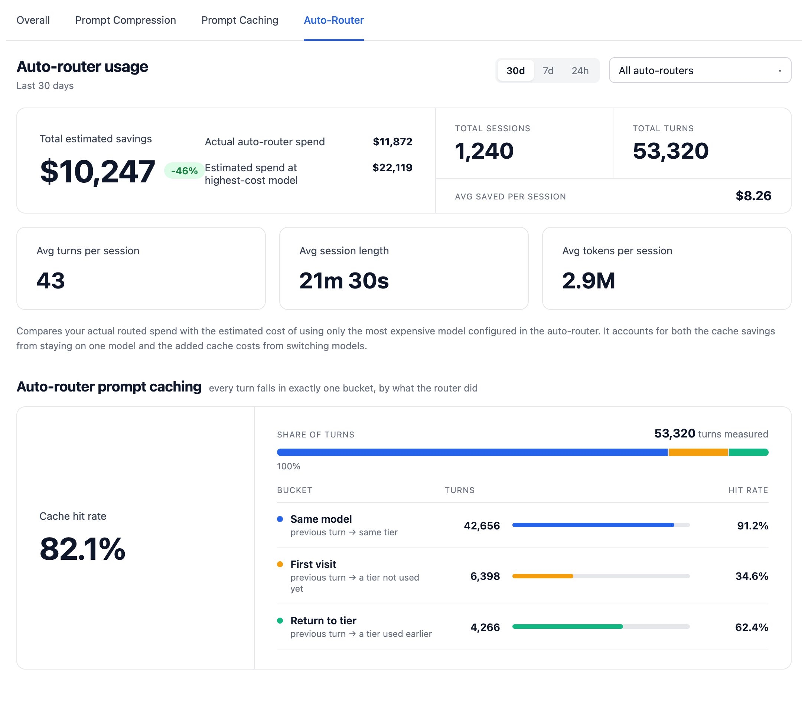

import NavigationCards from '@site/src/components/NavigationCards';

Public benchmarks measure someone else's prompts. Two features measure yours: a **shadow evaluation** before you switch, and **savings accounting** after.

## Shadow evaluations

- **Samples** a slice of one key's, team's, or user's live traffic.
- **Duplicates** each sampled request through the router. The shadow response never reaches the client.
- **Judges** blind: an LLM compares the router's answer with the one the current model served.
- **Runs** up to 30 days (default 7) or up to the turn cap (default 200, max 2,000).
- **Compares** several router configs in one job on the same sampled traffic, so tier map and classifier choices are settled before anything changes.
- On our own traffic: **88.1%** matched or beat the current model, 143 judged turns, $1.55 judge spend.

<NavigationCards
columns={2}
items={[
  {
    title: "Shadow Evaluations: Test the Auto-Router on Your Own Production Traffic",
    description: "Setting up a job, defaults for turns and duration, choosing the judge, reading the results card.",
    to: "/blog/auto-router-shadow-evaluations",
  },
  {
    title: "Route on Context Size and Modality",
    description: "Multi-config shadow jobs and the key, team, and user targets.",
    to: "/blog/auto-router-more-routing-configurations",
  },
]}
/>

## Evaluate JEV on your own prompts

Start with [Test Routing](/docs/auto_router/setup#jev-classifier-typesafe-ai) to inspect tier choices, then use a shadow evaluation to compare actual answers. A classifier matching your tier labels does not establish that the selected model answers well. Freeze your rubric and labels before comparing JEV with another classifier, and report disagreement separately from correctness

The [JEV benchmark](/blog/jev-auto-router-benchmark) measured classifier latency and registry-priced classifier cost on authored synthetic cases. To evaluate a deployment, include classifier spend, downstream completions, embeddings where enabled, and shadow/judge requests. Record fallback rates and p95 latency as well as successful-call averages

JEV logs a separate `typesafe/<model>` classifier call attributed through the parent request's metadata. Its `classifier_cost` is also carried on a successful JEV routing decision and deducted in reported router savings. That metadata describes the classifier charge already logged separately: do not count it again when summing spend rows. Missing usage or a missing registry entry leaves classifier cost unknown, and cancellation does not prove the provider billed zero

## Savings after you switch

- **Per request:** what the router picked, why, and what the same request would have cost on the most expensive model in the hardest configured tier. The difference, net of any classifier call, is stamped on the request.
- **Rolled up:** into the daily spend tables, so it shows per key, team, tag, and organization.
- **Usage tab:** total estimated savings, sessions and turns, prompt-cache hit rate by turn type. A 30-day window over 400k sessions reads in 38 ms.
- **Classifier cost:** returned per request in the `x-litellm-classifier-cost` header when a classifier cost was recorded, including a successful JEV classification
- **Honest baseline:** priced with a warm cache on continuing turns; a fresh cache write after a switch counts against the saving, so a single request can read negative. Formula and every surface: [Reported savings](/docs/proxy/auto_routing#reported-savings).

<NavigationCards
columns={2}
items={[
  {
    title: "AutoRouter: Easy Visibility to Your Savings",
    description: "The usage tab, per-request classifier cost, and preset matching against your own deployments.",
    to: "/blog/auto-router-spend-visibility",
  },
  {
    title: "Decision log",
    description: "One greppable line per routing decision: cause, tier, score, signals, routed model.",
    to: "/docs/proxy/auto_routing#decision-log",
  },
]}
/>

## Reading a single decision

- Each routed request in the logs opens with a routing-decision card: tier, cause (including `jev_classifier`), and the model that served it
- Test Routing in the Add Model form shows the same card, so a surprising production decision can be replayed against the form with the same prompt.
