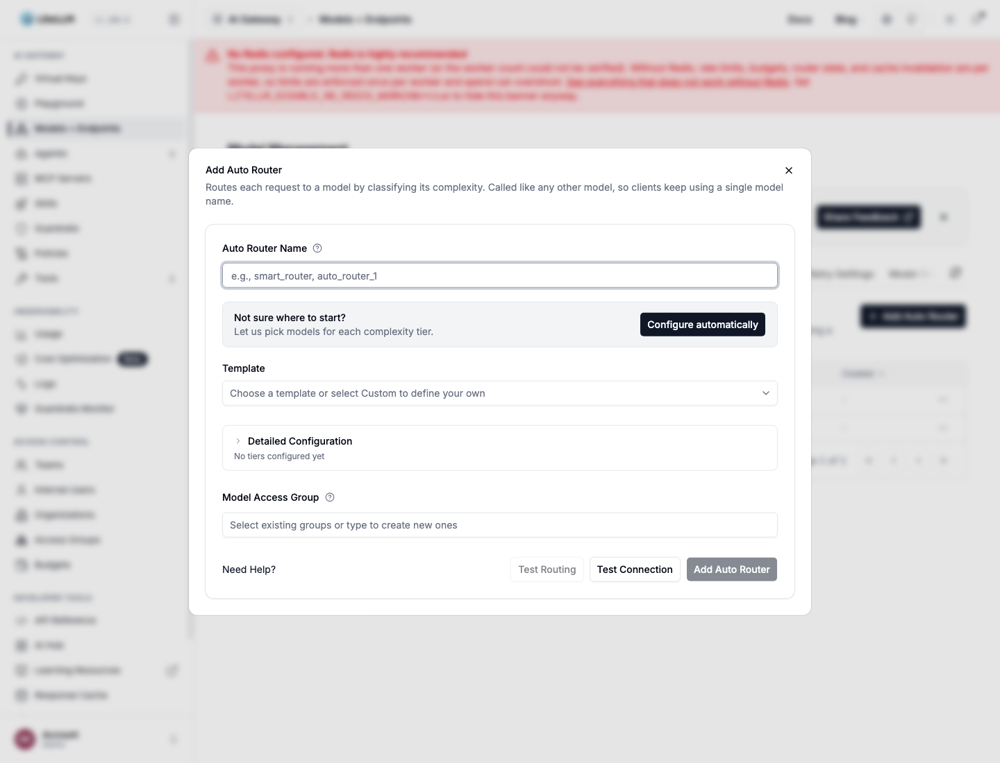

import NavigationCards from '@site/src/components/NavigationCards';

Five ways in. All of them create the same `auto_router/complexity_router` deployment.

<NavigationCards
columns={5}
items={[
  { title: "Add an Auto Router", description: "Models + Endpoints → Auto Router, then test and save.", to: "#add-an-auto-router-models--endpoints--auto-router" },
  { title: "Agent skill", description: "One line to your coding agent.", to: "#agent-skill" },
  { title: "config.yaml", description: "One router entry in model_list.", to: "#configyaml" },
  { title: "Model-management API", description: "POST /model/new, for CI/CD.", to: "#model-management-api" },
  { title: "lite autoroute", description: "Try it locally without touching the proxy.", to: "#lite-autoroute" },
]}
/>

## Add an Auto Router (Models + Endpoints → Auto Router)



- In the LiteLLM Dashboard, go to **Models + Endpoints** and open the **Auto Router** tab. Add a new Auto Router model, or enable and configure an existing one.
- Enter an Auto Router name, then select **Configure automatically** or choose a template. Review the generated tiers, test routing, and save.
- **Configure automatically** checks the models your proxy already serves, selects the best available models for all four complexity tiers, and fills in the form for you.
- Templates: 1M Context, Anthropic Family, OpenAI Family, Gemini Family, Lite. Each fills all four tiers from models your proxy already serves.
- A template whose models are not deployed is greyed out with the missing names listed.
- **Test Routing** sends one prompt through the classifier and shows the model it would pick. Nothing is created and the picked model is not called.
- **Test Connection** runs a minimal request per tier model group. Green means reachable with your credentials.
- Detailed Configuration holds the rest: keyword rules, LLM classifier and prompt, escalation keywords, adaptive pools.

The templates as config.yaml: [Recommended Configurations](/docs/auto_router/recommended_configurations). Release post: [AutoRouter: 1 Click Deploy](/blog/auto-router-setup-and-testing).

## Agent skill

```
run curl -fsSL https://docs.litellm.ai/skills/auto-router and follow the instructions
```

- Reads the models your proxy already serves.
- Asks for the router name and a model per tier.
- States the defaults it is assuming before it writes anything.

## config.yaml

```yaml title="config.yaml"
model_list:
  - model_name: {{openai_small}}
    litellm_params: {model: openai/{{openai_small}}, api_key: os.environ/OPENAI_API_KEY}
  - model_name: {{openai_large}}
    litellm_params: {model: openai/{{openai_large}}, api_key: os.environ/OPENAI_API_KEY}
  - model_name: {{anthropic}}
    litellm_params: {model: anthropic/{{anthropic}}, api_key: os.environ/ANTHROPIC_API_KEY}
  - model_name: {{anthropic_large}}
    litellm_params: {model: anthropic/{{anthropic_large}}, api_key: os.environ/ANTHROPIC_API_KEY}

  - model_name: smart-router
    litellm_params:
      model: auto_router/complexity_router
      complexity_router_config:
        tiers:
          SIMPLE:    {{openai_small}}
          MEDIUM:    {{openai_large}}
          COMPLEX:   {{anthropic}}
          REASONING: {{anthropic_large}}
      complexity_router_default_model: {{openai_large}}
```

- Tiers name other `model_name` entries in the same file, so every tier is a deployment the proxy already knows.
- `complexity_router_default_model` serves whenever the router cannot decide.
- No `classifier_type` means the heuristic scorer: free, no added latency.
- `classifier_type: llm` with a small model raises accuracy on agent traffic for a fraction of a cent per request. See [benchmarks](/docs/auto_router/benchmarks).
- Everything else (keyword rules, tier pools, session affinity, scorer tuning): [configuration reference](/docs/proxy/auto_routing).

## JEV classifier (TypeSafe AI)

`classifier_type: jev` uses TypeSafe System One Choice evaluation to select a tier inside the existing Auto Router. LiteLLM sends the classifier input to `POST /v1/systemone` as `state`, with one `questions.tier` question whose criteria describe the configured tiers. The chosen tier's model serves the completion

### Set the server key

Provision `TYPESAFE_API_KEY` in the proxy process through your deployment's secret manager. The dashboard does not need the provider key. Clients keep using a LiteLLM virtual key

```bash
export TYPESAFE_API_BASE="https://api.typesafe.ai"
litellm --config config.yaml
```

`TYPESAFE_API_BASE` is optional and defaults to `https://api.typesafe.ai`. Omitting `jev_classifier_config.api_key` and `api_base` uses these server settings. A missing TypeSafe key prevents JEV initialization. An explicit `api_base` requires an explicit `api_key`, so a configuration override cannot redirect the server's environment key to a different host. Team members using the management API cannot set either field

### Create or edit in the dashboard

In **Models + Endpoints**, open **Auto Router** and add a router, or edit an existing router. Configure its tier models, then choose **JEV Classifier** under **Classification Method** in Detailed Configuration

Set **JEV Model** (`jev-latest` by default) and **JEV Timeout (ms)** (`3000` by default). Review the circuit breaker, classifier fallback, **Context Window Size**, **Context Character Budget**, and assistant-turn setting. Enterprise users can replace the built-in rubric with **JEV Instructions**, or restore the built-in instructions

JEV uses the same history defaults as the LLM classifier: up to three prior user turns within an 8,000-character prior-turn budget, with assistant turns excluded. This history is sent to the configured TypeSafe endpoint, which can differ from your completion provider. Set **Context Window Size** to `0` to omit history; the current ask and selected system text are still sent

When upgrading an existing JEV router to the [dashboard and context integration](https://github.com/BerriAI/litellm/pull/41886), omitting these settings enables those defaults. Set `classifier_context_window_size: 0` before upgrading if the router should continue sending no prior conversation

**Test Routing** classifies your input without creating a router or calling the selected completion model. It can make a paid JEV request, and semantic keyword matching can also make a paid embedding request. **Test Connection** checks the configured model dependencies and makes a separate JEV classification probe. Its JEV result reports an error when routing used a fallback, even if the selected completion model is reachable. These probes can incur provider charges

Save the router and call its model name through the normal completion API. Reopen the edit form to change the classifier settings. To investigate a decision, inspect its cause and classifier metadata in the routing-decision card rather than assuming that a successful completion proves JEV answered

### Configure in YAML

Add this router entry alongside the tier deployments in your `model_list`. The tier values and default model must name deployments already configured on the proxy

```yaml title="config.yaml"
- model_name: jev-router
  litellm_params:
    model: auto_router/complexity_router
    complexity_router_default_model: {{openai_large}}
    complexity_router_config:
      tiers:
        SIMPLE: {{openai_small}}
        MEDIUM: {{openai_large}}
        COMPLEX: {{anthropic}}
        REASONING: {{anthropic_large}}
      classifier_type: jev
      jev_classifier_config:
        model: jev-latest
        timeout_ms: 3000
        circuit_breaker_enabled: true
        circuit_breaker_cooldown_seconds: 30
      classifier_fallback: default_model
      classifier_context_window_size: 3
      classifier_context_budget_chars: 8000
      classifier_context_include_assistant_turns: false
```

This example explicitly chooses `default_model` fallback. The shipped `classifier_fallback` default is `heuristic`. The prior-turn character budget does not bound the current ask or system text, so review classifier input separately from the completion model's context window

Built-in JEV classification uses the same licensing policy as the built-in LLM classifier. Custom `instructions` and `tier_definitions` use the existing Enterprise custom-classifier capability. JEV also supports `enable_non_reasoning_tier`

See the [JEV reference](/docs/proxy/auto_routing#jev-classifier) for defaults, context, recovery, authorization and accounting, the [measured comparison](/blog/jev-auto-router-benchmark) for quality and cost scope, and [TypeSafe pass-through](/docs/pass_through/typesafe) for calling System One directly

## Model-management API

For CI/CD or scripts, create the same deployment with `POST /model/new`. Enable `store_model_in_db` first; Auto Routers are model deployments, so there is no separate `/auto_router/new` endpoint. This example uses the [Anthropic Family preset](/docs/auto_router/recommended_configurations#anthropic-family); create the referenced model deployments first.

```bash
curl -X POST "http://localhost:4000/model/new" \
  -H "Authorization: Bearer $LITELLM_MASTER_KEY" \
  -H "Content-Type: application/json" \
  -d '{
    "model_name": "claude-auto",
    "litellm_params": {
      "model": "auto_router/complexity_router",
      "complexity_router_config": {
        "tiers": {
          "SIMPLE": "claude-haiku-4-5",
          "MEDIUM": "{{anthropic}}",
          "COMPLEX": "{{anthropic_large}}",
          "REASONING": "claude-opus-5-high"
        },
        "classifier_type": "heuristic",
        "escalation_keywords": ["LITELLM ESCALATE"],
        "session_affinity": false
      },
      "complexity_router_default_model": "{{anthropic}}"
    }
  }'
```

The response includes `model_id`. Use it with `PATCH /model/{model_id}/update` for partial changes, and call the router by its `model_name`. Validate a complexity configuration before saving with `POST /auto_router/validate_complexity_router_config`. See [Model Management](/docs/proxy/model_management) for deployment CRUD and [Configuration Reference](/docs/proxy/auto_routing) for the full router payload.

## lite autoroute

- Stands up a throwaway local proxy that forwards every request to your real proxy.
- Routes Claude Code traffic through it for the session. Nothing bypasses the real proxy and its config is untouched.
- Guide: [lite autoroute](/docs/learn/autorouter_cli).

## Claude Code and Claude Desktop

- Claude Code populates its model picker from `/v1/models` and keeps only names containing `claude` or `anthropic`. Name the router accordingly, or set `ANTHROPIC_MODEL` directly.
- On Claude for Teams or Enterprise, the exact router name must be on the organization allowlist. The check runs client-side, so a rejected router leaves nothing in gateway logs.
- A router advertises no context window until you declare one in `model_info`, and Claude Code applies its own default regardless. Both sides: [context window](/docs/proxy/auto_routing#context-window).
- Tutorial: [Auto Router with Claude Code and Claude Desktop](/docs/tutorials/claude_code_autorouter).
