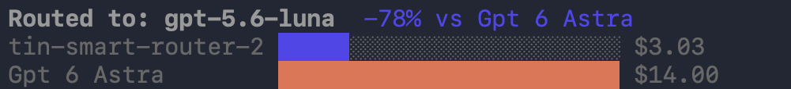

Connect your coding agent to an Auto Router your team has deployed. Ask your admin for the LiteLLM gateway URL, a virtual API key with access to the router, and the router's model name. To create a router first, see [Admin Setup](/docs/auto_router/setup).

Install Claude Code or Codex before continuing. For Codex, use stable version 0.129.0 or newer.

## 1. Install the LiteLLM CLI

```bash
curl -fsSL https://raw.githubusercontent.com/BerriAI/litellm/main/scripts/install-cli.sh | sh
```

See the [LiteLLM Proxy CLI](/docs/proxy/management_cli#quick-start) for other installation options.

## 2. Configure your coding agent

Replace the gateway URL and key with the values from your admin, then run:

```bash
export LITELLM_PROXY_API_KEY="sk-your-virtual-key"

lite configure \
  --gateway-url https://your-proxy.example.com \
  --api-key "$LITELLM_PROXY_API_KEY"
```

Choose **Claude Code**, **Codex**, or both, then select your team's Auto Router from the model picker for each agent. The CLI checks your key and available models before saving the connection in your agent's settings. Use a long-lived virtual key for this setup; `lite configure` does not use the temporary credential from `lite login`.

You can also specify the agent and router in the command. Replace `smart-router` with your router's model name.

### Claude Code

```bash
lite configure \
  --gateway-url https://your-proxy.example.com \
  claude \
  --api-key "$LITELLM_PROXY_API_KEY" \
  --model smart-router

claude
```

### Codex

```bash
lite configure \
  --gateway-url https://your-proxy.example.com \
  codex \
  --api-key "$LITELLM_PROXY_API_KEY" \
  --model smart-router

codex
```

After setup, start your agent with `claude` or `codex` from any terminal. You do not need to repeat `lite configure` or export the key each time.

## Live session savings

In Claude Code, `lite configure` adds a status line with the model that handled your last turn and your session's routed spend compared with an estimated baseline.



This example shows $3.03 in routed spend against a $14.00 estimated baseline, a 78% saving. The baseline uses the most expensive model in your router's highest configured tier. Your savings depend on the session; see [Reported savings](/docs/proxy/auto_routing#reported-savings) for how LiteLLM calculates the estimate.

Stats can lag a completed turn while the gateway records usage. If you see the routed model without savings, ask your admin to check that the gateway has a database and spend logging enabled, and that your key can access `/auto_router/session`. A key restricted to `llm_api_routes` also needs access to this endpoint. Savings require an available baseline estimate.

## Undo setup

Run the command for the agent you want to disconnect:

```bash
lite unconfigure claude
# Or, for Codex:
lite unconfigure codex
```

The CLI restores the settings it changed and preserves later edits you made.
