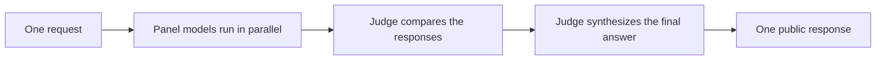

import Tabs from '@theme/Tabs';
import TabItem from '@theme/TabItem';

# Fusion model

`litellm/fusion-1` is a LiteLLM-provided virtual model for requests that benefit from independent model perspectives. It sends the request to a configurable panel in parallel, asks a judge to compare the successful responses, then has the judge synthesize one public response.

The request and response keep the native shape of the SDK method you call. Fusion works with Chat Completions, Anthropic Messages, and Responses.



The judge first produces a structured comparison covering consensus, contradictions, coverage gaps, unique insights, and blind spots. LiteLLM feeds that private analysis back to the judge, which writes the final answer. The public `response.model` identifies the concrete judge model that produced it.

## Quick start

Set credentials for every provider used by the panel and judge. The same `fusion` configuration works across all three SDK interfaces.

<Tabs>
<TabItem value="chat" label="Chat Completions" default>

```python showLineNumbers
import litellm

fusion = {
    "models": [
        "openai/gpt-4o-mini",
        "anthropic/claude-haiku-4-5",
    ],
    "judge": {
        "model": "openai/gpt-4o-mini",
        "criteria": "Prioritize correctness and verifiable evidence.",
    },
}

response = litellm.completion(
    model="litellm/fusion-1",
    messages=[
        {
            "role": "user",
            "content": "Review this database migration plan for operational risks.",
        }
    ],
    fusion=fusion,
)

print(response.model)
print(response.choices[0].message.content)
```

</TabItem>
<TabItem value="messages" label="Anthropic Messages">

```python showLineNumbers
import litellm

fusion = {
    "models": [
        "openai/gpt-4o-mini",
        "anthropic/claude-haiku-4-5",
    ],
    "judge": {
        "model": "openai/gpt-4o-mini",
        "criteria": "Prioritize correctness and verifiable evidence.",
    },
}

response = litellm.anthropic.messages.create(
    model="litellm/fusion-1",
    max_tokens=2048,
    messages=[
        {
            "role": "user",
            "content": "Review this database migration plan for operational risks.",
        }
    ],
    fusion=fusion,
)

print(response["model"])
print(response["content"][0]["text"])
```

</TabItem>
<TabItem value="responses" label="Responses">

```python showLineNumbers
import litellm

fusion = {
    "models": [
        "openai/gpt-4o-mini",
        "anthropic/claude-haiku-4-5",
    ],
    "judge": {
        "model": "openai/gpt-4o-mini",
        "criteria": "Prioritize correctness and verifiable evidence.",
    },
}

response = litellm.responses(
    model="litellm/fusion-1",
    input="Review this database migration plan for operational risks.",
    fusion=fusion,
)

print(response.model)
print(response.output_text)
```

</TabItem>
</Tabs>

Calling `litellm/fusion-1` always runs deliberation. There is no separate flag to enable it. You can omit `fusion` to use the default panel and judge.

## Response behavior

Fusion returns one normal response in the format of the SDK method you called. It does not return separate panel responses or the private judge comparison. The response's hidden Fusion metadata reports whether deliberation ran and how many panel calls succeeded or failed, without including their content. Its hidden `router` field identifies `litellm/fusion-1`.

## Configuration

Pass a `fusion` dictionary alongside `model="litellm/fusion-1"`. Every field is optional.

| Field | Default | Description |
|---|---|---|
| `models` | LiteLLM default panel | One to eight models that answer independently in parallel. |
| `judge.model` | LiteLLM default judge | Model that compares successful panel responses and writes the final answer. |
| `judge.criteria` | `None` | Instructions used to compare the panel responses. |
| `max_tool_calls` | `4` | Maximum internal tool-calling steps per panel or judge call. |
| `max_completion_tokens` | `16000` | Maximum output tokens, including reasoning, for each internal call. |
| `reasoning` | Provider default | Reasoning effort forwarded to panel and judge calls. |
| `temperature` | Provider default | Temperature forwarded to panel calls. The judge uses temperature `0`. |

## Tools and streaming

Standard tools and streaming remain available on the public request. Client tool schemas are kept private from panel and comparison calls. The judge receives them when it authors the final response.

## Cost and recursion

Fusion makes several provider calls for one public request. Cost and latency increase with panel size and the configured models. Panel and judge models cannot recursively invoke `litellm/fusion-1`; deliberation is bounded to one level.
