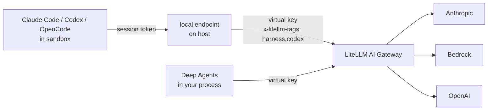

# Using with LiteLLM AI Gateway

The recommended way to run `litellm.harness` is against a [LiteLLM AI Gateway](/docs/proxy/docker_quick_start). Claude Code, Codex, OpenCode and Deep Agents each expect a different provider API and a different way to pass credentials. With the gateway they all use one virtual key, the same model groups and fallbacks, and every call lands in the gateway's spend logs tagged with the harness that made it.

Keys stay out of the sandbox. The runtime only ever sees a per-session token for a local endpoint on your host, and that endpoint adds your virtual key when it forwards to the gateway. Provider keys live on the gateway and never reach your machine at all.

## How requests flow



Every forwarded request carries `x-litellm-tags: harness,<name>` (see [request tags](/docs/proxy/request_tags)), where `<name>` is the harness value (`claude_code`, `codex`, `opencode` or `deepagents`), and your `metadata=` is sent as `x-litellm-spend-logs-metadata`. The `model` in each request is rewritten to the model group you passed, so a runtime's own default model name never reaches the gateway.

## 1. Configure the gateway

One model group, `coder`, serves all four harnesses. The gateway exposes it on `/v1/messages` for Claude Code, `/v1/responses` for Codex and `/v1/chat/completions` for OpenCode and Deep Agents, and translates between formats when needed.

```yaml title="config.yaml"
model_list:
  - model_name: coder
    litellm_params:
      model: anthropic/claude-sonnet-4-5
      api_key: os.environ/ANTHROPIC_API_KEY
  - model_name: coder
    litellm_params:
      model: bedrock/us.anthropic.claude-sonnet-4-5-20250929-v1:0
      aws_region_name: us-west-2
  - model_name: coder-fallback
    litellm_params:
      model: openai/gpt-5
      api_key: os.environ/OPENAI_API_KEY

router_settings:
  fallbacks: [{"coder": ["coder-fallback"]}]

general_settings:
  master_key: os.environ/LITELLM_MASTER_KEY
  database_url: os.environ/DATABASE_URL
```

```bash
litellm --config config.yaml --port 4000
```

The two `coder` entries load-balance between Anthropic and Bedrock, and the gateway falls back to `coder-fallback` if both fail. A database is needed for virtual keys and spend logs.

## 2. Create a virtual key

```bash
curl -X POST http://localhost:4000/key/generate \
  -H "Authorization: Bearer $LITELLM_MASTER_KEY" \
  -H "Content-Type: application/json" \
  -d '{"models": ["coder"], "key_alias": "agent-harness", "metadata": {"owner": "platform"}}'
```

The response contains a `key` starting with `sk-`. Scoping it to `models: ["coder"]` means a harness can't call any other model group with it. See [Virtual keys](/docs/proxy/virtual_keys) for rate limits and team keys.

## 3. Point litellm.harness at it

```bash
export LITELLM_PROXY_API_BASE=http://localhost:4000
export LITELLM_PROXY_API_KEY=sk-...
```

With those set, every call uses the gateway. You can also pass `gateway=Gateway(api_base=..., api_key=...)` explicitly, which takes precedence over the environment. `api_base` is the gateway root, without `/v1`.

## 4. Run each harness

The runtime binaries for the CLI harnesses must already be on the sandbox's `PATH`. The loop below runs the same task on all four, each against the same `coder` group.

```python title="compare.py"
import litellm
from litellm import sandbox
from litellm.harness import Harness

task = "Add a /health endpoint with a test. Keep the diff small."

for harness in (Harness.CLAUDE_CODE, Harness.CODEX, Harness.OPENCODE, Harness.DEEPAGENTS):
    r = litellm.harness.run(
        harness,
        task,
        sandbox=sandbox.docker("litellm-harness-runtimes:latest", mounts={"./api": "/workspace"}),
        model="coder",
        metadata={"run": "health-endpoint-compare"},
    )
    print(f"{harness.name:12} {r.stop_reason:8} ${r.cost:.4f} {len(r.files)} files")
```

```text
CLAUDE_CODE  done     $0.1822 2 files
CODEX        done     $0.1417 2 files
OPENCODE     done     $0.1590 2 files
DEEPAGENTS   done     $0.2034 2 files
```

`r.cost` comes from the gateway's `x-litellm-response-cost` header, so it matches what the gateway records.

## 5. See spend by harness

In the gateway UI, open **Usage** and switch to the tag view. Each harness shows up as its own tag (`claude_code`, `codex`, `opencode`, `deepagents`) next to the shared `harness` tag, so you can compare cost and request count per runtime. The same data is available from the API.

```bash
# daily spend and tokens for each harness tag
curl "http://localhost:4000/tag/daily/activity?tags=claude_code,codex,opencode,deepagents&start_date=2026-09-01&end_date=2026-09-30" \
  -H "Authorization: Bearer $LITELLM_MASTER_KEY"

# individual requests made with the harness key
curl "http://localhost:4000/spend/logs?api_key=sk-...&start_date=2026-09-30&end_date=2026-10-01&summarize=false" \
  -H "Authorization: Bearer $LITELLM_MASTER_KEY"
```

Each spend log row has `request_tags` set to `["harness", "codex"]` (or the matching harness) and your `metadata=` under `metadata.spend_logs_metadata`, so you can filter by a run id or a user id you passed in.

## Without a gateway

If you don't run a gateway, `litellm.harness` calls providers directly through the LiteLLM SDK. Leave `LITELLM_PROXY_API_BASE` unset, set the usual provider variable on your host, and pass a full LiteLLM model string.

```python
result = litellm.harness.run(
    Harness.CODEX,
    "Add type hints to utils.py",
    sandbox=sandbox.local("./repo"),
    model="anthropic/claude-sonnet-4-5",  # reads ANTHROPIC_API_KEY on the host
)
```

The per-session endpoint still keeps the key on the host, and cost is computed locally from LiteLLM's model cost map. You lose central spend logs, shared keys and gateway-side fallbacks. See [Models and routing](./models.md#sdk-mode) for details.
