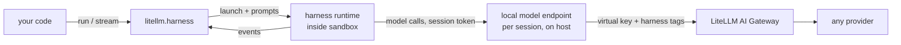

# Agent Harnesses

:::info Beta
`litellm.harness` is in beta. The API may change between releases.
:::

`litellm.harness` runs complete agent runtimes (Claude Code, Codex, OpenCode and Deep Agents) from Python with one API. Every model call the runtime makes goes through the LiteLLM AI Gateway, so all four harnesses share one virtual key, one set of model groups and fallbacks, and one place to see spend.

```python title="fix_flaky.py"
import litellm
from litellm import sandbox
from litellm.harness import Harness, Gateway

gateway = Gateway(
    api_base="https://litellm.example.com",
    api_key="sk-litellm-...",  # a LiteLLM virtual key
)

result = litellm.harness.run(
    Harness.CLAUDE_CODE,
    "Find why tests/test_router.py is flaky and fix it.",
    sandbox=sandbox.local("./repo"),
    gateway=gateway,
    model="coder",  # a model group on the gateway
)

print(result.text)
print(result.cost)         # 0.4137
for f in result.files:
    print(f.kind, f.path)  # modified tests/test_router.py
```

If `LITELLM_PROXY_API_BASE` and `LITELLM_PROXY_API_KEY` are set, you can leave out `gateway=` and it is picked up from the environment. To run the same task on Codex, change `Harness.CLAUDE_CODE` to `Harness.CODEX`. The rest of the call stays the same.

See [Using with LiteLLM AI Gateway](./gateway.md) for the proxy config, virtual keys and spend by harness. You can also run without a gateway, calling providers directly through the LiteLLM SDK; see [Models and routing](./models.md#sdk-mode).

## Supported harnesses

| Harness | Runtime | Runs in |
|---|---|---|
| [`Harness.CLAUDE_CODE`](./claude_code.md) | Anthropic's Claude Code CLI | your sandbox |
| [`Harness.CODEX`](./codex.md) | OpenAI's Codex CLI | your sandbox |
| [`Harness.OPENCODE`](./opencode.md) | OpenCode CLI | your sandbox |
| [`Harness.DEEPAGENTS`](./deepagents.md) | LangChain Deep Agents | your Python process, tools act on your sandbox |

[Supported harnesses](./supported.md) has the full capability table.

## What a harness is

A harness is a complete agent program with its own tool loop, file tools, shell, conversation history, compaction and permission model. You don't rebuild any of that. `litellm.harness` starts the runtime, sends it prompts, and turns what it does into typed Python events.

With `litellm.completion` you get one model call and write the loop yourself. With a harness you get a finished loop that somebody else maintains. Use a harness when you want a coding agent working on a repo or a container, and `completion` when you need exact control over each model call.

## How it works



For each session, `litellm.harness` starts a small model endpoint on the host and points the runtime at it with the runtime's own base URL setting, such as `ANTHROPIC_BASE_URL` for Claude Code. The runtime gets a random token that only works for that session. The endpoint forwards each request to the gateway with your virtual key and tags it `harness,<name>`. Neither your virtual key nor any provider key enters the sandbox.

Deep Agents is a Python library, so it runs in your process and talks to the gateway through a `ChatLiteLLM` model. It doesn't need the local endpoint.

## Core concepts

`Harness` is an enum of the supported runtimes. It's a plain `Enum`, and passing a string like `"codex"` raises `TypeError` with a hint pointing at `Harness.CODEX`.

`Gateway` holds the gateway's base URL and a virtual key. Pass one explicitly or let `Gateway.from_env()` build it from `LITELLM_PROXY_API_BASE` and `LITELLM_PROXY_API_KEY`.

A `Sandbox` is where the runtime runs and which files it can touch. You always pass one; there is no default that runs on your host. In this release the runtime binary must already be installed in the sandbox.

A `Session` is a live runtime with its sandbox, working directory and history. `run()` and `stream()` open one for a single turn and close it after. `session()` keeps it open across turns.

An `Event` is one of eight frozen dataclasses: `Text`, `Reasoning`, `ToolCall`, `ToolResult`, `FileChange`, `Compaction`, `Approval` and `Done`. The set is closed, so a `match` statement over it can be exhaustive.

## Install

```bash
pip install "litellm[harness]"
```

For Deep Agents, install `litellm[harness-deepagents]` instead. The CLI harnesses also need their binary on the sandbox's `PATH`; each harness page lists the install command.
