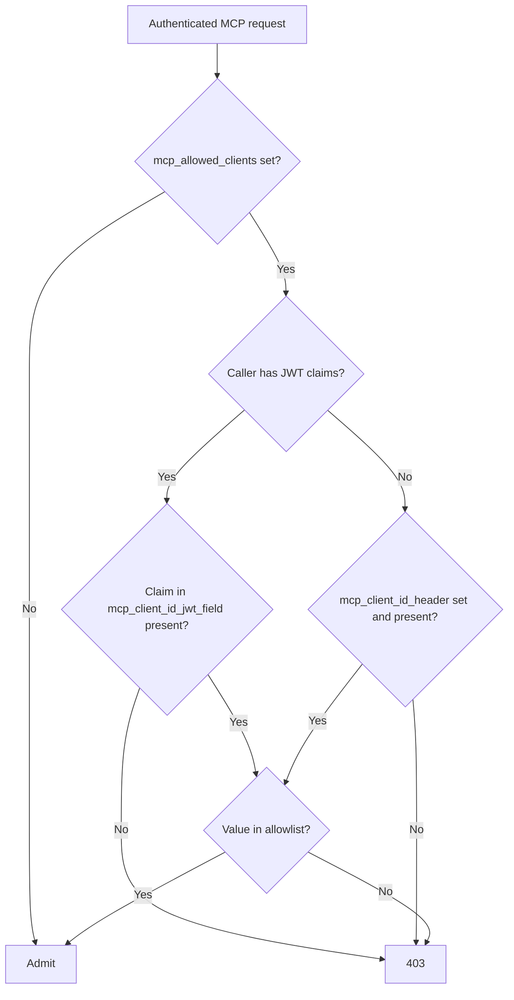

import Tabs from '@theme/Tabs';
import TabItem from '@theme/TabItem';
import Image from '@theme/IdealImage';

# Allowlisting MCP Client Applications

Decide which MCP client applications (Claude Code, Cursor, an internal CLI, and so on) may use your gateway at all. Every MCP request that arrives without a listed client identity is rejected with a 403 before it reaches any MCP server, whichever key or token it carries.

## Overview

| Property | Details |
|-------|-------|
| Description | Gateway-wide allowlist of MCP client applications, checked on every MCP request after authentication |
| Allowlist | `mcp_allowed_clients` in `general_settings`, a list of `alias` + `value` entries (unset admits every client) |
| JWT identity | `mcp_client_id_jwt_field` in `litellm_jwtauth`, for example `azp` or `client_id` |
| Header identity | `mcp_client_id_header` in `general_settings`, opt-in and less secure |
| Where to edit | config.yaml or the **Network Settings** tab under MCP Servers in the Admin UI |

## How It Works

The check runs right after LiteLLM authenticates the MCP request, on the `/mcp` Streamable HTTP endpoint, the `/mcp/sse` endpoint and the authenticated [MCP REST API](./mcp_rest_api.md) routes alike. It works out who the calling client is, then compares that identity against the `value` of each entry in `mcp_allowed_clients` with an exact, case-sensitive string match.

Each allowed client has two parts. The `value` is the string the identity provider (or the header) will actually carry, typically an OAuth client ID such as `0oa1b2c3d4e5f6g7h8i9`. The `alias` is the name you give that client so the dashboard and the gateway logs read "Coding CLI" rather than an opaque ID. Only the value is ever compared; an alias never admits anyone.

A caller that authenticated with a JWT is identified by the claim named in `litellm_jwtauth.mcp_client_id_jwt_field`. Identity providers stamp the client application into the token (`cid` on Okta, `azp` on Entra ID v2 tokens, `client_id` on RFC 9068 access tokens), so the client cannot change this value. A JWT caller whose token lacks the claim, or whose claim is not on the list, is rejected; the token never falls back to the header. This is the recommended path.

Any other caller (a virtual key, the master key, an OAuth session without a usable JWT claim) is identified by the request header named in `general_settings.mcp_client_id_header`, if you set one. The client picks the header value itself, so treat this as a policy control rather than a security boundary. Without the header setting, callers that carry no JWT identity are rejected while the allowlist is set.

This claim is separate from `agent_id_jwt_field`, which identifies an AI agent. `mcp_client_id_jwt_field` names the client software, such as a coding harness or desktop app.



## Populating the claim in your identity provider

Most identity providers already put the OAuth client ID into every access token, so usually no custom claim is needed: point `mcp_client_id_jwt_field` at that standard claim and allowlist the client IDs of the apps you trust, giving each a readable alias.

**Okta.** Access tokens carry the reserved `cid` claim, the client ID of the app that requested the token, so `mcp_client_id_jwt_field: cid` works with no extra setup and the allowlist values are your Okta app client IDs (for example `0oa1b2c3d4e5f6g7h8i9`). If you would rather match on a name you control, create a custom claim on a [custom authorization server](https://developer.okta.com/docs/guides/customize-tokens-returned-from-okta/main/) (Security > API > Authorization Servers > your server > Claims > Add Claim, included in the access token) with an expression such as `app.clientId`, or `app.profile.mcpClientName` after adding that attribute to each app's profile, and set `mcp_client_id_jwt_field` to the claim's name. Custom claims are not available on the Okta org authorization server

**Other providers.** Entra ID v2 access tokens carry the client app ID in `azp` (v1 tokens use `appid`), and access tokens that follow RFC 9068 carry it in `client_id`. Check your provider's token reference for the exact claim; `mcp_client_id_jwt_field` accepts dot notation for nested claims

## Walkthrough

This walkthrough admits one internal CLI, whose identity provider issues tokens with `azp: antigravity-cli`, under the alias "Antigravity CLI", and shuts out everything else. It assumes [JWT auth](./proxy/token_auth.md) is already enabled on the proxy.

### Step 1: Name the JWT claim that identifies the client

`litellm_jwtauth` lives in config.yaml, so add the claim there and restart the proxy. Use the claim your identity provider fills with the client application id; `azp` is the usual choice, and dot notation works for nested claims.

```yaml title="config.yaml" showLineNumbers
general_settings:
  master_key: sk-1234
  enable_jwt_auth: true
  litellm_jwtauth:
    mcp_client_id_jwt_field: azp
    user_id_jwt_field: sub
    user_id_upsert: true
```

### Step 2: Add the allowlist in the Admin UI

Open the MCP Servers page and switch to the **Network Settings** tab. The **Allowed Client Applications** section sits below the private IP ranges and starts out empty, which means every client is admitted.

<Image
  img={require('../img/mcp_client_allowlist_ui_empty.png')}
  style={{width: '100%', display: 'block', margin: '0'}}
/>

Click **Add client** under **Allowed Clients** and fill the row: **Alias** `Antigravity CLI`, **Value** `antigravity-cli`. Add one row per client application, for example a second row with **Alias** `Claude Code` and **Value** `claude-code`. If some of your callers use virtual keys instead of JWTs, also fill **Client Identity Header** with the header they will send, for example `x-mcp-client`. Click **Save**. The change is stored in the database and picked up by every proxy worker on its next settings poll, without a restart.

<Image
  img={require('../img/mcp_client_allowlist_ui_saved.png')}
  style={{width: '100%', display: 'block', margin: '0'}}
/>

To go back to admitting every client, remove every row and click **Save** again; the setting is deleted rather than saved as an empty list. If an empty list is ever stored (for example through the API), or the stored value is not a list of alias and value pairs (for example a plain list of strings written by an older version), the page warns that every client is being denied. Add the rows you want and Save to replace it, or Save with the list empty to remove it.

<Image
  img={require('../img/mcp_client_allowlist_ui_deny_all.png')}
  style={{width: '100%', display: 'block', margin: '0'}}
/>

### Step 3: Verify from the client side

A JWT whose `azp` claim is `antigravity-cli` initializes normally.

```bash title="Listed JWT client" showLineNumbers
curl -sS -w 'HTTP %{http_code}\n' http://localhost:4000/mcp \
  -H "Authorization: Bearer $JWT_WITH_AZP_ANTIGRAVITY_CLI" \
  -H "Content-Type: application/json" \
  -H "Accept: application/json, text/event-stream" \
  -d '{"jsonrpc":"2.0","id":0,"method":"initialize","params":{"protocolVersion":"2025-06-18","capabilities":{},"clientInfo":{"name":"antigravity-cli","version":"1.0.0"}}}'
```

```text
event: message
data: {"jsonrpc":"2.0","id":0,"result":{"protocolVersion":"2025-06-18",...,"serverInfo":{"name":"litellm-mcp-server","version":"1.0.0"}}}
HTTP 200
```

The same request with a JWT whose `azp` is `claude-code` is refused, and adding `x-mcp-client: antigravity-cli` to that request changes nothing because the token decides.

```text
{"detail":{"error":"Forbidden","details":"MCP client 'claude-code' (from JWT claim 'azp') is not listed in this gateway's mcp_allowed_clients."}}
HTTP 403
```

A virtual key is identified by the header instead. `x-mcp-client: antigravity-cli` gets a 200; any other value, or no header at all, gets a 403 that names the header.

```bash title="Listed header client" showLineNumbers
curl -sS -w 'HTTP %{http_code}\n' http://localhost:4000/mcp \
  -H "Authorization: Bearer sk-1234" \
  -H "x-mcp-client: antigravity-cli" \
  -H "Content-Type: application/json" \
  -H "Accept: application/json, text/event-stream" \
  -d '{"jsonrpc":"2.0","id":0,"method":"initialize","params":{"protocolVersion":"2025-06-18","capabilities":{},"clientInfo":{"name":"antigravity-cli","version":"1.0.0"}}}'
```

```text
event: message
data: {"jsonrpc":"2.0","id":0,"result":{"protocolVersion":"2025-06-18",...,"serverInfo":{"name":"litellm-mcp-server","version":"1.0.0"}}}
HTTP 200
```

Drop the header from that request and the gateway names what it was looking for.

```text
{"detail":{"error":"Forbidden","details":"The request has no 'x-mcp-client' header naming the client application. This gateway only admits client applications listed in mcp_allowed_clients."}}
HTTP 403
```

Rejected requests show up in the proxy log as `Rejected MCP request from a disallowed client application: ...`.

## Configuration Reference

<Tabs>
<TabItem value="ui" label="UI">

MCP Servers page, **Network Settings** tab, **Allowed Client Applications** section. Each **Allowed Clients** row (alias and value) is one entry of `mcp_allowed_clients` and **Client Identity Header** maps to `mcp_client_id_header`. A row needs both fields; Save rejects a row with only one of them filled. A key that is set in config.yaml cannot be edited here; remove it from the file first.

</TabItem>
<TabItem value="config" label="config.yaml">

```yaml title="config.yaml" showLineNumbers
general_settings:
  enable_jwt_auth: true
  litellm_jwtauth:
    mcp_client_id_jwt_field: azp      # JWT claim naming the client app; supports dot notation
  mcp_allowed_clients:                # unset = admit every client; only value is matched
    - alias: Antigravity CLI
      value: antigravity-cli
    - alias: Claude Code
      value: claude-code
  mcp_client_id_header: x-mcp-client  # optional, for callers without a JWT identity
```

</TabItem>
<TabItem value="api" label="API">

```bash title="Save the allowlist at runtime" showLineNumbers
curl -X POST <your-litellm-url>/config/field/update \
  -H "Authorization: Bearer sk-..." \
  -H "Content-Type: application/json" \
  -d '{
    "field_name": "mcp_allowed_clients",
    "field_value": [
      {"alias": "Antigravity CLI", "value": "antigravity-cli"},
      {"alias": "Claude Code", "value": "claude-code"}
    ],
    "config_type": "general_settings"
  }'
```

Repeat with `"field_name": "mcp_client_id_header"` and `"field_value": "x-mcp-client"` to enable header identity

```bash title="Admit every client again" showLineNumbers
curl -X POST <your-litellm-url>/config/field/delete \
  -H "Authorization: Bearer sk-..." \
  -H "Content-Type: application/json" \
  -d '{"field_name": "mcp_allowed_clients", "config_type": "general_settings"}'
```

</TabItem>
</Tabs>

### Behavior summary

| `mcp_allowed_clients` | Caller | Result |
|---|---|---|
| Unset | Anyone | Admitted |
| Set | JWT with listed claim value | Admitted |
| Set | JWT with unlisted or missing claim value | 403, even with a listed header |
| Set | Non-JWT caller with listed header value | Admitted |
| Set | Non-JWT caller with unlisted or missing header, or no `mcp_client_id_header` configured | 403 |
| Set to `[]`, or to entries missing `alias` or `value` | Anyone | 403 |

The allowlist gates the MCP protocol endpoints (`/mcp` and `/mcp/sse`) and the authenticated [MCP REST API](./mcp_rest_api.md) routes (`/mcp-rest/tools/list`, `/mcp-rest/tools/call`). The Admin UI's own connection-test routes are not affected, and requests made with a dashboard session token (the credential the Admin UI mints for a logged-in user) skip the check so the MCP tool tester in the dashboard keeps working; that token expires after `LITELLM_UI_SESSION_DURATION` (24 hours by default), but a user who copies it out of the browser can use it from a client that is not on the list until then. Per-key and per-team MCP server permissions from [MCP Permission Management](./mcp_control.md) still apply after a client is admitted.
