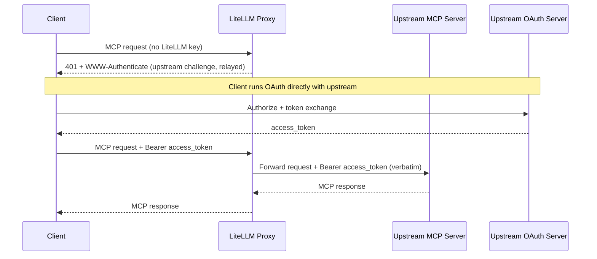
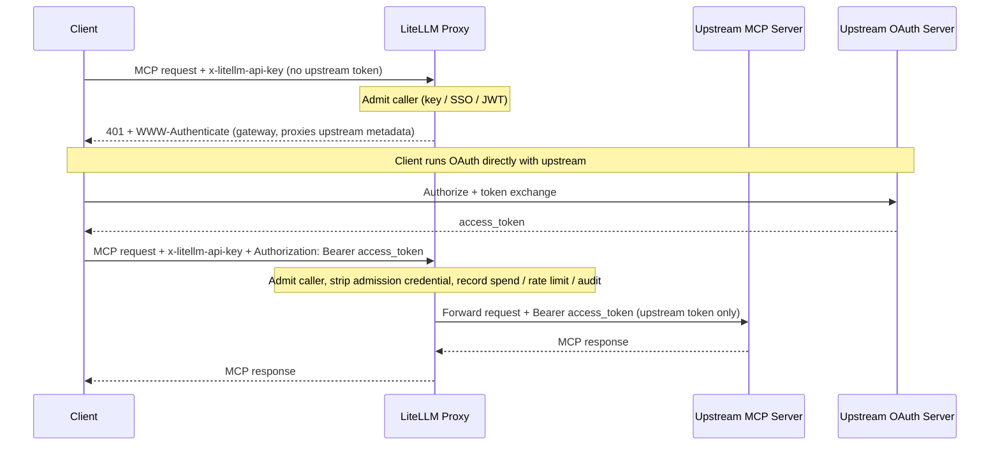
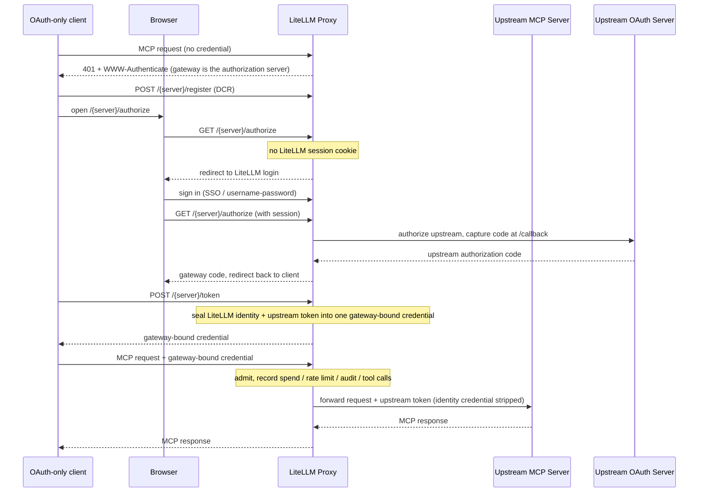

# MCP OAuth Passthrough

Some MCP servers run their own OAuth issuer and expect the client (Claude Code, Cursor, ChatGPT, etc.) to authenticate directly against it. For those servers LiteLLM can let the client's own upstream token flow through instead of minting, storing, or refreshing anything itself.

:::danger Breaking Changes

**Legacy delegated OAuth MCP routes require LiteLLM authentication in builds containing [PR #40923](https://github.com/BerriAI/litellm/pull/40923).** This is an upcoming release change: `auth_type: oauth2` with `delegate_auth_to_upstream: true` no longer admits callers based only on an upstream OAuth token. Such requests now return `401`. Authenticate to LiteLLM separately and migrate to `auth_type: oauth_delegate`; the upstream token still uses `Authorization: Bearer <upstream-token>` unchanged. Existing requests with distinct LiteLLM and upstream credentials remain supported. See the [migration steps](#delegate-auth-to-upstream-pkce-passthrough).

The passthrough spend behavior below also applies to builds containing this PR. Older builds may omit successful anonymous tool calls from spend logs. No released version is assigned to this notice yet.

:::

Two `auth_type` values cover this. They differ in one thing: whether LiteLLM still authenticates the caller at its own edge.

| Mode | LiteLLM admission | Credential forwarded upstream | Spend / rate limits / audit | Use when |
|------|-------------------|-------------------------------|-----------------------------|----------|
| `true_passthrough` | None; anonymous at the LiteLLM layer | The client's `Authorization`, verbatim | Successful tool spend is recorded without identity attribution; no identity-based budget debits or rate limits | LiteLLM should add zero auth and the upstream is the sole gate |
| `oauth_delegate` | Required (LiteLLM key / SSO / JWT) | A distinct upstream bearer the caller sends alongside admission | Recorded, keyed on the admission identity | You want LiteLLM to keep gating and observing the route while the upstream owns tool authorization |

Both modes return the upstream's protected-resource metadata verbatim during discovery, so the client always authorizes against the real upstream issuer.

Both forward the token exactly as the caller sent it. LiteLLM does not decode it, does not check its audience or scopes, and does not exchange it; the upstream MCP server is the only party that validates it. If the caller's token was minted for a different resource, neither mode can make it work, and you want [`oauth2_token_exchange`](#audience-locked-tokens-passthrough-or-token-exchange) instead.

Both also take an orthogonal `dcr_bridge` flag that changes where an OAuth-only client discovers its authorization server. Turn it on for clients that cannot register with the upstream IdP themselves or cannot send two separate credentials, such as OpenCode, Claude Code, Cursor, and Claude Desktop. See [Gateway-hosted sign-in (DCR bridge)](#gateway-hosted-sign-in-dcr-bridge).

## Audience-locked tokens: passthrough or token exchange {#audience-locked-tokens-passthrough-or-token-exchange}

An OAuth access token carries an audience (`aud`, or the resource it was requested for). A well-behaved upstream MCP server rejects any token whose audience names something else, for example a token an agent obtained for a SaaS API and then presented to the MCP server. Because `true_passthrough` and `oauth_delegate` forward the token verbatim, that rejection shows up as the upstream's own `401` relayed back to the client. This is the correct confused-deputy-safe outcome: the gateway did not launder a token minted for one resource into access to another, and it is not a LiteLLM bug to file.

Pick the mode from the token you actually hold:

| The caller's token was minted for | Use | What LiteLLM does with it |
|-----------------------------------|-----|---------------------------|
| The upstream MCP server itself (the client ran OAuth against that server's issuer) | `true_passthrough` or `oauth_delegate` | Forwards it verbatim; the upstream validates audience and scopes |
| A different resource (your IdP, an internal API, a SaaS API), and your IdP supports RFC 8693 or Entra On-Behalf-Of | `oauth2_token_exchange` | Sends it to the IdP as the `subject_token`, receives a token whose audience is the MCP server (`audience: ...` in the server config), caches it, and forwards only the exchanged token. See [MCP OBO Auth](./mcp_obo_auth.md) |
| A LiteLLM virtual key, SSO session, or IdP JWT that only proves identity to the gateway | Neither passthrough mode | Admission credentials are never forwarded upstream. Configure a server-side credential (`oauth2` client credentials, a static `authentication_token`, or token exchange) instead |

The practical test: if you would have to ask your IdP to widen a token's audience so the upstream accepts it, stop and use token exchange. Widening audiences turns one bearer into a key for several resources, and the passthrough modes exist precisely so that the gateway never does that on the caller's behalf.

## true_passthrough

LiteLLM acts as a transparent proxy: no admission check, nothing minted or stored, and the client's `Authorization` forwarded unchanged. Reach for it when the upstream is the source of truth for access and you do not want LiteLLM gating the route twice.

### Setup

```yaml title="config.yaml" showLineNumbers
mcp_servers:
  notion_passthrough:
    url: "https://mcp.notion.com/mcp"
    auth_type: true_passthrough
```

That is the entire configuration. No client credentials or token endpoints, because LiteLLM never participates in the token exchange.

### How It Works

- The client sends its MCP request with no LiteLLM API key.
- With no upstream token yet, LiteLLM relays the upstream's own `401` and `WWW-Authenticate`.
- The client runs OAuth directly against the upstream issuer.
- The client retries with `Authorization: Bearer <upstream-token>`, and LiteLLM forwards it untouched.



### Fail-Closed Behavior

The transparent path fires only when every target resolves to `true_passthrough`. It falls back to normal LiteLLM admission when:

- The server's `auth_type` is anything else.
- The request targets multiple servers (`x-mcp-servers: a,b`) and any one is not `true_passthrough`.
- The target server cannot be resolved from the URL path or the `x-mcp-servers` header.

### Security Trade-offs

- The MCP route becomes an unauthenticated ingress at the LiteLLM layer.
- Successful tool calls are recorded in spend logs, but without key, user, or team attribution. See [MCP Cost Tracking](./mcp_cost.md#identity-and-budget-attribution).
- These unattributed records do not debit key, user, or team budgets. Per-key rate limits and guardrails requiring a user identity cannot enforce caller-specific policy.
- LiteLLM cannot tell who the caller is, so per-user auditing must come from the upstream server's logs.
- `available_on_public_internet: false` adds no authentication here; it mainly controls IP-based discovery ([see guide](./mcp_public_internet.md)).
- Only enable it on servers whose upstream OAuth issuer you trust to enforce access control.

### Config Reference

| Field | Required | Description |
|-------|----------|-------------|
| `auth_type` | Yes | Must be `true_passthrough`. |
| `url` | Yes | The upstream MCP server URL. |
| `allowed_tools` | No | Server-level tool allowlist. With no caller identity there are no per-key or per-team tool permissions, so this list is the only tool restriction and it applies to every caller identically. |

```yaml title="config.yaml" showLineNumbers
mcp_servers:
  notion_passthrough:
    url: "https://mcp.notion.com/mcp"
    auth_type: true_passthrough
    allowed_tools:
      - search
      - fetch
```

## oauth_delegate

LiteLLM still admits the caller (LiteLLM API key, SSO, or JWT), then forwards a separate upstream bearer the caller supplies. LiteLLM mints nothing and never forwards the admission credential upstream. Use it when the upstream owns tool-level authorization but you still want LiteLLM gating the route and keeping spend, rate-limit, and audit attribution.

### Setup

```yaml title="config.yaml" showLineNumbers
mcp_servers:
  notion_delegate:
    url: "https://mcp.notion.com/mcp"
    auth_type: oauth_delegate
```

No client credentials, for the same reason as `true_passthrough`. What changes is the request: the caller sends two credentials.

### How It Works

- The caller admits with a LiteLLM credential in `x-litellm-api-key`.
- The upstream token rides in `Authorization` (or `x-mcp-<alias>-authorization` for aggregate requests).
- LiteLLM validates admission, then forwards only the upstream bearer, never the admission credential.
- With no upstream token yet, LiteLLM returns a `401` pointing at the gateway's `oauth-protected-resource` well-known, which proxies the upstream metadata verbatim.



:::warning Keep the two credentials in separate headers

If a caller sends a single credential in `Authorization` with no `x-litellm-api-key`, LiteLLM treats it as the admission credential (virtual key, IdP JWT, or SSO session token) and never forwards it upstream. That is the leak defense keeping a LiteLLM or IdP token from reaching a third-party MCP server.

In builds containing [PR #40923](https://github.com/BerriAI/litellm/pull/40923), repeating the LiteLLM admission credential in both headers also strips it from upstream requests. Use a distinct upstream token.

:::

### Security Trade-offs

- Admission always runs, so there is no anonymous ingress.
- Spend, rate limits, and audit resolve against the admission identity.
- LiteLLM forwards the upstream token without inspecting it, so the upstream still owns tool-level authorization and token validation.

### Config Reference

| Field | Required | Description |
|-------|----------|-------------|
| `auth_type` | Yes | Must be `oauth_delegate`. |
| `url` | Yes | The upstream MCP server URL. |

At request time: admission in `x-litellm-api-key`, upstream token in `Authorization: Bearer <upstream-token>` (or `x-mcp-<alias>-authorization` for a specific server in an aggregate request).

Because admission runs, the full LiteLLM permission model applies on top of whatever the upstream enforces: [per-key and per-team tool permissions](./mcp_control.md#per-entity-tool-level-permissions), the server-level `allowed_tools` list, per-key rate limits, and spend logging of every tool call under the admitted identity.

## Multi-server aggregate requests {#multi-server-aggregate-requests}

A request to the aggregate `/mcp` endpoint (or one carrying `x-mcp-servers: a,b`) fans out to several upstreams, but the request can only carry one `Authorization` header. If two of those upstreams both forward the caller's token, sending that one header to both would replay a single bearer across unrelated resources (the cross-resource replay RFC 9700 warns about). LiteLLM therefore applies two rules to `true_passthrough` and `oauth_delegate` servers inside an aggregate scope.

Bind one upstream token to one server with `x-mcp-{alias}-authorization`. The alias is lowercased and any character outside `a-z0-9_` becomes `_`, so a server aliased `Jira Cloud` is addressed as `x-mcp-jira_cloud-authorization`. The value is forwarded verbatim, so include the scheme (`Bearer <token>`). Per-server headers are never withheld, on any operation, because each one names exactly one recipient.

The request-wide `Authorization` is withheld from a client-forwarded server during a listing fan-out (`tools/list`, and the prompt and resource listings) whenever another server in the same scope would also consume it. That server is then listed with no upstream credential, so a server that requires one returns its `401` and the aggregate absorbs it (see below). Explicitly addressed operations such as `tools/call` on a named tool, a single-server route like `/{server_name}/mcp`, or an aggregate scope where only one server forwards the caller's token are unaffected: the client named the one recipient, so the request-wide header is forwarded to it.

In practice this is why a single bearer that is valid for several upstreams can execute tools through the aggregate endpoint yet not appear in the aggregate `tools/list`: the tool call names one server, the listing does not. The fix is to send the token per server rather than request-wide.

```bash title="Aggregate tools/list with per-server tokens" showLineNumbers
curl -X POST "https://litellm.example.com/mcp" \
  -H "Content-Type: application/json" \
  -H "x-litellm-api-key: Bearer $LITELLM_API_KEY" \
  -H "x-mcp-servers: jira,confluence" \
  -H "x-mcp-jira-authorization: Bearer <token-for-jira>" \
  -H "x-mcp-confluence-authorization: Bearer <token-for-confluence>" \
  -d '{"jsonrpc":"2.0","id":1,"method":"tools/list","params":{}}'
```

Sending the same token value on two per-server headers is your decision, made explicitly per server, and LiteLLM honors it. What it refuses to do is make that decision for you by fanning out an unaddressed `Authorization`.

For `true_passthrough` there is an additional constraint: the transparent admission path fires only when every server in the scope is `true_passthrough`. Mixing a `true_passthrough` server into an aggregate with any other mode falls back to normal LiteLLM admission, so the caller needs a LiteLLM credential for that request.

## Previewing tools in the Admin UI {#previewing-tools-in-the-admin-ui}

LiteLLM holds no upstream token for these servers, so the create and edit forms cannot list tools on their own. Both forms show an "Authorize & Fetch Tools (browser-only)" button for `true_passthrough` and `oauth_delegate`. It runs the upstream OAuth flow in the admin's browser and keeps the resulting token in that browser session only, forwarding it per server for the tool preview and for configuring `allowed_tools`. The token is not written to the server row, to the per-user credential store, or to any cache; closing the tab discards it.

The optional OAuth Client ID and Client Secret next to that button are different: they are saved with the server as declared configuration. Set them when the upstream issuer does not support dynamic client registration and every admin should authorize through one pre-registered app.

## Intentional limits {#intentional-limits}

The following are consequences of forwarding a token verbatim without inspecting it, and they are by design rather than defects.

On the multi-server aggregate there is no per-server "needs re-authentication" signal. A single-server route relays the upstream's `401` and `WWW-Authenticate` truthfully, but the aggregate absorbs one server's auth failure into an empty listing for that server so the remaining servers still list. Use the single-server route, or the per-server header, when you need to see which upstream rejected the token.

Sender-constrained tokens (DPoP, RFC 9449, or mTLS-bound tokens, RFC 8705) cannot be relayed. The binding proves the request came from the TLS client or the key holder that obtained the token, and a layer-7 proxy is neither. The upstream will reject them; obtain a plain bearer for the MCP server or use token exchange.

Revoked tokens are not detected at connect time. LiteLLM keeps no state about a forwarded token and does not introspect it, so a token revoked at the issuer is forwarded and rejected by the upstream on the request that uses it. The client sees the upstream's `401` at that point, exactly as it would talking to the upstream directly.

## Gateway-hosted sign-in (DCR bridge) {#gateway-hosted-sign-in-dcr-bridge}

OAuth-only MCP clients (OpenCode, Claude Code, Cursor, Claude Desktop) connect by running a single Dynamic Client Registration (RFC 7591) plus PKCE flow against whatever authorization server the discovery metadata advertises. They:

- Hold no client credential pre-provisioned with the upstream IdP.
- Cannot send a separate LiteLLM credential alongside an upstream token.

So neither the plain `true_passthrough` request nor the two-header `oauth_delegate` request fits them. The `dcr_bridge` flag closes that gap:

- **On:** LiteLLM advertises itself as the authorization server during discovery and hosts `/{server_name}/register`, `/{server_name}/authorize`, and `/{server_name}/token`. The client registers and signs in through the gateway while LiteLLM runs the upstream OAuth behind those endpoints.
- **Off:** LiteLLM relays the upstream server's own OAuth metadata verbatim. Suits clients already registered with the upstream IdP, or able to run DCR directly against it.

Where to set it:

- Valid only on `true_passthrough` and `oauth_delegate`; rejected on any other `auth_type` at create, update, and config load.
- In the Admin UI it is the "Gateway-hosted sign-in (DCR bridge)" switch on the MCP server form, defaulted on for those two modes.
- In config it is a boolean field.

### true_passthrough with the bridge

```yaml title="config.yaml" showLineNumbers
mcp_servers:
  miro:
    url: "https://mcp.miro.com/"
    transport: http
    auth_type: true_passthrough
    dcr_bridge: true
```

The transparent option for OAuth-only clients:

- The client discovers the gateway as its authorization server and registers through `POST /{server_name}/register`.
- It runs PKCE against `GET /{server_name}/authorize` and `POST /{server_name}/token`.
- Where the upstream supports DCR, LiteLLM relays the client's registration to it.
- Where the server has no stored `client_id`, LiteLLM mints an ephemeral client for the flow and persists nothing.
- No LiteLLM sign-in or caller identity is involved. In builds containing [PR #40923](https://github.com/BerriAI/litellm/pull/40923), successful tool spend is recorded without identity attribution, as for other `true_passthrough` requests.

### oauth_delegate with the bridge

```yaml title="config.yaml" showLineNumbers
mcp_servers:
  miro:
    url: "https://mcp.miro.com/"
    transport: http
    auth_type: oauth_delegate
    dcr_bridge: true
```

This combination keeps LiteLLM in the observability path for OAuth-only clients, so spend, rate limits, audit, and per-tool-call attribution all resolve. Reach for it when you want to see in LiteLLM which server a caller used and which tools it invoked.

An OAuth-only client cannot present a LiteLLM key inline, so identity comes from a LiteLLM browser session instead:

- At the authorize step LiteLLM looks for a LiteLLM UI session cookie.
- With no cookie, it redirects to LiteLLM login (`/sso/key/generate`) first.
- After sign-in the user re-initiates the connection.
- LiteLLM seals that identity plus the upstream token into a gateway-bound credential.
- The client stores that credential and replays it on every later request; admission, spend, and audit resolve against it.

:::warning Two prerequisites

- **The gateway needs a working browser sign-in** (SSO or username/password). Without one there is no identity to bind and the authorize step cannot proceed. A missing gateway sign-in is the usual reason an `oauth_delegate` bridge connection stalls at the login page.
- **The client's OAuth flow must run in an interactive browser session.** OpenCode, Claude Code, Cursor, and Claude Desktop all do.

For fully scripted, non-interactive delegation, leave `dcr_bridge` off and use the two-header `oauth_delegate` request instead.

:::



### Choosing the flag

| Situation | `dcr_bridge` |
|-----------|--------------|
| An OAuth-only client (OpenCode, Claude Code, Cursor, Claude Desktop, ChatGPT) that holds no upstream `client_id` and cannot send two credentials | `true` |
| A client already registered with the upstream IdP, or one that runs DCR directly against the upstream | `false` |
| A scripted, non-interactive caller that can send `x-litellm-api-key` plus an upstream `Authorization` bearer | `false`, with `auth_type: oauth_delegate` (two-header form) |

### Connecting a client

- Point the client at `https://<gateway-host>/<server_name>/mcp` and let it discover OAuth from there.
- Do not configure a `client_id` or secret on the client; the gateway handles registration and the token exchange.
- On a `true_passthrough` bridge server the browser flow authorizes only with the upstream.
- On an `oauth_delegate` bridge server it signs in to LiteLLM first, then authorizes with the upstream.

Follow each client's own MCP documentation for exact field names, which change over time.

Claude Code registers and runs the browser flow on first use:

```bash
claude mcp add --transport http miro https://<gateway-host>/miro/mcp
```

Cursor reads remote MCP servers from `~/.cursor/mcp.json`:

```json
{
  "mcpServers": {
    "miro": {
      "url": "https://<gateway-host>/miro/mcp"
    }
  }
}
```

OpenCode reads them from `opencode.json`:

```json
{
  "mcp": {
    "miro": {
      "type": "remote",
      "url": "https://<gateway-host>/miro/mcp",
      "enabled": true
    }
  }
}
```

### Config Reference

| Field | Required | Description |
|-------|----------|-------------|
| `auth_type` | Yes | Must be `true_passthrough` or `oauth_delegate`; `dcr_bridge` is rejected on any other value. |
| `url` | Yes | The upstream MCP server URL. |
| `dcr_bridge` | Yes | `true` so the gateway hosts sign-in for OAuth-only clients. Off relays the upstream's own OAuth metadata instead. |

## Migrate legacy delegated OAuth {#delegate-auth-to-upstream-pkce-passthrough}

:::warning Deprecated

In builds containing [PR #40923](https://github.com/BerriAI/litellm/pull/40923), `auth_type: oauth2` with `delegate_auth_to_upstream: true` is deprecated and requires LiteLLM admission. Loading a legacy interactive configuration from YAML or the database logs a migration warning. Use `auth_type: oauth_delegate` for authenticated delegation.

:::

Previously, a request targeting only legacy delegated servers could skip LiteLLM authentication. Upstream OAuth protected the upstream server, but did not establish a LiteLLM identity or protect the gateway's session and request-processing capacity. The anonymous admission path has been removed; the upstream OAuth protocol has not changed.

### Update the server configuration

Replace the legacy configuration:

```yaml title="Before" showLineNumbers
mcp_servers:
  notion_mcp:
    url: "https://mcp.notion.com/mcp"
    auth_type: oauth2
    oauth2_flow: authorization_code
    delegate_auth_to_upstream: true
```

with:

```yaml title="After" showLineNumbers
mcp_servers:
  notion_mcp:
    url: "https://mcp.notion.com/mcp"
    auth_type: oauth_delegate
```

Keep the server alias, URL, tool permissions, and cost configuration. The delegated mode does not require `oauth2_flow`, `delegate_auth_to_upstream`, or gateway-managed OAuth client credentials. This migration is for interactive delegation, not `oauth2_flow: client_credentials` servers.

### Keep the upstream token and add LiteLLM admission

For a client using a LiteLLM key, send the key separately from the upstream bearer:

```bash
curl -i http://localhost:4000/notion_mcp/mcp \
  -H "Content-Type: application/json" \
  -H "Accept: application/json, text/event-stream" \
  -H "x-litellm-api-key: Bearer $LITELLM_API_KEY" \
  -H "Authorization: Bearer $UPSTREAM_OAUTH_TOKEN" \
  -d '{"jsonrpc":"2.0","id":1,"method":"initialize","params":{"protocolVersion":"2025-03-26","capabilities":{},"clientInfo":{"name":"mcp-client","version":"1.0"}}}'
```

The upstream still validates its own token. LiteLLM validates admission separately and does not forward that admission credential upstream, even if the same value was repeated in both headers. Existing clients already sending distinct credentials do not need to change the upstream token or its header.

LiteLLM admission is not limited to virtual keys: existing JWT, SSO, custom-auth, and gateway-session paths still apply when configured. The command above shows the two-header key flow; it does not require every authentication method to use that header. For OAuth-only clients that cannot send two headers, use the existing [`oauth_delegate` DCR bridge](#oauth_delegate-with-the-bridge), which signs the caller in to LiteLLM before upstream authorization.

Keeping the legacy server configuration does not keep anonymous access: a request with only the upstream token now gets `401`, including when all its targets are legacy delegated servers. Valid dual-credential requests remain supported while you migrate.

### Discovery and explicit anonymous access

OAuth discovery and the upstream authorization flow remain available without a LiteLLM credential, subject to the existing server visibility rules. A credential-free discovery request to a matching legacy MCP route can return `401` with the RFC 9728 `WWW-Authenticate` resource-metadata challenge. That challenge is not admission to an MCP session or permission to list or call tools. Completing upstream OAuth alone does not authenticate the caller to LiteLLM.

If anonymous gateway access is intentional, configure [`true_passthrough`](#true_passthrough) explicitly and account for its security trade-offs. It is not required to preserve the upstream OAuth header contract. Its successful tool calls are logged without identity attribution, which does not restore caller-specific budget or rate-limit enforcement. Setting `available_on_public_internet: false` remains a separate IP-based restriction, not an authentication method.
