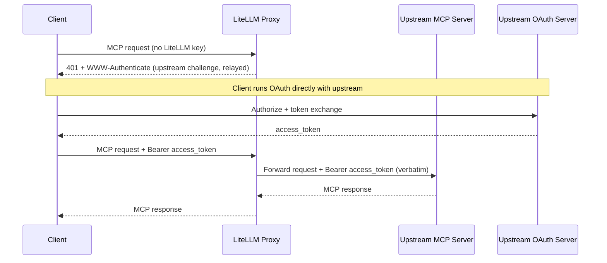
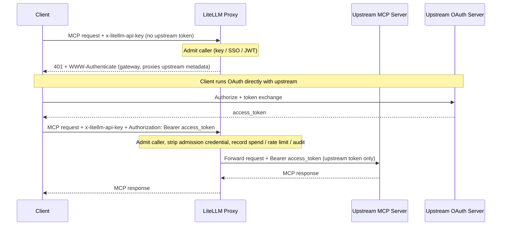
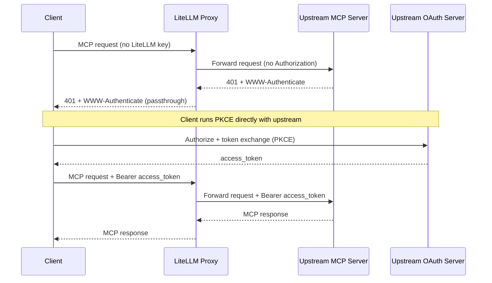

# MCP OAuth Passthrough

Some MCP servers run their own OAuth issuer and expect the client (Claude Code, Cursor, ChatGPT, etc.) to authenticate directly against it. For those servers LiteLLM can let the client's own upstream token flow through instead of minting, storing, or refreshing anything itself. Two `auth_type` values cover this, and they differ in one thing: whether LiteLLM still authenticates the caller at its own edge.

With `true_passthrough` LiteLLM performs no admission of its own and forwards the client's `Authorization` header to the upstream verbatim. With `oauth_delegate` LiteLLM still admits the caller (LiteLLM API key, SSO, or JWT) and then forwards a *separate* upstream bearer the caller supplies alongside that admission, so spend tracking, rate limits, and audit continue to run.

| Mode | LiteLLM admission | Credential forwarded upstream | Spend / rate limits / audit | Use when |
|------|-------------------|-------------------------------|-----------------------------|----------|
| `true_passthrough` | None; anonymous at the LiteLLM layer | The client's `Authorization`, verbatim | Not recorded | LiteLLM should add zero auth and the upstream is the sole gate |
| `oauth_delegate` | Required (LiteLLM key / SSO / JWT) | A distinct upstream bearer the caller sends alongside admission | Recorded, keyed on the admission identity | You want LiteLLM to keep gating and observing the route while the upstream owns tool authorization |

Both modes return the upstream's protected-resource metadata verbatim during discovery, so the client always authorizes against the real upstream issuer and the upstream validates the token audience.

## true_passthrough

LiteLLM acts as a transparent proxy. It runs no admission check, mints and stores nothing, and forwards the client's `Authorization` header to the upstream unchanged. This is the mode to reach for when the upstream server is the source of truth for who can access it and you do not want LiteLLM gating the route a second time.

### Setup

```yaml title="config.yaml" showLineNumbers
mcp_servers:
  notion_passthrough:
    url: "https://mcp.notion.com/mcp"
    auth_type: true_passthrough
```

That is the entire configuration. The mode carries no client credentials or token endpoints because LiteLLM never participates in the token exchange.

### How It Works

The client sends its MCP request with no LiteLLM API key. When no upstream token is present yet, LiteLLM relays the upstream's own `401` and `WWW-Authenticate` so the client runs OAuth directly against the upstream issuer. The client completes the flow, retries with `Authorization: Bearer <upstream-token>`, and LiteLLM forwards that request untouched.



### Fail-Closed Behavior

The transparent path only fires when every target the request resolves to is `true_passthrough`. It falls back to normal LiteLLM admission in any of these cases:

- The server's `auth_type` is anything other than `true_passthrough`.
- The request targets multiple servers (`x-mcp-servers: a,b`) and any one of them is not `true_passthrough`.
- The target server cannot be resolved from the URL path or the `x-mcp-servers` header.

### Security Trade-offs

This mode turns the MCP route into an unauthenticated ingress at the LiteLLM layer. Spend tracking, per-key rate limits, and any guardrails that depend on `user_api_key_auth.user_id` do not run for these requests, and LiteLLM cannot tell who the caller is, so per-user auditing must come from the upstream MCP server's own logs. Only enable it on servers whose upstream OAuth issuer you trust to enforce access control.

Because the caller is anonymous at the LiteLLM layer by design, setting `available_on_public_internet: false` does not add authentication here; it mainly controls IP-based discovery ([see guide](./mcp_public_internet.md)). Enforce access at the upstream IdP and the network edge.

### Config Reference

| Field | Required | Description |
|-------|----------|-------------|
| `auth_type` | Yes | Must be `true_passthrough`. |
| `url` | Yes | The upstream MCP server URL. |

## oauth_delegate

LiteLLM still admits the caller with its usual LiteLLM API key, SSO, or JWT check, then forwards a separate upstream bearer that the caller supplies alongside admission. LiteLLM mints nothing and never forwards the admission credential upstream. Use this when the upstream owns tool-level authorization but you still want LiteLLM to gate the route and keep spend, rate-limit, and audit attribution.

### Setup

```yaml title="config.yaml" showLineNumbers
mcp_servers:
  notion_delegate:
    url: "https://mcp.notion.com/mcp"
    auth_type: oauth_delegate
```

The mode carries no client credentials for the same reason as `true_passthrough`: LiteLLM does not run the token exchange. What changes is the request: the caller sends two credentials.

### How It Works

The caller admits with a LiteLLM credential in `x-litellm-api-key` and carries the upstream token in `Authorization` (or in a per-server `x-mcp-<alias>-authorization` header for aggregate requests). LiteLLM validates admission, then forwards only the separate upstream bearer to the upstream, never the admission credential. When admission succeeds but no upstream token is present yet, LiteLLM issues a `401` at the gateway pointing the client at the gateway's `oauth-protected-resource` well-known, which proxies the upstream metadata verbatim so the client authorizes against the real upstream issuer.



The one thing to get right is keeping the two credentials in separate headers. If a caller sends a single credential in `Authorization` with no `x-litellm-api-key`, LiteLLM treats that `Authorization` as the admission credential (a virtual key, an IdP JWT, or an SSO session token) and never forwards it upstream, which is the leak defense that keeps a LiteLLM or IdP token from reaching a third-party MCP server.

### Security Trade-offs

Unlike `true_passthrough`, `oauth_delegate` keeps LiteLLM in the auth and observability path. Admission always runs, so there is no anonymous ingress, and spend, rate limits, and audit resolve against the admission identity. The upstream token is a distinct credential that LiteLLM forwards without inspecting, so the upstream remains responsible for tool-level authorization and token validation.

### Config Reference

| Field | Required | Description |
|-------|----------|-------------|
| `auth_type` | Yes | Must be `oauth_delegate`. |
| `url` | Yes | The upstream MCP server URL. |

At request time the caller sends admission in `x-litellm-api-key` and the upstream token in `Authorization: Bearer <upstream-token>` (or `x-mcp-<alias>-authorization` when addressing a specific server in an aggregate request).

## Delegate Auth to Upstream (PKCE Passthrough) {#delegate-auth-to-upstream-pkce-passthrough}

:::warning Deprecated

`delegate_auth_to_upstream` is the original flag-based form of transparent passthrough and is planned for deprecation. It is the direct predecessor of `auth_type: true_passthrough` and behaves the same way (same how-it-works, same fail-closed behavior, same security trade-offs), so new servers should use `true_passthrough`. The section below is kept for existing configs.

:::

For OAuth2 MCP servers where the client (Claude Code, Cursor, ChatGPT, etc.) already authenticates directly against the upstream server's own OAuth issuer, you can opt the route into **upstream-delegated auth**: LiteLLM stops checking its own API key / SSO and lets the client's PKCE flow run end-to-end with the upstream MCP server.

Use this when the upstream server is the source of truth for who can access it and you don't want LiteLLM to gate the route a second time.

### Setup

```yaml title="config.yaml" showLineNumbers
mcp_servers:
  notion_mcp:
    url: "https://mcp.notion.com/mcp"
    auth_type: oauth2
    oauth2_flow: authorization_code
    delegate_auth_to_upstream: true
```

That's the entire change. Delegated servers are interactive, so they take `oauth2_flow: authorization_code`. The flag is honored **only** when `auth_type: oauth2`; setting it on any other auth type is silently ignored.

:::warning Internal-only (`available_on_public_internet: false`) **and** upstream PKCE delegation

Using **`available_on_public_internet: false`** together with **`delegate_auth_to_upstream: true`** on an **`auth_type: oauth2`** interactive server (not `oauth2_flow: client_credentials`) still allows **anonymous** callers to reach the upstream OAuth2 **`/authorize`** flow and complete PKCE for matching MCP routes **without a LiteLLM API key session**. The internal-only flag mainly controls IP-based discovery and related behavior ([see guide](./mcp_public_internet.md)); it does **not** disable this delegate bypass.

**What to do:** Enforce access at the upstream IdP and network edge. The LiteLLM UI surfaces a warning when both settings are enabled; the proxy logs a warning when the server is loaded from config or the database.

:::

### How It Works

1. Client sends an MCP request to LiteLLM with no `x-litellm-api-key` (and optionally no `Authorization` header).
2. LiteLLM detects that every target server in the request is `auth_type: oauth2` AND has `delegate_auth_to_upstream: true`, and skips its own API-key/SSO check.
3. LiteLLM also skips its pre-emptive 401, so the upstream MCP server's own `401` + `WWW-Authenticate` flows back to the client.
4. The client completes PKCE directly with the upstream OAuth issuer.
5. The client retries with `Authorization: Bearer <upstream-token>`. LiteLLM forwards it untouched.



### Fail-Closed Behavior

The bypass only fires when **every** target the request resolves to opts in. It fails closed and runs normal LiteLLM auth in any of these cases:

- The server's `auth_type` is anything other than `oauth2`.
- `delegate_auth_to_upstream` is not explicitly `true`.
- The request targets multiple servers (`x-mcp-servers: a,b`) and any one of them is not delegated.
- The target server cannot be resolved from the URL path or `x-mcp-servers` header.

### Security Trade-offs

- This flag turns the MCP route into an **unauthenticated** ingress at the LiteLLM layer. Spend tracking, per-key rate limits, and any guardrails that depend on `user_api_key_auth.user_id` will not run for these requests.
- LiteLLM cannot tell who the caller is — that's the entire point — so per-user auditing must come from the upstream MCP server's own logs.
- Only enable this on servers whose upstream OAuth issuer you trust to enforce access control.

### Config Reference

| Field | Required | Description |
|-------|----------|-------------|
| `auth_type` | Yes | Must be `oauth2`. The flag is ignored otherwise. |
| `oauth2_flow` | Yes | Set to `authorization_code`; delegation passes the client's interactive PKCE flow through to the upstream server. |
| `delegate_auth_to_upstream` | Yes | Set to `true` to opt this server into PKCE passthrough. |
