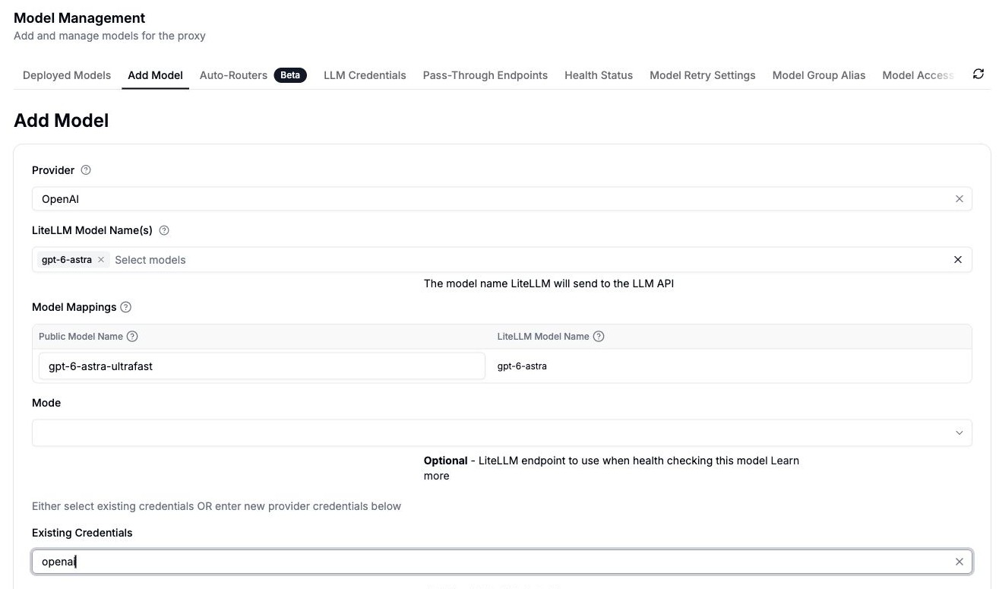
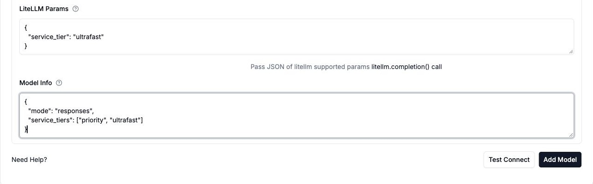

import Tabs from '@theme/Tabs';
import TabItem from '@theme/TabItem';

# OpenAI Ultrafast mode

To use Ultrafast through LiteLLM, send a [Responses API](./responses_api.md) request to `gpt-6-astra` with `service_tier: "ultrafast"`. You can set that tier as a deployment default in the Admin UI or `config.yaml`, or choose it per request.

This guide creates the gateway alias `gpt-6-astra-ultrafast`, backed by OpenAI's `gpt-6-astra`. The alias is a name you choose; the `service_tier` parameter selects Ultrafast.

## Before you start

Use a recent LiteLLM release with GPT-6 Astra and Ultrafast pricing support, an OpenAI API credential with available credits, and permission to add models to your gateway. The UI walkthrough below was captured on LiteLLM v1.105.0. For a new gateway, follow the [Admin UI quickstart](../../proxy/docker_quick_start.md) first.

OpenAI currently offers Ultrafast for GPT-6 Astra at low initial rate limits; GPT-5.6 Sol requires preview access. Ultrafast costs more than Standard. Check OpenAI's [Ultrafast guide](https://developers.openai.com/api/docs/guides/ultrafast-mode) for current access, limits, pricing, and regional availability.

## Set up in the Admin UI

### 1. Select the model and credentials

Open **Models + Endpoints**, then **Add Model**. Choose **OpenAI** as the provider and `gpt-6-astra` under **LiteLLM Model Name(s)**. In **Model Mappings**, set **Public Model Name** to `gpt-6-astra-ultrafast`.

Select your OpenAI credential under **Existing Credentials**, or enter your OpenAI API key in the provider credential fields. The screenshot uses an existing credential named `openai`; use your own credential's name.

Leave **Mode** blank for now. In v1.105.0, that dropdown does not include Responses; set it through **Model Info** in the next step.



### 2. Set the service tier

Expand **Advanced Settings** and enter this JSON in **LiteLLM Params**:

```json
{
  "service_tier": "ultrafast"
}
```

Enter this JSON in **Model Info**:

```json
{
  "mode": "responses",
  "service_tiers": ["priority", "ultrafast"]
}
```

`mode: "responses"` makes the connection test use the Responses endpoint. `service_tiers` advertises the available tiers to clients such as Codex; it is optional for direct API calls and does not select a tier. The singular `service_tier` in **LiteLLM Params** sets the request default.



### 3. Test and save

Click **Test Connect**. The test should send `model: "gpt-6-astra"` and `service_tier: "ultrafast"` to OpenAI's `/v1/responses` endpoint. Resolve any credential, quota, or access errors shown by the test, then click **Add Model** to save.

Under **Deployed Models**, search for `gpt-6-astra-ultrafast`, open its model ID, and select **Raw JSON**. Confirm that `litellm_params.service_tier` is `"ultrafast"` and `model_info.mode` is `"responses"`. Use a [virtual key](../../proxy/virtual_keys.md) with access to this public model name for the requests below.

## Set up with config.yaml

Add the following deployment to your gateway configuration as an alternative to adding it in the UI:

```yaml title="config.yaml"
model_list:
  - model_name: gpt-6-astra-ultrafast
    litellm_params:
      model: openai/gpt-6-astra
      api_key: os.environ/OPENAI_API_KEY
      service_tier: ultrafast
    model_info:
      mode: responses
      service_tiers: ["priority", "ultrafast"]
```

Set `OPENAI_API_KEY` in the gateway's environment and restart with the updated configuration. For a local proxy installation, start it with `litellm --config config.yaml`; see [proxy configuration](../../proxy/configs.md) for deployment options.

The `openai/` prefix selects the upstream provider. Clients call the public `model_name`, `gpt-6-astra-ultrafast`. Keep the provider key on the gateway; clients authenticate with their LiteLLM virtual keys.

## Send a request through the gateway

Set `LITELLM_BASE_URL` to your gateway URL without a trailing `/v1`, and `LITELLM_API_KEY` to a virtual key that can access the model:

```bash
export LITELLM_BASE_URL="http://localhost:4000"
export LITELLM_API_KEY="<your-litellm-virtual-key>"
```

<Tabs>
<TabItem value="curl" label="curl">

```bash
curl "${LITELLM_BASE_URL}/v1/responses" \
  -H "Authorization: Bearer ${LITELLM_API_KEY}" \
  -H "Content-Type: application/json" \
  -d '{
    "model": "gpt-6-astra-ultrafast",
    "service_tier": "ultrafast",
    "input": "Say hello in one sentence."
  }'
```

</TabItem>
<TabItem value="openai-sdk" label="OpenAI Python SDK">

Install or upgrade `openai`, then run:

```python
import os
from openai import OpenAI

client = OpenAI(
    base_url=os.environ["LITELLM_BASE_URL"].rstrip("/") + "/v1",
    api_key=os.environ["LITELLM_API_KEY"],
)

response = client.responses.create(
    model="gpt-6-astra-ultrafast",
    service_tier="ultrafast",
    input="Say hello in one sentence.",
)

print(response.output_text)
print(response.service_tier)
```

</TabItem>
</Tabs>

Both examples explicitly request Ultrafast. If the client omits `service_tier`, the deployment default above supplies it. An explicit tier in the request overrides that default. To choose Ultrafast only for selected calls, leave `service_tier` out of the deployment and send it on those calls.

## Use the LiteLLM Python SDK directly

Without a gateway, set `OPENAI_API_KEY` in your application's environment and call the upstream model with `litellm.responses()`:

```python
import litellm

response = litellm.responses(
    model="openai/gpt-6-astra",
    service_tier="ultrafast",
    input="Say hello in one sentence.",
)

print(response)
```

## Offer /ultrafast in Codex

The `model_info.service_tiers` list above lets Codex offer `/ultrafast` while keeping `/fast` for the `priority` tier. Codex CLI 0.159 or newer also needs `model_catalog_url` pointed at your gateway's `/v1/models` endpoint and `[features] api_key_model_discovery = true`. Follow the [Codex model catalog setup](../../proxy/client_setup/codex_cli.md#model-catalog-and-service-tiers), select your gateway model, then use `/ultrafast`.

For a model where users toggle Ultrafast on and off, omit the deployment's `litellm_params.service_tier` and keep `model_info.service_tiers`. Otherwise, a client that stops sending a tier still inherits the deployment's Ultrafast default. Advertising a tier does not grant OpenAI access to it.

## Verify and troubleshoot

Check the successful response's `service_tier` field for `"ultrafast"` to confirm the tier that served the request. For streaming, inspect the response on the `response.completed` event. A saved model name, a catalog entry, or an outgoing request alone does not confirm that OpenAI served an Ultrafast response.

| Symptom | What to check |
| --- | --- |
| `insufficient_quota` or `credit_balance_exhausted` | Check the OpenAI account's credits and billing. A LiteLLM virtual-key budget does not fund the upstream account. |
| The provider rejects the model or tier | Confirm the upstream model is `gpt-6-astra`, the tier is `ultrafast`, and your OpenAI project has access. Check the current OpenAI availability requirements. |
| The request uses a different tier | Inspect the client's `service_tier`; it overrides the deployment default. Confirm the selected alias routes to the intended deployment. |
| Codex does not show `/ultrafast` | Check both catalog settings and the model's `service_tiers`. If several deployments share an alias, configure the list on each. See the Codex guide for catalog caching and version requirements. |

The examples use HTTP Responses requests. For repeated agent tool calls, OpenAI recommends a persistent WebSocket connection to reduce connection overhead; see [LiteLLM's Responses WebSocket guide](../../response_api.md#websocket-mode).
