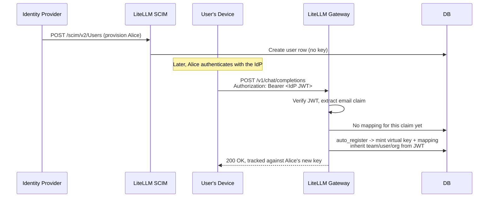

# Provisioning identities and issuing keys

A question that comes up with SSO deployments is whether a user provisioned through your identity provider (via SCIM) automatically ends up with a virtual key and a credential sitting on their laptop, ready to call the gateway. The short answer is that LiteLLM has all the pieces for this, but they are three separate features you compose rather than one turnkey flow. This page explains what each piece does, what it deliberately does not do, and how to wire them together so a SCIM-provisioned user can auto-register a virtual key and authenticate from their device.

If you only need the setup for one of these features, jump straight to its dedicated page: [SCIM provisioning](../tutorials/scim_litellm.md), [OIDC JWT auth](./token_auth.md), [JWT to virtual key mapping](./jwt_key_mapping.md), or [CLI authentication](./cli_sso.md). This page is the map that connects them.

---

## The four pieces

LiteLLM separates identity, authentication, authorization, and the on-device credential into distinct layers, and each one is a different feature:

| Layer | Feature | What it produces | Enterprise? |
|---|---|---|---|
| Identity provisioning | SCIM | `LiteLLM_UserTable` rows and teams, synced from your IdP | Yes |
| Request authentication | JWT auth | A verified caller identity per request, from an IdP token | Yes |
| Authorization + spend | Virtual keys | Model access, budgets, rate limits, spend tracking | No |
| On-device credential | CLI login (`lite login`) | A LiteLLM-issued session token stored on the laptop | No (beta) |

The important thing to internalize is that these do not automatically hand off to each other. SCIM creating a user does not mint a key; JWT auth verifying a token does not by itself create a virtual key; and neither of those puts anything on the user's device. You get the end-to-end behavior by turning on the right combination and aligning them on a shared claim.

---

## SCIM provisions identities, not keys

When your IdP (Okta, Entra ID, OneLogin, and so on) pushes a user to `POST /scim/v2/Users`, LiteLLM creates a `LiteLLM_UserTable` row with the user's email, alias, external id, and default role. When it pushes a group to `POST /scim/v2/Groups`, LiteLLM creates a team, mapping the group id to the team id and the group's display name to the team alias, and syncs membership.

What SCIM does **not** do is create a virtual key. Every SCIM user-creation path sets `auto_create_key=False`, so provisioning writes an identity row and nothing in the `LiteLLM_VerificationToken` table. A freshly SCIM-provisioned user has an account and team memberships, but no API key to call the gateway with.

SCIM does manage the lifecycle of keys the user already has. Toggling a user to `active: false` (via PATCH or PUT) blocks that user's existing keys, and deprovisioning the user deletes them, so removed users lose access immediately. The IdP authenticates to the SCIM endpoints with an ordinary LiteLLM virtual key whose `allowed_routes` is restricted to `/scim/*`; you create that token once in the Admin UI under Settings > Admin Settings > SCIM. Full walkthrough on the [SCIM page](../tutorials/scim_litellm.md).

---

## JWT auth authenticates requests, and can resolve to a key

With `enable_jwt_auth: True`, the gateway accepts an IdP-minted JWT as the bearer token on any request, verifies its signature against your `JWT_PUBLIC_KEY_URL` (JWKS or OIDC discovery), optionally checks audience and issuer, and extracts claims that map to a proxy admin, team, user, or org. See [OIDC JWT auth](./token_auth.md) for the base setup.

By default JWT auth is self-contained: a valid JWT resolves to a **team**, and the gateway synthesizes an ephemeral caller identity for that request with limits drawn from the resolved team and user rows. No virtual key is looked up or created; the boundary is the team, shared by everyone under it.

Setting `virtual_key_claim_field` switches on the second mode, where each JWT client (identified by a claim like `client_id`, `sub`, or `email`) maps to its **own** virtual key, giving per-client model access, budgets, rate limits, and spend tracking without distributing API keys. What happens when a token arrives with no registered mapping is governed by `unregistered_jwt_client_behavior`:

| Value | Behavior |
|---|---|
| `fallback_team_mapping` | Fall through to team-based JWT auth (default) |
| `reject` | Return 403 |
| `auto_register` | Mint a virtual key and mapping on first encounter |

The [JWT to virtual key mapping](./jwt_key_mapping.md) page covers this mode in depth.

---

## Auto-registering a virtual key for a SCIM-provisioned user

This is the composition that answers the original question. SCIM gives you the user record ahead of time; JWT `auto_register` mints the key the first time that user's device presents a token. Wire them together like this:

```yaml
general_settings:
  master_key: sk-1234
  enable_jwt_auth: True
  litellm_jwtauth:
    user_id_jwt_field: "sub"
    team_ids_jwt_field: "groups"
    virtual_key_claim_field: "email"          # align this with the SCIM externalId/identity
    unregistered_jwt_client_behavior: "auto_register"
```

The flow then runs end to end:



Three things are worth calling out. First, the trigger is the request, not the SCIM event; the key is created lazily when the device first calls the gateway, not when the IdP provisions the user. Second, SCIM and JWT auth do not share state directly, so you must align them: `virtual_key_claim_field` has to point at a JWT claim whose value matches the identity SCIM stored (SCIM keeps the IdP's `externalId` as the user's `sso_user_id`, and the user's email is usually the reliable join key across both). Third, `auto_register` only mints a key after the token clears full policy (signature, RBAC and scope checks, `custom_validate`, and `user_allowed_email_domain`), it inherits the team, user, and org resolved from the validated JWT, it skips tokens that resolve to a proxy admin, and it requires a database connection. Because SCIM pre-created the user and their team memberships, the auto-registered key attaches to a real, correctly-scoped identity instead of a bare claim value.

---

## Getting a credential onto the device

There are two distinct ways a device ends up holding a credential for the gateway, and they answer the "keychain" part of the question differently.

**Bring your own IdP token.** In the JWT flow above, the credential on the device is the IdP-minted JWT itself. Whatever your organization already uses to get SSO tokens onto a laptop (a coding agent's SSO integration, an environment variable, your IdP's device tooling) is what holds it. The device sends that JWT as the bearer token on every call, and the gateway auto-registers or looks up the virtual key behind the scenes. LiteLLM never stores this token; your IdP tooling owns its lifecycle. For example, pointing a coding agent at the gateway is just setting the base URL and using the JWT as the API key:

```bash
export ANTHROPIC_BASE_URL="http://your-litellm-proxy:4000"
export ANTHROPIC_API_KEY="<user-sso-jwt-token>"
```

**LiteLLM-issued CLI session token.** The `lite login` flow is a separate, self-serve path where LiteLLM issues and stores its own credential. It runs an OAuth-device-style handshake (browser SSO, a user-code confirmation, then a poll loop) and returns a short-lived encrypted session token that the CLI writes to `~/.litellm/token.json` with `0600` permissions. The SDK reads it back through `litellm.get_litellm_gateway_api_key()`, which only returns the token when the caller's base URL matches the one the token was issued for, so a credential minted for one gateway is never sent to another. This flow requires `EXPERIMENTAL_UI_LOGIN=True` on the proxy; see [CLI authentication](./cli_sso.md).

A couple of clarifications that trip people up. LiteLLM has no OS keychain or credential-helper integration; the on-device store for the CLI flow is that `0600` JSON file, not the macOS Keychain, Windows Credential Manager, or a git-style credential helper. If you want the token in an OS keychain, wrap `lite login` with your own tooling. And the CLI session token is a LiteLLM-issued token scoped to the gateway, not the raw IdP JWT and not a persisted virtual key row; it is minted by the CLI login flow and is independent of the JWT `auto_register` path described above. Pick the model that fits: bring-your-own IdP JWT when clients already carry SSO tokens (coding agents, service-to-service), or `lite login` when you want developers to self-serve a gateway credential from the command line.

---

## What LiteLLM does and does not do

| Behavior | Supported? |
|---|---|
| SCIM provisions users and teams from your IdP | Yes |
| SCIM auto-creates a virtual key for a provisioned user | No (`auto_create_key=False`) |
| SCIM deprovisioning revokes the user's keys | Yes |
| JWT auth authenticates requests with IdP tokens | Yes |
| JWT auth auto-registers a per-client virtual key | Yes, with `virtual_key_claim_field` + `auto_register` |
| SCIM provisioning event directly triggers key creation | No (the request does, lazily) |
| `lite login` stores a gateway credential on the device | Yes (`~/.litellm/token.json`, `0600`) |
| Credential stored in an OS keychain / credential helper | No (plain file with owner-only permissions) |
| Device-stored credential is the raw IdP JWT | No (it is a LiteLLM-issued session token) |

---

## Related

- [SCIM with LiteLLM](../tutorials/scim_litellm.md) — provisioning users and teams from your IdP
- [OIDC JWT auth](./token_auth.md) — base JWT auth setup
- [JWT to virtual key mapping](./jwt_key_mapping.md) — per-client keys and `auto_register`
- [CLI authentication](./cli_sso.md) — the `lite login` device flow
- [Virtual keys](./virtual_keys.md) — the unit of access control and spend
