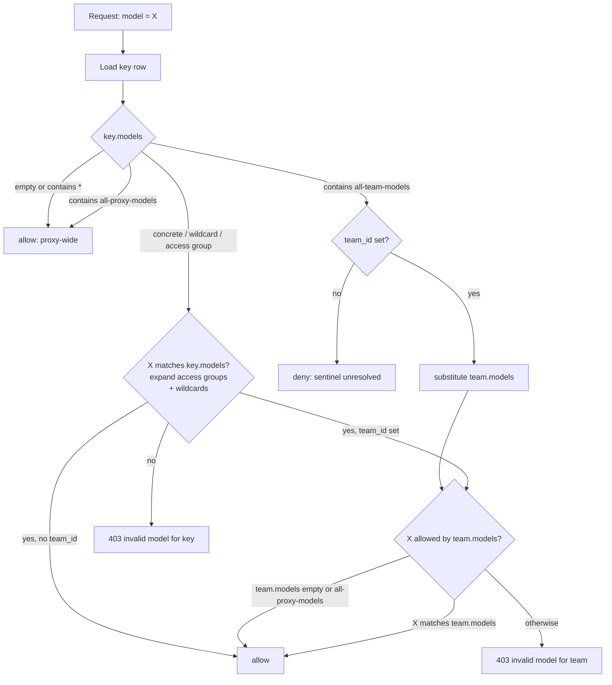

# How Key-Based Auth Works

Explanation of how the proxy resolves what a virtual key can call. Focus: how the `models` field is evaluated when a key has a `team_id` versus when it does not, and the sentinel values from `SpecialModelNames` that override normal resolution. For setup see [Virtual Keys](./virtual_keys.md) and [Model Access Groups](./model_access_groups.md).

## The `models` field

Every virtual key row carries a `models` list. Entries fall into four categories:

| Entry | Meaning |
|---|---|
| Concrete model group | Name from `config.yaml` `model_name` (`gpt-4`, `azure-gpt-3.5`) |
| Wildcard | Provider prefix pattern matched against `model_name` (`openai/*`, `openai/o1-*`) |
| Access group | Label declared under `model_info.access_groups` or `/access_group/new`; expands at request time to the set of models tagged with it |
| Sentinel | One of the reserved strings in `SpecialModelNames` (below) |

The empty list and the literal `*` both mean "all models on the proxy" when evaluated on a key or team.

## Sentinels

These strings are reserved as enum values in `litellm.proxy._types.SpecialModelNames`. They short-circuit normal matching.

| Sentinel | Where it belongs | Effect |
|---|---|---|
| `all-proxy-models` | Key, team, or user `models` list | Grants every model on the proxy. On a team, treated the same as an empty `models` list. On a user, grants direct access to every non-team deployment. |
| `all-team-models` | Key `models` list only | Inherits the parent team's `models` at request time. If the key has no `team_id` the sentinel resolves to itself, matches nothing, and access is denied rather than silently opening up. |
| `no-default-models` | User `models` list only | Hard denial on the user path; forces the user to route requests through a team. Set via `default_internal_user_params.models` so SSO signups cannot mint standalone keys with proxy-wide access. |

`all-team-models` is the sentinel most often confused with an empty list. Empty means "all models"; `all-team-models` means "whatever the team says, and nothing if there is no team".

## Resolution: with team_id vs without

Two rules are load-bearing. First, a team-attached key is subject to a second check against `team.models`; the key's own list is not the final word. Second, the sentinels do not carry through the second check identically. `all-proxy-models` on a team means the team check trivially passes, but the key still has to pass its own step first. `all-team-models` on a key skips the key step entirely and defers to the team check.

The failure surface differs by which step rejects: the key step raises `Invalid model for key`; the team step raises `Invalid model for team <team_alias>: <model>. Valid models for team are: [...]` (see [Restrict models by team_id](./model_access.md#restrict-models-by-team_id)).

## Access groups and wildcards

Access groups exist so that adding a model to a group grants every attached key access without mutating any key row. The label is stored on the key or team; the expansion happens at auth-check time by looking up which deployments carry that label in their `model_info.access_groups`. Wildcards resolve the same way but match against `model_name` rather than a tag, and can themselves belong to access groups so a subfamily can be carved out (`openai/*` in `default-models`, `openai/o1-*` in `restricted-models`; a key holding only `default-models` cannot call the `o1` family). See [Model Access Groups](./model_access_groups.md).

## What the master key skips

The master key is compared as plaintext in memory, is not stored in `LiteLLM_VerificationToken`, has no `models` list, and bypasses every check above. Treat it as an operator credential; a leak grants every model on the proxy regardless of team, access group, or sentinel configuration. See [Master Key Rotations](./master_key_rotations.md).

## Related

[Model Access](./model_access.md) · [Model Access Groups](./model_access_groups.md) · [Virtual Keys](./virtual_keys.md) · [Multi-Tenant Architecture](./multi_tenant_architecture.md)
