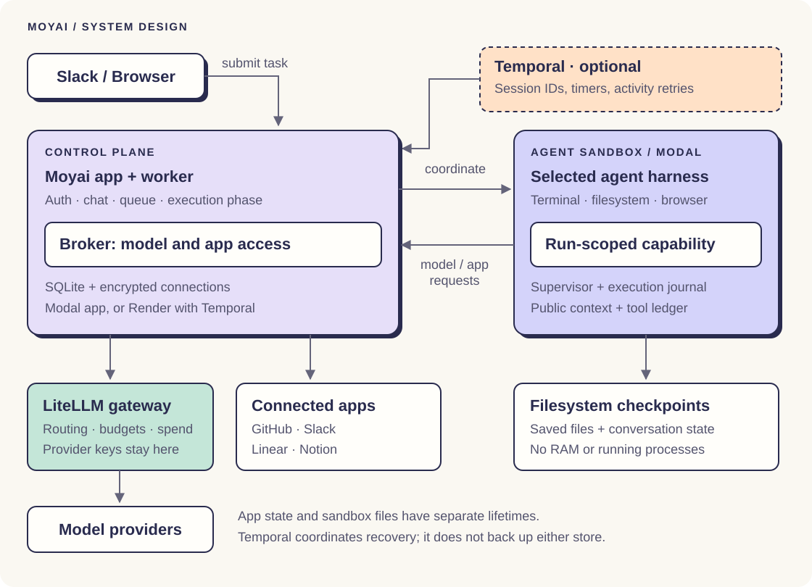

import {MoyaiHero, GuideNav, Benefits} from '@site/src/components/Moyai';
import BugWorkflowDemo from '@site/blog/internal-devin-two-days/BugWorkflowDemo';

<GuideNav active="overview" />
<MoyaiHero />

## Watch a task go from request to PR {#watch-a-task}

Start with a bug report. Follow the investigation, inspect the regression tests, and open the pull request from the same conversation.

<BugWorkflowDemo />

You can use the web app to inspect tool activity and files while the agent works. Send a follow-up in the same session to continue from its saved workspace. Review the code and test results before you merge.

## Why run Moyai?

A coding task can outlast the time you have to sit with it. With Moyai, you give the agent a cloud workspace and return when you have something to review. Your team owns the deployment, chooses the model stack, and can inspect the source.

<Benefits />

## Give it a task you can verify

Start with a bounded change in a repository you know. Include the expected behavior and the checks you want the agent to run.

| Task | Example request | Review the result |
|---|---|---|
| Fix a bug | “Reproduce this issue, add a regression test, fix it, and open a PR.” | Reproduction, test output, and diff |
| Update a dependency | “Upgrade this package, address breaking changes, and run the affected tests.” | Lockfile, compatibility changes, and test results |
| Investigate a failure | “Read this failing CI job and identify the cause. Show the evidence before changing code.” | Logs, explanation, and proposed fix |
| Divide a test run | “Split these cases across agents and report failures with reproduction steps.” | Case coverage and each worker's results |

Connect only the apps and repositories the task needs. Enabled app tools can write under their connection policy without a per-use approval prompt. You control access in **Connections**, and GitHub PR approval and merging remain human steps.

## Built for the LiteLLM team's own work

We built Moyai for our engineering workflow, including requests from Slack and work across several agents. The [launch story](/blog/moyai-open-source) reports **$101,872 for 31 days of Devin usage**, compared with a Moyai estimate of **about $700 per day**. Multiplying that estimate by 31 gives **$21,700**, about **79% lower**.

That is our internal cost comparison, not a controlled benchmark or a savings promise. Your model mix, task length, retries, idle compute, and storage affect the bill. Track inference in Moyai and LiteLLM, then include your hosting and sandbox costs when comparing deployments.

## How the pieces fit {#how-moyai-uses-litellm}

You use Slack or the web app to submit work. Moyai manages the conversation and provisions a sandbox with a terminal, files, and browser. The agent calls models through your LiteLLM gateway and uses connected apps through Moyai's broker.

The [setup guide](./moyai/setup.md) uses Modal for the app and its agent sandboxes. The [architecture guide](./moyai/architecture.md) also covers Render with Temporal, the deployment behind the hero illustration. It explains where state lives, how checkpoints work, and how Moyai handles an uncertain tool result.

Choose a harness whose API your gateway and model support: Claude Agent SDK uses Messages, Codex uses Responses, and Hermes, OpenCode, Deep Agents, and Tool Loop use Chat Completions. Auto selection resolves `openai/` models to Codex and `anthropic/` models to Claude Agent SDK; a deployment override or explicit choice takes precedence.

## Start with one cloud task {#prerequisites}

You need a Modal account, a reachable LiteLLM gateway, and a gateway key with access to your chosen model. The guide takes you through deployment, a file-writing task, a follow-up that checks saved state, and your first repository connection.

Moyai suits a trusted team willing to run its own service. You own updates, credentials, backups, and compute costs. Model requests still go to the provider you select; self-hosting does not keep those requests inside your cloud account.

**[Set up Moyai](./moyai/setup.md)** · [Read the architecture](./moyai/architecture.md) · [Explore the source](https://github.com/BerriAI/moyai)

Looking for the previous gateway instructions?

The [gateway configuration](./moyai/setup.md#configure-litellm), [connection check](./moyai/setup.md#check-the-model-connection), [spend tracking](./moyai/setup.md#track-spend), and [troubleshooting](./moyai/setup.md#troubleshooting) now live in the setup guide.

