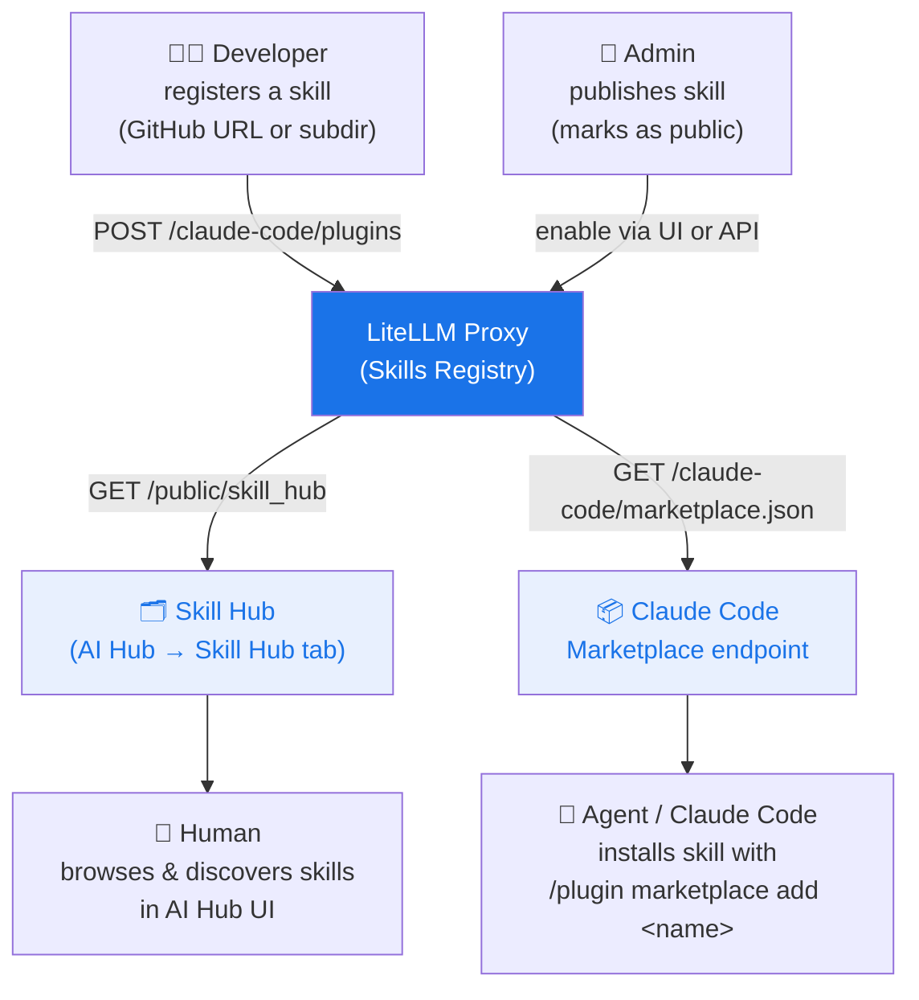

# Skills Gateway

<iframe width="840" height="500" src="https://www.loom.com/embed/cb74eb79df3e4c2b83a6efae54a589f9" frameborder="0" webkitallowfullscreen mozallowfullscreen allowfullscreen></iframe>

LiteLLM acts as a **Skills Registry**, a central place to register, manage, and discover Claude Code skills across your organization. Teams can publish skills once and have agents and developers find them through a single hub.

## How it works



## Quick start

### 1. Register a skill

Paste any GitHub URL into the Skills UI and LiteLLM auto-detects the source type and skill name.

```bash
curl -X POST https://your-proxy/claude-code/plugins \
  -H "Authorization: Bearer $LITELLM_KEY" \
  -H "Content-Type: application/json" \
  -d '{
    "name": "grill-me",
    "source": {
      "source": "git-subdir",
      "url": "https://github.com/mattpocock/skills",
      "path": "grill-me"
    },
    "description": "Interview skill for relentless questioning",
    "domain": "Productivity",
    "namespace": "interviews"
  }'
```

Skills nested in subdirectories (e.g. `github.com/org/repo/tree/main/skill-name`) are supported, and LiteLLM parses the URL automatically in the UI.

### 2. Publish to hub

In the Admin UI: **AI Hub → Skill Hub → Select Skills to Make Public**.

Or via API:

```bash
curl -X POST https://your-proxy/claude-code/plugins/grill-me/enable \
  -H "Authorization: Bearer $LITELLM_KEY"
```

### 3. Browse the hub

Public skills appear at:
- **Admin UI**: AI Hub → Skill Hub tab
- **Public page**: `/ui/model_hub` → Skill Hub tab (no login required)
- **API**: `GET /public/skill_hub`

### 4. Install in Claude Code

Point Claude Code at your proxy marketplace once:

```json title="~/.claude/settings.json"
{
  "extraKnownMarketplaces": {
    "my-org": {
      "source": "url",
      "url": "https://your-proxy/claude-code/marketplace.json"
    }
  }
}
```

Then install any skill:

```
/plugin marketplace add grill-me
```

### 5. Install in other agents

Agents other than Claude Code install skills through the [`skills` CLI](https://github.com/vercel-labs/skills), which reads an [Agent Skills discovery index](https://agentskills.io) from the proxy. Serving that index is opt-in:

```yaml title="config.yaml"
litellm_settings:
  public_skills_index: true
```

It is off by default. The CLI sends no credentials, so the index and the archives it points at are served without a LiteLLM key, and anyone who can reach the proxy can read every skill uploaded through `POST /v1/skills`. Turn it on only on a proxy whose skills you are happy to publish

With it on, point any agent at the proxy:

```bash
npx skills add https://your-proxy -a gemini-cli
npx skills add https://your-proxy -a cursor
```

The CLI reads `GET /.well-known/agent-skills/index.json`, downloads each skill from `GET /v1/skills/{skill_id}/archive`, checks the bytes against the `sha256` digest the index published, and writes the skill into that agent's skills directory. Run `npx skills add --help` for the list of agent names it accepts

The index covers skills uploaded as a zip through `POST /v1/skills`. An upload with no `SKILL.md` at the root of its archive is left out, since discovery clients have no manifest to read

Skills registered as a git source (the `POST /claude-code/plugins` flow above) work differently, because LiteLLM stores the source URL rather than the skill's files. Agents install those from the git URL directly:

```bash
npx skills add https://github.com/mattpocock/skills -a gemini-cli
```

`GET /public/skill_hub` returns that URL in each skill's `source` field. Some agents also ship their own installer for git URLs, such as `gemini skills install https://github.com/mattpocock/skills`, so check the agent's own docs

## Skill fields

| Field | Description |
|-------|-------------|
| `name` | Unique skill identifier (used in `/plugin marketplace add`) |
| `source` | Git source — `github`, `url`, or `git-subdir` |
| `description` | Short description shown in the hub |
| `domain` | Category for grouping (e.g. `Engineering`, `Productivity`) |
| `namespace` | Subcategory within a domain (e.g. `quality`, `meetings`) |
| `keywords` | Tags for search and filtering |
| `version` | Semver string |

## API reference

| Endpoint | Auth | Description |
|----------|------|-------------|
| `POST /claude-code/plugins` | Required | Register a skill |
| `GET /claude-code/plugins` | Required | List all skills (admin) |
| `POST /claude-code/plugins/{name}/enable` | Required | Publish a skill |
| `POST /claude-code/plugins/{name}/disable` | Required | Unpublish a skill |
| `GET /public/skill_hub` | None | List public skills |
| `GET /claude-code/marketplace.json` | None | Claude Code marketplace manifest |
| `GET /.well-known/agent-skills/index.json` | None | Agent Skills discovery index, needs `public_skills_index: true` |
| `GET /v1/skills/{skill_id}/archive` | None | Download an uploaded skill as a zip, needs `public_skills_index: true` |
