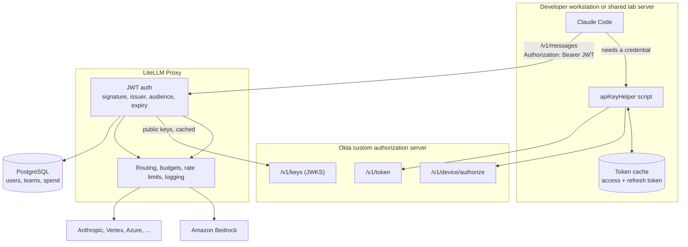
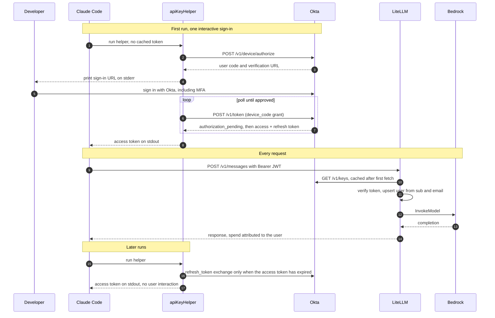

# Claude Code with Okta SSO (JWT Auth)

Route Claude Code through LiteLLM using each developer's Okta identity. Claude Code sends the developer's own Okta access token with every request, LiteLLM validates it against your Okta authorization server and creates the user automatically on first request, and usage, spend, and logs are attributed to that user. There are no per-user API keys to issue and no manual provisioning, so the setup works the same for 10 developers or 10,000.

:::info

JWT authentication is a LiteLLM Enterprise feature. [Get in touch](https://www.litellm.ai/enterprise) for a license key.

:::

This guide uses Okta, but any OIDC provider that issues JWT access tokens (Azure AD, Keycloak, Auth0, etc.) works the same way; only the issuer URLs and app setup differ.

## How it works

The first time a developer uses Claude Code, a small `apiKeyHelper` script opens an Okta sign-in page. After that, everything is silent: the script serves cached tokens and refreshes them in the background, Claude Code sends the token as its API key, and LiteLLM verifies the token signature against Okta's published JWKS keys. Because `user_id_upsert` is enabled, LiteLLM creates an internal user record from the token's `sub` and `email` claims on first request, so per-user spend tracking starts immediately without an admin issuing anything.

The developer keeps running plain `claude`. Nothing about their workflow changes, and no extra CLI is installed; the only moving parts on the machine are the helper script, its token cache, and the Claude Code settings that point at your proxy.



Only the helper talks to Okta, and only the proxy holds provider credentials, so a developer's machine never sees an AWS or Anthropic key. The full exchange looks like this:



## 1. Create an Okta app

In the Okta Admin Console, create an **OIDC Native Application** for Claude Code:

1. **Applications > Create App Integration**, choose **OIDC** and **Native Application**.
2. Under **Grant type**, enable **Device Authorization** (best for CLI tools; no client secret and no localhost redirect needed) and **Refresh Token**.
3. Assign the app to the Okta groups that should have access.
4. Note the **Client ID**.

Tokens must come from a **custom authorization server** (for example the built-in one named `default`), not the org authorization server, because only custom authorization server access tokens are JWTs you can verify against a JWKS endpoint. Under **Security > API > Authorization Servers**, confirm the `default` server exists and note two values:

- JWKS URL: `https://<your-okta-domain>/oauth2/default/v1/keys`
- Audience: `api://default` (or whatever your server's audience is set to)

Access tokens from custom authorization servers include `sub` by default. To also get the user's email in the access token, add a claim under **Security > API > Authorization Servers > default > Claims**: name `email`, include in **Access Token**, value `user.email`.

## 2. Configure LiteLLM

Enable JWT auth in your proxy config:

```yaml
model_list:
  - model_name: claude-opus-5
    litellm_params:
      model: anthropic/claude-opus-5
      api_key: os.environ/ANTHROPIC_API_KEY

  - model_name: claude-sonnet-5
    litellm_params:
      model: anthropic/claude-sonnet-5
      api_key: os.environ/ANTHROPIC_API_KEY

  - model_name: claude-haiku-4-5
    litellm_params:
      model: anthropic/claude-haiku-4-5
      api_key: os.environ/ANTHROPIC_API_KEY

general_settings:
  master_key: os.environ/LITELLM_MASTER_KEY
  enable_jwt_auth: true
  litellm_jwtauth:
    user_id_jwt_field: "sub"
    user_email_jwt_field: "email"
    user_id_upsert: true
```

Set the environment variables. User upsert writes to the database, so `DATABASE_URL` is required:

```bash
export JWT_PUBLIC_KEY_URL="https://<your-okta-domain>/oauth2/default/v1/keys"
export JWT_AUDIENCE="api://default"
export DATABASE_URL="postgresql://..."
export LITELLM_LICENSE="<your-enterprise-license>"
export ANTHROPIC_API_KEY="sk-ant-..."
export LITELLM_MASTER_KEY="sk-1234"
```

Start the proxy:

```bash
litellm --config /path/to/config.yaml
```

:::tip

To restrict access to your corporate domain, add `user_allowed_email_domain: "yourcompany.com"` under `litellm_jwtauth`. See [JWT-based Auth](../proxy/token_auth) for all available claim mappings and access controls.

:::

## 3. Verify with a token

Get an access token for your own Okta user, for example by running the helper script from step 4 once, then call the proxy with it:

```bash
export OKTA_TOKEN="<your-okta-access-token>"

curl -X POST http://0.0.0.0:4000/v1/messages \
  -H "Authorization: Bearer $OKTA_TOKEN" \
  -H "Content-Type: application/json" \
  -d '{
    "model": "claude-sonnet-5",
    "max_tokens": 100,
    "messages": [{"role": "user", "content": "Hello"}]
  }'
```

A successful response means the token validated against Okta's JWKS. Open the Admin UI under **Internal Users** and you will see a user created from your token's `sub` claim, with this request's spend already attributed to it.

## 4. Configure Claude Code

Claude Code supports a dynamic credential via [`apiKeyHelper`](https://code.claude.com/docs/en/settings): a script it runs to get a fresh API key instead of using a static one. Save this as `~/.claude/okta-token.sh` (fill in your Okta domain and the Client ID from step 1):

```bash
#!/usr/bin/env bash
set -euo pipefail

OKTA_DOMAIN="https://<your-okta-domain>"
AUTH_SERVER="default"
CLIENT_ID="<okta-app-client-id>"
SCOPES="openid profile email offline_access"
CACHE="$HOME/.claude/okta_token.json"

token_url="$OKTA_DOMAIN/oauth2/$AUTH_SERVER/v1/token"
now=$(date +%s)

if [ -f "$CACHE" ]; then
  if [ "$now" -lt "$(( $(jq -r '.expires_at // 0' "$CACHE") - 60 ))" ]; then
    jq -r '.access_token' "$CACHE"
    exit 0
  fi
  refresh=$(jq -r '.refresh_token // empty' "$CACHE")
  if [ -n "$refresh" ]; then
    if resp=$(curl -sf "$token_url" \
        -d grant_type=refresh_token \
        -d client_id="$CLIENT_ID" \
        -d refresh_token="$refresh" \
        -d scope="$SCOPES"); then
      echo "$resp" | jq --argjson now "$now" '. + {expires_at: ($now + .expires_in)}' > "$CACHE"
      chmod 600 "$CACHE"
      jq -r '.access_token' "$CACHE"
      exit 0
    fi
  fi
fi

device=$(curl -sf "$OKTA_DOMAIN/oauth2/$AUTH_SERVER/v1/device/authorize" \
  -d client_id="$CLIENT_ID" \
  -d scope="$SCOPES")
echo "Sign in with Okta: $(echo "$device" | jq -r '.verification_uri_complete')" >&2
device_code=$(echo "$device" | jq -r '.device_code')
interval=$(echo "$device" | jq -r '.interval // 5')

while true; do
  sleep "$interval"
  resp=$(curl -s "$token_url" \
    -d grant_type=urn:ietf:params:oauth:grant-type:device_code \
    -d client_id="$CLIENT_ID" \
    -d device_code="$device_code")
  if echo "$resp" | jq -e '.access_token' > /dev/null; then
    echo "$resp" | jq --argjson now "$(date +%s)" '. + {expires_at: ($now + .expires_in)}' > "$CACHE"
    chmod 600 "$CACHE"
    jq -r '.access_token' "$CACHE"
    exit 0
  fi
  err=$(echo "$resp" | jq -r '.error // empty')
  if [ "$err" != "authorization_pending" ] && [ "$err" != "slow_down" ]; then
    echo "Okta sign-in failed: $resp" >&2
    exit 1
  fi
done
```

The script prints only the access token to stdout, which is what `apiKeyHelper` requires; sign-in prompts go to stderr. Make it executable with `chmod +x ~/.claude/okta-token.sh`.

Then point Claude Code at LiteLLM in `~/.claude/settings.json`:

```json
{
  "env": {
    "ANTHROPIC_BASE_URL": "https://litellm.yourcompany.com",
    "CLAUDE_CODE_API_KEY_HELPER_TTL_MS": "3300000"
  },
  "apiKeyHelper": "~/.claude/okta-token.sh"
}
```

`CLAUDE_CODE_API_KEY_HELPER_TTL_MS` controls how long Claude Code caches the helper's output; set it just under your Okta access token lifetime (Okta's default is 1 hour, so 55 minutes here). On first launch the developer completes one Okta sign-in in the browser, and every request after that carries their identity automatically.

## 5. Roll out through MDM

Nothing above requires per-user admin work, so rollout is just distributing two files to every machine: the helper script and the Claude Code settings. Ship the settings as [managed settings](https://code.claude.com/docs/en/settings) rather than `~/.claude/settings.json`, because managed settings take precedence over user and project settings and cannot be overridden locally, which is what pins every request through LiteLLM and blocks a developer from pointing Claude Code back at the public API. Deploy both files with whatever you already use for endpoint management (Jamf or Kandji on macOS, Intune or Group Policy on Windows, Ansible, Puppet, Chef, or your golden image on Linux); Anthropic publishes starter templates for the common ones in the [Claude Code settings docs](https://code.claude.com/docs/en/settings).

The two files are the same on every platform, only the paths change. Managed settings live at `/Library/Application Support/ClaudeCode/managed-settings.json` on macOS, `/etc/claude-code/managed-settings.json` on Linux and WSL, and `C:\Program Files\ClaudeCode\managed-settings.json` on Windows. Install the helper somewhere world-readable but only root-writable, such as `/usr/local/bin/okta-token.sh` (mode `0755`, owned by root), and reference it by absolute path:

```json
{
  "env": {
    "ANTHROPIC_BASE_URL": "https://litellm.yourcompany.com",
    "CLAUDE_CODE_API_KEY_HELPER_TTL_MS": "3300000"
  },
  "apiKeyHelper": "/usr/local/bin/okta-token.sh"
}
```

The token cache stays per user under `$HOME/.claude/okta_token.json` at mode `0600`, which is what makes this safe on a shared lab server that several developers SSH into: each of them signs in as themselves, each gets their own refresh token, and spend in LiteLLM lands on the right user even though the helper script is shared. Never place the cache in a shared directory such as `/tmp`.

### Windows

On Windows you can deploy the same JSON to `C:\Program Files\ClaudeCode\managed-settings.json`, or push it as policy through Intune or Group Policy by writing the JSON document into the `Settings` value under `HKLM\SOFTWARE\Policies\ClaudeCode`. Policy is the better fit for Intune since it needs no file staging and is easy to report on; the file is easier if you already deploy configuration with your imaging pipeline.

The helper is the one part that needs a Windows-specific version. Claude Code invokes `apiKeyHelper` through the system shell, so point it at a small `.cmd` shim that runs PowerShell, which avoids execution-policy and quoting problems:

```json
{
  "env": {
    "ANTHROPIC_BASE_URL": "https://litellm.yourcompany.com",
    "CLAUDE_CODE_API_KEY_HELPER_TTL_MS": "3300000"
  },
  "apiKeyHelper": "C:\\Program Files\\ClaudeCode\\okta-token.cmd"
}
```

`okta-token.cmd` is one line:

```bat
@powershell -NoProfile -NonInteractive -ExecutionPolicy Bypass -File "%~dp0okta-token.ps1"
```

And `okta-token.ps1` is the PowerShell equivalent of the bash helper, cached under the user's profile and locked down with `icacls`:

```powershell
#Requires -Version 5.1
Set-StrictMode -Version Latest
$ErrorActionPreference = 'Stop'

$OktaDomain = 'https://<your-okta-domain>'
$AuthServer = 'default'
$ClientId   = '<okta-app-client-id>'
$Scopes     = 'openid profile email offline_access'
$Cache      = Join-Path $HOME '.claude\okta_token.json'

$tokenUrl = "$OktaDomain/oauth2/$AuthServer/v1/token"
$now      = [int][double]::Parse((Get-Date -UFormat %s))

function Save-Token($resp) {
    $dir = Split-Path -Parent $Cache
    if (-not (Test-Path $dir)) { New-Item -ItemType Directory -Path $dir -Force | Out-Null }
    $resp | Add-Member -NotePropertyName expires_at `
        -NotePropertyValue ([int][double]::Parse((Get-Date -UFormat %s)) + $resp.expires_in) -Force
    $resp | ConvertTo-Json -Compress | Set-Content -Path $Cache -Encoding ascii
    icacls $Cache /inheritance:r /grant:r "$($env:USERNAME):(R,W)" | Out-Null
    $resp.access_token
}

# Okta signals "not signed in yet" with a 400 carrying an `error` field, so read the body either way.
function Invoke-TokenRequest($body) {
    try {
        return Invoke-RestMethod -Method Post -Uri $tokenUrl -Body $body
    } catch {
        $detail = $_.ErrorDetails.Message
        if ($detail) { return $detail | ConvertFrom-Json }
        throw
    }
}

if (Test-Path $Cache) {
    $cached = Get-Content $Cache -Raw | ConvertFrom-Json
    if ($now -lt ($cached.expires_at - 60)) {
        $cached.access_token
        exit 0
    }
    if ($cached.PSObject.Properties['refresh_token'] -and $cached.refresh_token) {
        $resp = Invoke-TokenRequest @{
            grant_type    = 'refresh_token'
            client_id     = $ClientId
            refresh_token = $cached.refresh_token
            scope         = $Scopes
        }
        if ($resp.PSObject.Properties['access_token']) {
            Save-Token $resp
            exit 0
        }
    }
}

$device = Invoke-RestMethod -Method Post -Uri "$OktaDomain/oauth2/$AuthServer/v1/device/authorize" `
    -Body @{ client_id = $ClientId; scope = $Scopes }
[Console]::Error.WriteLine("Sign in with Okta: $($device.verification_uri_complete)")
$interval = if ($device.PSObject.Properties['interval']) { $device.interval } else { 5 }

while ($true) {
    Start-Sleep -Seconds $interval
    $resp = Invoke-TokenRequest @{
        grant_type  = 'urn:ietf:params:oauth:grant-type:device_code'
        client_id   = $ClientId
        device_code = $device.device_code
    }
    if ($resp.PSObject.Properties['access_token']) {
        Save-Token $resp
        exit 0
    }
    if ($resp.error -notin @('authorization_pending', 'slow_down')) {
        [Console]::Error.WriteLine("Okta sign-in failed: $($resp.error_description)")
        exit 1
    }
}
```

Developers running Claude Code inside WSL are on the Linux path instead: install the bash helper and `/etc/claude-code/managed-settings.json` inside the distribution, since the Windows-side policy does not apply there.

### Operating it

Roll out to a pilot group first and confirm in the Admin UI under **Internal Users** that requests show up attributed to real Okta identities before widening. Because the helper is a plain file on disk, upgrades are a redeploy of that file and rollback is redeploying the previous one; nothing is stored server side per machine. Two failure modes are worth knowing in advance. If a developer's helper starts printing sign-in prompts again, their refresh token was revoked or expired, so check Okta's token lifetime policy and whether they were unassigned from the app. If requests fail with an authentication error rather than a prompt, delete the cache file to force a fresh device flow, and verify the proxy's `JWT_AUDIENCE` matches the audience your authorization server issues.

On the Okta side, treat the access token lifetime as the blast radius of a leaked token and keep it short, an hour or less, with `CLAUDE_CODE_API_KEY_HELPER_TTL_MS` set just under it. Refresh token lifetime and idle window control how often developers see a browser sign-in at all, so set those to match how long you are comfortable with a machine staying authorized. Revocation is immediate on the Okta side: unassign the user from the app or revoke their tokens, and the next refresh fails.

## Optional: teams, budgets, and per-user keys

Two extensions are common once the basic flow works. To attribute spend to teams, add a `groups` claim to your Okta access tokens and map it with `team_ids_jwt_field: "groups"`; the group values must match LiteLLM team IDs, which you can sync from Okta via [SCIM](../tutorials/scim_litellm) or create manually. To give each developer their own budget, rate limits, and model access instead of shared team settings, use [JWT to Virtual Key Mapping](../proxy/jwt_key_mapping) with `unregistered_jwt_client_behavior: "auto_register"`, which provisions a virtual key per user on their first request.

## Related docs

- [JWT-based Auth](../proxy/token_auth): all `litellm_jwtauth` options
- [JWT to Virtual Key Mapping](../proxy/jwt_key_mapping): per-user keys, budgets, and model access
- [Provisioning identities and issuing keys](../proxy/identity_provisioning): how JWT auth, SCIM, and key auto-registration fit together
- [Claude Code Quickstart](./claude_responses_api): basic Claude Code with LiteLLM setup
